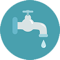

# はじめに {#getting-started}

## Adobe Marketo Engage とは {#what-is-marketo-engage}

Marketo とは何でしょうか。素晴らしい質問です。

[Marketo Engage の詳細はこちら](/help/marketo/getting-started/what-is-adobe-marketo-engage.md){target="_blank"}

## セットアップを行う {#get-set-up}

IT チームから少々支援を受けることで、すぐに完了できます。

[設定を開始するには](/help/marketo/getting-started/initial-setup/setup-steps.md){target="_blank"}

## すばやく成果を獲得 {#get-some-quick-wins}

Marketo Engage の主な機能を学ぶには、以下のミッションを完了します。

<table style="table-layout:fixed">
<tr>
  <td>
    
    

    <a href="/help/marketo/getting-started/quick-wins/get-set-up-and-add-a-person.md">1.セットアップと人物の追加</a>
    

     
  </td>
  <td>
      
    
<a href="getting-started/quick-wins/send-an-email.md">2.メールの送信</a>
    

     
  </td>
  <td>
    
    

    <a href="getting-started/quick-wins/landing-page-with-a-form.md">3.フォームを含むランディングページ</a>
    

     
  </td>
  <td>
    
    

    <a href="getting-started/quick-wins/simple-scoring.md">4.シンプルなスコアリング</a>
    

     
  </td>
  <td>
      
    
<a href="getting-started/quick-wins/email-auto-response.md">5.メールの自動応答</a>
    

     
  </td>
</tr>
<tr>
  <td>
    
    

    <a href="getting-started/quick-wins/import-a-list-of-people.md">6.人物のリストのインポート</a>
    

     
  </td>
  <td>
    
    

    <a href="getting-started/quick-wins/drip-drip-nurture.md">7.ドリップ、ドリップ、ナーチャリング</a>
    

     
  </td>
  <td>
      
    
<a href="getting-started/quick-wins/personalize-an-email.md">8.メールのパーソナライズ</a>
    

     
  </td>
  <td>
    
    

    <a href="getting-started/quick-wins/alert-the-sales-rep.md">9.セールス担当者にアラート</a>
    

     
  </td>
  <td>
    
    

    <a href="getting-started/quick-wins/update-person-data.md">10.人物データの更新</a>
    

     
  </td>
</tr>
</table>

## 手順 4 おめでとうございます！Nation に参加する準備は万全です  {#congrats-youre-ready-for-the-nation}

詳しくは、[Marketing Nation](https://nation.marketo.com){target="_blank"} を参照してください。
