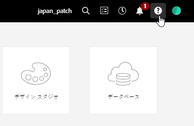
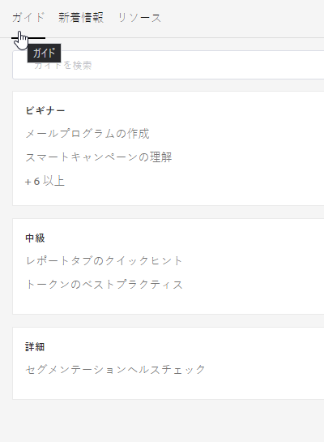
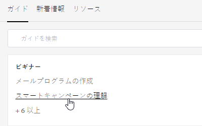
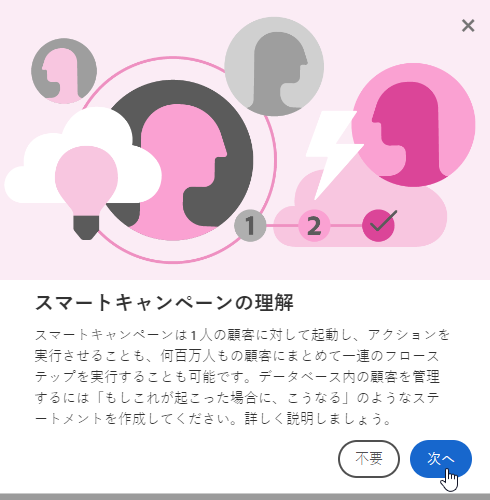
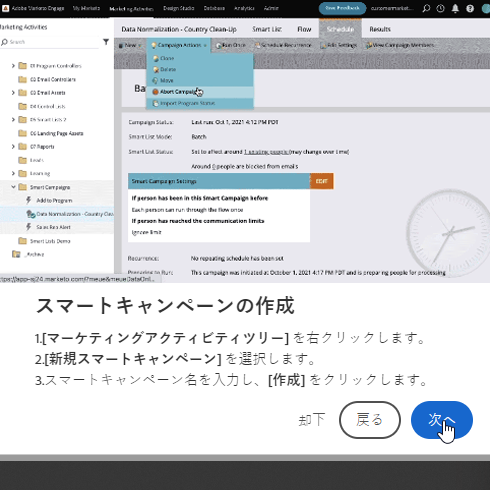
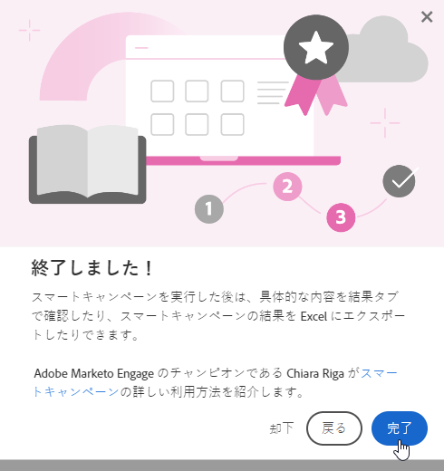
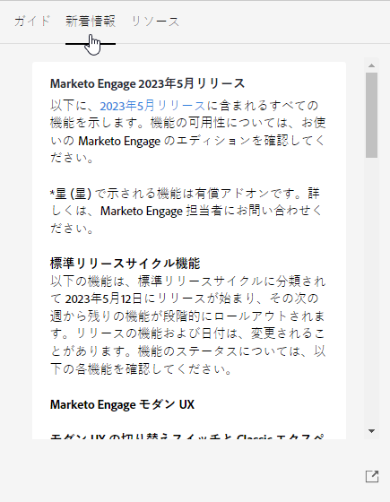
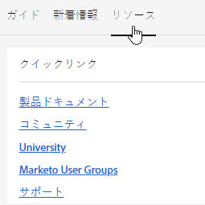

# ヘルプセンター {#help-center}

Marketo Engage のヘルプセンターは、サポートを受けるための一元的な場所として機能します。様々なリソース（例えば、[製品ドキュメント](/help/marketo/home.md){target="_blank"}, [release information](/help/marketo/release-notes/current.md){target="_blank"}, the [Marketing Nation Community](https://nation.marketo.com/){target="_blank"}）へのリンクに加えて、エクスペリエンスレベルで整理された、便利な製品内ウォークスルーにアクセスできます。

## アクセス方法 {#how-to-access}

Marketo Engage にログインしたら、ヘルプアイコンをクリックします。

### ガイド {#guides}

ガイドは、人気の高い機能の簡単なウォークスルーとして機能します。

1. 目的のガイドをクリックして表示します。

   

1. 「**開始する**」をクリックします。

   

1. 続行するには、「**次へ**」をクリックします。

   

1. 「**完了**」をクリックして、ウォークスルーを終了します。

   

   >[!TIP]
   >
   >「**閉じる**」をクリックすることで、いつでもガイドを終了できます。

### 新着情報 {#whats-new}

「新着情報」タブには、Marketo Engage の最新リリースの詳細が含まれていています。

>[!TIP]
>
>Experience League のページを表示するには、下部の矢印アイコンをクリックします。

### リソース {#resources}

「リソース」タブでは、Marketo Engage インスタンスに関する追加のサポートを得る様々な方法に直接、すばやくアクセスできます。

