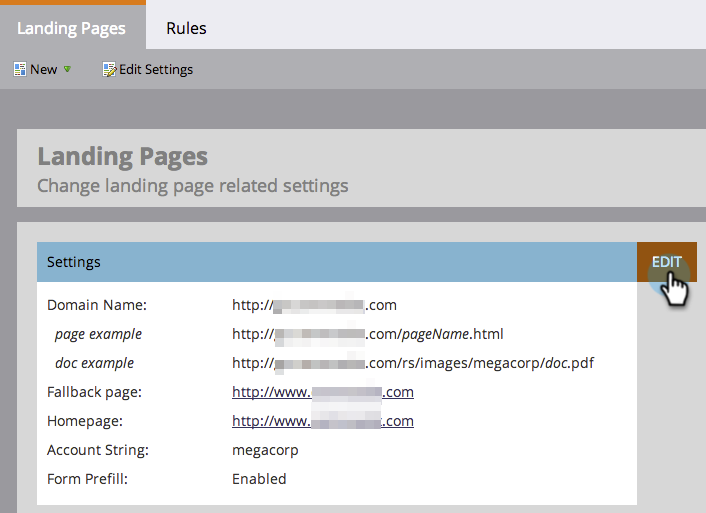

# 設定手順 {#setup-steps}

**Adobe Marketo Engageへようこそ！**

取り組む前に、完了する必要がある手順がいくつかあります。

以下の手順が含まれます。

* ランディングページの URL とメールリンクのブランディングによる信頼性と配信品質の向上
* Marketo Engage用のプロトコルの設定
* CRM の同期
* 会社の web サイトへのトラッキングコードの追加

>[!NOTE]
>
>自社に **Marketo を初めて導入する**&#x200B;お客様は、これらの手順を行うだけで完了できます。初めてではない場合は、既に設定が完了している可能性があります。

一部の手順では、IT チームのサポートが必要です。

## メールの配信品質を確保する {#ensure-email-deliverability}

>[!NOTE]
>
>Launch Pack をご利用の場合は、この手順をスキップできます。初回コール時に、担当のコンサルタントが IT セットアップ手順書を提供します。

メールができるだけ多くの人に届くように、いくつかの方法が用意されています。

* **トラッキングリンクのブランディング**。Marketo からのメールに含めるリンクに、（Marketo ドメインではなく）独自のドメインを使用する CNAME を選択できます。これにより、ドメインのブランディングが強化され、受信者との信頼と配信品質が向上します。
* **企業メールにMarketo許可リストに加えるを追加します**。 実際のユーザーにメールを送信する前に、テストアカウントにテストメールを送信することが一般的なベストプラクティスです。 Marketo を許可リストに加えることで、これらのテストメールがブロックされたりスパムとしてフラグ付けされたりするのを防ぐことができます。
* **SPF と DKIM を設定します**。 これらのテクノロジーにより、Marketoのメールがスパムでないことが受信者に保証されます。 受信者のスパムフィルターによる Marketo メールの拒否を防ぐには、以下の手順に従って[メールの配信品質に SPF と DKIM を設定](/help/marketo/product-docs/email-marketing/deliverability/set-up-spf-and-dkim-for-your-email-deliverability.md)します。
* **ドメインの MX レコードを設定します。** MX レコードを使用すると、返信や自動返信を処理するために、メールを送信するドメインにメールを受け取ることができます。会社ドメインから送信する場合は、既にこの設定が完了している可能性があります。そうでない場合は、通常、会社ドメインの MX レコードにマッピングするように設定できます。
* **送信元アドレスの推奨設定。**&#x200B;すべてのメールキャンペーンの送信元アドレスに、有効な既存メールドメインと動作中のメールドメインを使用する必要があります。会社ドメインから送信するのではなく、会社ドメインのサブドメインを設定すると便利です。これにより、会社のメールストリームの問題が Marketo のメールストリームに影響を与えず、逆についても同様のことが言えます。さらに、`something@nonexistentdomain.com` からメールを送信すると、メールがフィルターされたりブロックされたりします。送信者の送信元アドレスで使用されるドメインには、有効で動作中の postmaster@ アカウントと abuse@ アカウントが必要です。

Google アプリを使用して自社のメールをホストしている場合、お使いのドメインで abuse@ や postmaster@ のメールを作成することはできません。この問題を回避するには、「abuse」および「postmaster」という名前のグループを作成する必要があります。このグループのメンバーであるユーザーは、そのアドレスに送信されたメールを受信します（例：postmaster@domain.com）。グループ作成の詳しい手順については、[こちら](https://support.google.com/a/answer/33343#adminconsole){target="_blank"}を参照してください。

メールトラッキングリンクの CNAME を選択します（手順 3 で選択したランディングページ CNAME とは&#x200B;_異なる_&#x200B;ものを選択）。以下に例を示します。

* go2.[CompanyDomain].com
* em.[CompanyDomain].com
* wow.[CompanyDomain].com

最初の部分は、メールトラッキング CNAME `[EmailTrackingCNAME]` です。あなたはそれを IT に与える必要があります。

>[!CAUTION]
>
>電子メールとランディングページの CNAME は別にする必要があります。また、「track」や「link」といった CNAME は使用しないでください。多くの場合、スパムとしてフラグ付けされます

Marketo のトラッキングリンクを確認するには、「**[!UICONTROL 管理者]**」領域に移動します。

「**[!UICONTROL メール]**」をクリックします。

メール設定から[!UICONTROL トラッキングリンク]をコピーします。

[!UICONTROL トラッキングリンク]は、`mkto-[a-z][4 digits].com` の形式で入力します。

これがあなたの `[MktoTrackingLink]` です。保存します。これは、手順 5 で IT チームに渡す必要があります。

「差出人」ドメインを収集します。Marketo からのメール送信に使用するすべての「差出人」ドメイン（`[Sender]@[FromDomain].com` のように）のリストを作成します。ほとんどの場合、1 つだけです。

例、「marketo.com」、「info.marketo.com」。これらは `[FromDomain1]`、`[FromDomain2]` 等があります。保存します。これらは、手順 5 で IT チームに渡す必要があります。

リクエストを IT チームに送信するために必要な情報がすべて揃いました。

## CNAME を使用したランディングページ URL のカスタマイズ {#customize-your-landing-page-urls-with-a-cname}

>[!NOTE]
>
>Launch Pack をご利用の場合は、この手順をスキップできます。初回コール時に、担当のコンサルタントが IT セットアップ手順書を提供します。

>[!NOTE]
>
>**管理者権限が必要**

ランディングページの CNAME を選択します。以下に例を示します。

    * **go**.[CompanyDomain].com
    * **www2**.[CompanyDomain].com
    * **lp**.[CompanyDomain].com

>[!TIP]
>
>短くするようにします。URL は短いほど覚えやすくなります。ドメインには「go」を指定することをお勧めします。

最初の部分（太字）が `[LandingPageCNAME]` です。手順 5 で必要になります。

ランディングページの CNAME に置き換える Munchkin ID を取得するには、**Admin** 領域に移動します。

「**マイアカウント**」をクリックします。

ランディングページ設定から[!UICONTROL アカウント文字列]をコピーします。

これが `[Munchkin ID]`.です。保存します。これは、手順 5 で IT チームに渡す必要があります。

ランディングページが（ホストされている場所で）Marketo ドメインではなく、自社のドメインを使用するように、ドメイン設定を指定します。

## プロトコルの設定を IT チームに依頼する {#ask-it-to-configure-protocols}

>[!NOTE]
>
>Launch Pack をご利用の場合は、この手順をスキップできます。初回コール時に、担当のコンサルタントが IT セットアップ手順書を提供します。

必要な情報をすべて収集したら、IT チームにリクエストを送信する準備が整いました。以下のテキストをテンプレートとして使用し、太字のテキストを独自の情報に置き換えることができます。

[この記事へのリンクを含める](/help/marketo/getting-started/initial-setup/configure-protocols-for-marketo.md)。

メールにこのテキストを貼り付け、太字のプレースホルダーを置き換えます。

>[!NOTE]
>
>上記の手順 3 と 4 を参照して、プレースホルダーを置き換えるテキストを決定してください。`[LandingPageCNAME]` と `[EmailTrackingCNAME]` は、別のものを使用する必要があります。

`----------------------------------------------`

IT 管理者様

マーケティングチームは、コミュニケーションに Marketo プラットフォームを使用することになりました。優れたメール配信品質を確保するには、以下の変更を行う必要があります。

`1)` ランディングページには、**[LandingPageCNAME]**.**[CompanyDomain]**.com の DNS エントリ（CNAME）を追加します（**[Munchkin ID]**.mktoweb.com を指しています）。

`2)` メール内のトラッキングリンクには、**[EmailTrackingCNAME]**.**[CompanyDomain]**.com の DNS エントリ（CNAME）を追加して、**[MktoTrackingLink]** を指すようにしてください。

`3)` Marketo を許可リストに加えてください。

    * メール許可リストに IP アドレスを使用する場合は、以下に示す IP アドレスを追加してください。
    199.15.212.0/22
    
    192.28.144.0/20
    
    192.28.160.0/19
    
    185.28.196.0/22
    
    130.248.172.0/24
    
    130.248.173.0/24
    
    103.237.104.0/22
    
    94.236.119.0/26

>[!NOTE]
>
>ご使用の環境に合わせた IP の短縮リストを希望する場合は、Marketo サポートにお問い合わせください。

    * スパム対策システムで送信元ドメインが使用されている場合は、以下のドメインを追加してください。

**`[FromDomain1]`**
**`[FromDomain2]`**

`4)` SPF と DKIM を設定し、Marketo が署名済みメールを会社に代わって送信する権限を付与する必要があります。

`a.` SPF を設定するには、DNS エントリに以下の行を追加してください。

IN  TXT **[From Domain]**:  v=spf1 mx ip4:**[Corporate IP(s)]**
 include: mktomail.com ~all

DNS エントリに既に SPF レコードが存在する場合は、以下のコードを追加します。

include: mktomail.com

`[`**From Domain** をメール送信元ドメイン（例：company.com）に、**CorpIP** を会社のメールサーバーの IP アドレス（例：255.255.255.255）に置き換えます。Marketo を通じて複数のドメインからメールを送信する場合は、IT スタッフに各ドメインに対してこの行を（1 行で）追加してもらう必要があります。`]`

`b.`DKIM の場合は、設定するドメインごとに DNS リソースレコードを作成してください。署名する各ドメインのホストレコードと TXT 値を以下に示します。

**`[DKIMDomain1]`**：ホストレコードが **`[HostRecord1]`** で、TXT 値が **`[TXTValue1]`** です。

**`[DKIMDomain2]`**：ホストレコードが **`[HostRecord2]`** で、TXT 値が **`[TXTValue2]`** です。

`[`[こちらの手順に従って](/help/marketo/product-docs/email-marketing/deliverability/set-up-a-custom-dkim-signature.md)、設定した **DKIMDomain** ごとに **HostRecord** と **TXTValue** をコピーします。IT スタッフがこの手順を完了したら、必ず&#x200B;**管理者／メール／DKIM** で各ドメインを確認してください。`]`

`5)` FROM ドメイン **`[FromDomain1]`**、**`[FromDomain2]`** などに有効な MX レコードがあることを確認する必要があります。 確認できますか？そうでない場合は、会社のドメイン MX レコードにマッピングするように設定してください。これにより、Marketo 宛ての返信／自動応答を確実に処理できます。

これらの手順が完了したらお知らせください。Marketo で設定プロセスを完了します。

ありがとうございました。ご協力感謝します。

よろしくお願いします。

**`[Your Name]`**

`----------------------------------------------`

IT チームにメールを送信します。IT チームがこれらのタスクを完了するまでに時間がかかる場合があることを承知しています。次の手順に進むことができますが、Marketo Engage設定を完了するには、この手順に戻る必要があることに注意してください。

## IT チームの作業完了後に、Marketo の設定を完了する {#complete-your-marketo-setup-after-it-finishes}

IT チームが作業を完了したら、以下の手順に従ってランディングページとメールの CNAME を追加し、DKIM 署名を有効にします。

「**[!UICONTROL 管理者]**」領域に移動してランディングページ CNAME を追加します。

ランディングページを選択し、「[!UICONTROL 設定]」領域の「**[!UICONTROL 編集]**」をクリックします。

「**[!UICONTROL ランディングページのドメイン名]**」フィールドに新しいドメイン名を入力します。これは、以下の形式で記述します。

`[LandingPageCNAME].[CompanyDomain].com`

「**[!UICONTROL フォールバック]**」ページフィールドに、ランディングページが利用できない場合に訪問者に表示する URL を入力します。フォールバックページがない場合は、会社のホームページを使用できます。「**[!UICONTROL ホームページ]**」フィールドに、会社の web サイトを入力します。

「[!UICONTROL 管理者]」領域で「**[!UICONTROL メール]**」を選択して、メール CNAME を追加します

「[!UICONTROL ブランディングドメイン]」までスクロールします。ドメインを選択し、「**[!UICONTROL 編集]**」をクリックします。

「ドメイン」フィールドに、メールトラッキングドメインを入力します。これは、以下の形式で記述します。

`[EmailTrackingCNAME].[CompanyDomain].com`.「**[!UICONTROL 保存]**」をクリックします。

## CRM を統合する {#integrate-your-crm}

これはおそらく、設定の最もエキサイティングな部分です。 CRM に保存したすべてのリードと連絡先をMarketoでいっぱいにする時が来ました。

会社が使用している CRM に応じて、以下の中から選択します。

* [Marketo Engageと  [!DNL Salesforce.com] の統合](/help/marketo/product-docs/crm-sync/salesforce-sync/understanding-the-salesforce-sync.md)
* [Marketo Engageと  [!DNL Microsoft Dynamics] の統合](/help/marketo/product-docs/crm-sync/microsoft-dynamics-sync/understanding-the-microsoft-dynamics-sync.md)

  >[!NOTE]
  >
  >これらの手順を完了するには、会社の CRM 管理者の支援が必要です。

## Web サイトへのトラッキングコードの追加 {#add-tracking-code-to-your-website}

>[!NOTE]
>
>[!DNL Launch Pack] をご利用の場合は、この手順をスキップできます。担当のコンサルタントが、IT セットアップ手順ドキュメントに [!DNL Munchkin] コード手順を提供します。

Marketo Engageには、任意の web ページ上の人物アクティビティを追跡するために使用できる、カスタムトラッキングJavaScript（[!DNL Munchkin] と呼ばれます）があります。 Web サイトを Marketo に統合するには、[!DNL Munchkin] が必要です。以下の手順に従って、[web サイトに  [!DNL Munchkin]  トラッキングコードを追加](/help/marketo/product-docs/administration/additional-integrations/add-munchkin-tracking-code-to-your-website.md){target="_blank"}します。

>[!NOTE]
>
>トラッキングコードを追加するには、HTMLの経験が必要です。

## パフォーマンスの期待値 {#performance-expectations}

Marketo のパフォーマンスに関して期待できる点は何ですか？マーケティングキャンペーンのサイズと複雑さに応じて異なる場合があります。ただし、[Marketo Engageの製品説明 ](https://helpx.adobe.com/legal/product-descriptions/adobe-marketo-engage-product-description.html){target="_blank"} に記載されているいくつかのテーブルの「標準」列に概説されているレベルと同等のパフォーマンスレベルを想定することはできます。 「Performance」列と「Performance Plus」列は、[ より高いパフォーマンス・レベル ](https://nation.marketo.com/t5/product-documents/marketo-engage-performance-tiers/ta-p/328835){target="_blank"} を提供するパフォーマンス層パッケージを指します。

>[!MORELIKETHIS]
>
>* [Marketo Engageのプロトコルの設定 ](/help/marketo/getting-started/initial-setup/configure-protocols-for-marketo.md)
>
>* [ ユーザー設定 ](/help/marketo/getting-started/initial-setup/user-setup.md)
