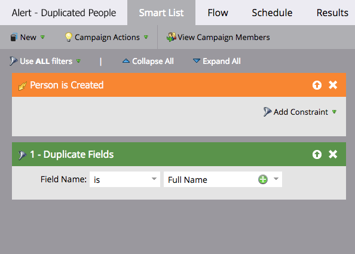

# 重複の可能性がある人物のアラートの自動化 {#automate-an-alert-for-possible-duplicate-people}

重複の可能性がある人物が作成されるたびにアラートを表示しますか？スマートキャンペーンを設定する方法を次に示します。

1. [新規スマートキャンペーンを作成します](/help/marketo/product-docs/core-marketo-concepts/smart-campaigns/creating-a-smart-campaign/create-a-new-smart-campaign.md){target="_blank"}。次のスマートリストを定義します。

* トリガー：**[!UICONTROL 人物が作成される]**
* フィルター： **[!UICONTROL 重複フィールド]**. フィールド名は「**[!UICONTROL 氏名」]**

   

   >[!TIP]
   >
   >クリエイティブになりましょう。様々なフィールドを試すことで、フィルタリング結果を向上できます。

1. フローステップで、「[[!UICONTROL アラートを送信]](/help/marketo/product-docs/core-marketo-concepts/smart-campaigns/flow-actions/send-alert.md){target="_blank"}」フローアクションを選択します。

   

   >[!TIP]
   >
   >[アラート情報送信トークン](/help/marketo/product-docs/email-marketing/general/using-tokens/use-the-send-alert-info-token.md){target="_blank"}を使用して、CRM に人物へのリンクを含めます。

   >[!CAUTION]
   >
   >サイズの大きいリストをインポートすると、大量のアラートが表示される可能性があります。
   >
   >また、同じ名前の 2 人が自動的に同じ人物であるとは限りません。

1. 「**[!UICONTROL スケジュール]**」タブのキャンペーンをアクティブ化します。

   

これで完了です。このスマートキャンペーンは、既存の氏名を持つ新しい人物が Marketo で作成されるたびにトリガーされます。

>[!MORELIKETHIS]
>
>[重複リードの検索と結合](/help/marketo/product-docs/core-marketo-concepts/smart-lists-and-static-lists/managing-people-in-smart-lists/find-and-merge-duplicate-people.md){target="_blank"}
