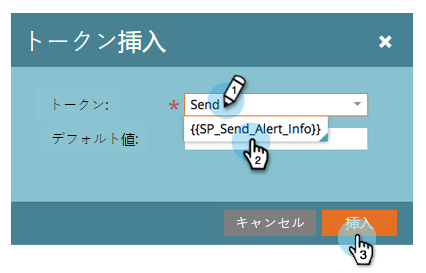
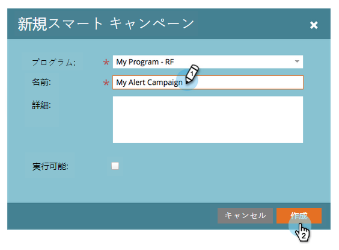
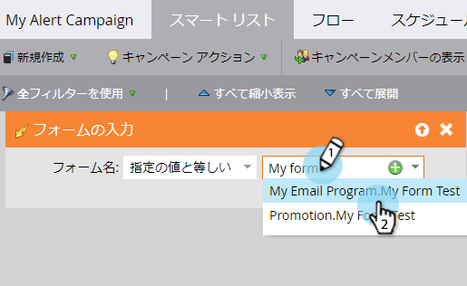
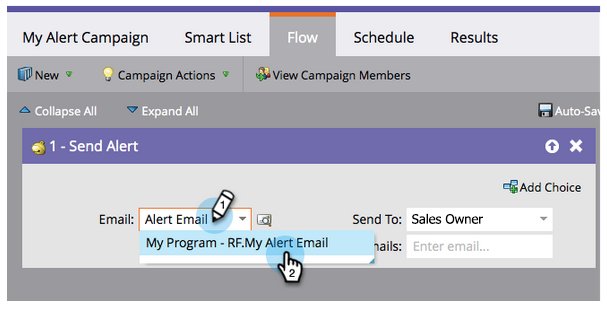
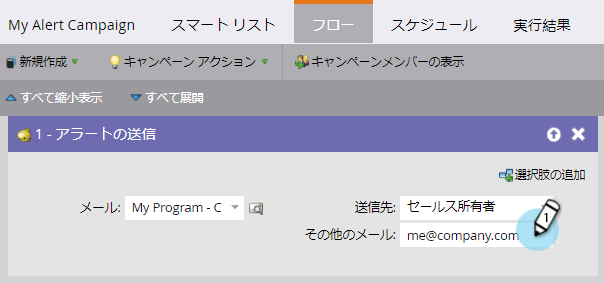

# 販売担当者に警告する {#alert-the-sales-rep}

## ミッション：訪問者がWebサイトのフォームに入力したときに販売担当者に警告する {#mission-alert-the-sales-rep-when-a-person-fills-out-a-form-on-your-web-site}

セールス担当者にアラート電子メールを自動的に送信するには、アラート電子メールと電子メールキャンペーンが必要です。 その方法を次に示します。

>[!NOTE]
>
>**FYI**
>
>Marketoは現在、すべての購読で言語を標準化しているので、購読およびdocs.marketo.comの人物/人物にリード/リードを表示できます。 これらの用語は同じことを意味し、記事の説明には影響しません。 他にも変化がある。 [詳細情報](http://docs.marketo.com/display/DOCS/Updates+to+Marketo+Terminology)。

>[!NOTE]
>
>**前提条件**
>
>* [フォームとのランディングページ](landing-page-with-a-form.md)

>

## 手順1:アラート電子メールの作成 {#step-create-an-alert-email}

1. 「 **マーケティングアクティビティ** 」領域に移動します。

   

1. Form **quick winを使用して** ランディングページで作成したプログラムを選択し、「 [新規](landing-page-with-a-form.md) 」で「新規ローカルアセット ********」「新規」をクリックします。

   

1. 「 **電子メール**」をクリックします。

   

1. **電子メールに** 「My Email Alert」という名前を付け、テンプレートを選択して「 **Create**」をクリックします。

   

1. 「 **送信者名**」、「電子メール **から」**、「 **返信先**」、「 **** 件名」の各フィールドに、営業チームに表示する名前を入力します。

   

1. 重複キーを押しながらクリックして、電子メールのテキストを編集します。

   

1. 電子メールの内容を入力します。

   

1. ユーザーの連絡先情報を挿入する場所にカーソルを置き、トークンの **挿入** アイコンをクリックします。

   

1. トー `{{SP_Send_Alert_Info}}` クンを探して選択し、「 **挿入** 」をクリックします ****。

   

   >[!NOTE]
   >
   >{{SP_Send_Alert_Info}}は、アラート電子メール用の特別なトークンです。 詳しくは、「アラート情報トークンの [送信](../../product-docs/email-marketing/general/using-tokens/use-the-send-alert-info-token.md) 」を参照してください。

1. 「 **保存**」をクリックします。

   

1. 「電子メールエディタ」タブまたはウィンドウを閉じます。

   

1. 「 **電子メールアクション** 」で、「 **承認**」をクリックします。

   

## 手順2:アラートトリガーキャンペーンの作成 {#step-create-an-alert-trigger-campaign}

1. 「 **以前に作成したプログラム** 」を選択し、「**新規**」で「 **新規スマートキャンペーン**」をクリックします。

   

1. **キャンペーンに** 「マイアラートキャンペーン」という名前を付け、「 **作成**」をクリックします。

   

1. 「 **スマートリスト** 」タブで、「フォームの **記入** 」トリガーを探し、キャンバスにドラッグします。

   

1. 前に作成したフォームを選択します。

   

1. 「 **フロー** 」タブで、「アラートの **送信** 」フローアクションを探し、キャンバスにドラッグします。

   

1. [ **作成済みの警告電子メール** ]を選択し、[ **送信先** ]を[ **販売所有者**]のままにします。

   

1. [その他の電子メール **へ** ]フィールドに電子メールアドレスを入力します。

   

1. 「 **スケジュール** 」タブに移動し、「**アクティブ化**」ボタンをクリックします。

   

   >[!TIP]
   >
   >
   >「 **資格ルール** 」を **(スマートキャンペーンを編集して** )毎回に設定し、同じ人が複数回アラートをトリガーできるようにします。

1. 確認画面で「 **アクティブ化** 」をクリックします。

   

## 手順3:試してみろ！ {#step-test-it-out}

1. ランディングページを選択し、「 **表示が承認したページ**」をクリックします。

   

   >[!NOTE]
   >
   >**Reminder**
   >
   >
   >ランディングページを認めるのを忘れないで。彼らは承認されるまで生きていかない。

1. フォームに入力し、「 **送信**」をクリックします。

   

1. まもなくメールを受け取るはずです。 すべて正常に動作することを確認したら、アラートの送信フローから電子メールアドレスを削除します（上記の手順2.7を参照）。

   >[!NOTE]
   >
   >連絡先情報を表示するには、マーケティングの「 **人物情報** 」タブをクリックします。

## ミッション完了！ {#mission-complete}

  

[etchaミッション7:電子メールのパーソナライズ](personalize-an-email.md)[ミッション9:リードデータの更新…](update-person-data.md)