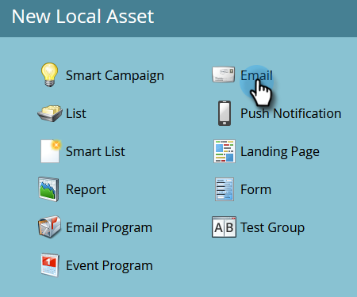

# セールス担当者にアラート {#alert-the-sales-rep}

## ミッション：人物が web サイトのフォームに入力したときにセールス担当者にアラートする {#mission-alert-the-sales-rep-when-a-person-fills-out-a-form-on-your-web-site}

セールス担当者にアラートメールを自動的に送信するには、アラートメールとメールキャンペーンが必要です。その方法を説明しましょう。

>[!PREREQUISITES]
>
>[フォームを含むランディングページ](/help/marketo/getting-started/quick-wins/landing-page-with-a-form.md){target="_blank"}

## 手順 1：アラートメールを作成する {#step-create-an-alert-email}

1. **[!UICONTROL マーケティングアクティビティ]**&#x200B;領域に移動します。

   

1. クイックウィン&#x200B;**フォームを含むランディングページ**&#x200B;に作成した[マイプログラム](/help/marketo/getting-started/quick-wins/landing-page-with-a-form.md){target="_blank"}を選択、次に「**[!UICONTROL 新規]**」で、「**[!UICONTROL 新規ローカルアセット]**」をクリックします。

   

1. 「**[!UICONTROL メール]**」をクリックします。

   

1. メールに「マイメールアラート」という&#x200B;**名前を付け**、テンプレートを選択し、「**[!UICONTROL 作成]**」をクリックします。

   

1. セールスチームが確認できるように、「**送信者名**」、「**送信元メール**」、「**[!UICONTROL 返信先]**」、「**[!UICONTROL 件名]**」を入力します。

   

1. ダブルクリックしてメールのテキストを編集します。

   

1. メールの内容を入力します。

   

1. 人物の取引先責任者情報を挿入する場所にカーソルを置き、「**トークンの挿入**」アイコンをクリックします。

   

1. `{{SP_Send_Alert_Info}}` **[!UICONTROL トークン]**&#x200B;を検索して選択し、「**[!UICONTROL 挿入]**」をクリックします。

   

   >[!NOTE]
   >
   >{{SP_Send_Alert_Info}} は、アラートメール用の特別なトークンです。詳しくは、[アラート情報トークンの送信の使用](/help/marketo/product-docs/email-marketing/general/using-tokens/use-the-send-alert-info-token.md){target="_blank"}{target="_blank"}を参照してください。

1. 「**[!UICONTROL 保存]**」をクリックします。

   

1. 「**[!UICONTROL メールアクション]**」ドロップダウンをクリックし、「**[!UICONTROL 承認して閉じる]**」を選択します。

   

## 手順 2：アラートトリガーキャンペーンを作成する {#step-create-an-alert-trigger-campaign}

1. 以前に作成した「**マイプログラム**」を選択し、「**[!UICONTROL 新規]**」で、「**[!UICONTROL 新規スマートキャンペーン]**」をクリックします。

   

1. キャンペーンに「マイアラートキャンペーン」という&#x200B;**名前を付け**、「**[!UICONTROL 作成]**」をクリックします。

   

1. 「**[!UICONTROL スマートリスト]**」タブで、「**[!UICONTROL フォームの入力]**」トリガーを検索して、キャンバスにドラッグします。

   

1. 先ほど作成したフォームを選択します。

   

1. 「**[!UICONTROL フロー]**」タブで、「**[!UICONTROL アラートを送信]**」フローアクションを検索してキャンバスにドラッグします。

   

1. 先ほど作成した「**[!UICONTROL マイアラートメール]**」を選択し、「**[!UICONTROL 送信先]**」を「**[!UICONTROL 営業所有者]**」とします。

   

1. 自分のメールアドレスを「**[!UICONTROL 他のメールへ]**」フィールドに入力します。

   

1. 「**[!UICONTROL スケジュール]**」タブに移動し、「**[!UICONTROL アクティブ化]**」ボタンをクリックします。

   

   >[!TIP]
   >
   >「**[!UICONTROL クオリフィケーションルール]**」を「**[!UICONTROL 毎回]**」（スマートキャンペーンを編集する）に設定し、同じ人物が複数回アラートをトリガーできるようにします。

1. 確認画面の「**[!UICONTROL アクティブ化]**」をクリックします。

   

## 手順 3：テストする {#step-test-it-out}

1. ランディングページを選択し、「**[!UICONTROL 承認済みページを表示]**」をクリックします。

   

   >[!NOTE]
   >
   >忘れずにランディングページを承認してください。承認されないと本番稼働しません。

1. フォームに入力し、「**[!UICONTROL 送信]**」をクリックします。

   

1. すぐにメールが届きます。すべて正常に動作することを確認したら、アラート送信フローからメールアドレスを削除します（上記の手順 2.7 を参照）。

   >[!NOTE]
   >
   >Marketo の「**[!UICONTROL 人物情報]**」タブをクリックして、取引先責任者情報を表示します。

## ミッション完了です。 {#mission-complete}

  

[◄ ミッション 7：メールのパーソナライズ](/help/marketo/getting-started/quick-wins/personalize-an-email.md)

[ミッション 9：人物データの更新 ►](/help/marketo/getting-started/quick-wins/update-person-data.md)
