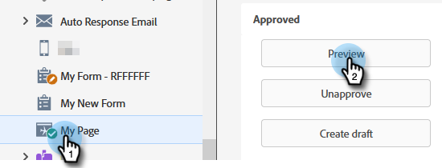

# セールス担当者にアラート {#alert-the-sales-rep}

## ミッション：人物が web サイトのフォームに入力したときにセールス担当者にアラートする {#mission-alert-the-sales-rep-when-a-person-fills-out-a-form-on-your-web-site}

セールス担当者にアラートメールを自動的に送信するには、アラートメールとメールキャンペーンが必要です。その方法を説明しましょう。

>[!PREREQUISITES]
>
>[フォームを含むランディングページ](/help/marketo/getting-started/quick-wins/landing-page-with-a-form.md){target=&quot;_blank&quot;}

## 手順 1：アラートメールを作成する {#step-create-an-alert-email}

1. **マーケティングアクティビティ**&#x200B;領域に移動します。

   

1. 選択 **マイプログラム** 作成した [フォームを含むランディングページ](/help/marketo/getting-started/quick-wins/landing-page-with-a-form.md){target=&quot;_blank&quot;} クイックウィン、次に **新規** クリック **新規ローカルアセット**.

   

1. 「**メール**」をクリックします。

   

1. メールに「マイメールアラート」という&#x200B;**名前を付け**、テンプレートを選択し、「**作成**」をクリックします。

   

1. セールスチームが確認できるように、「**送信者名**」、「**送信元メール**」、「**返信先**」、「**件名**」を入力します。

   

1. ダブルクリックしてメールのテキストを編集します。

   

1. メールの内容を入力します。

   

1. 人物の連絡先情報を挿入する場所にカーソルを置き、「**トークンの挿入**」アイコンをクリックします。

   

1. `{{SP_Send_Alert_Info}}` **トークン**&#x200B;を検索して選択し、「**挿入**」をクリックします。

   

   >[!NOTE]
   >
   >{{SP_Send_Alert_Info}} は、アラート電子メール用の特別なトークンです。 詳しくは、 [アラート情報トークンの送信](/help/marketo/product-docs/email-marketing/general/using-tokens/use-the-send-alert-info-token.md){target=&quot;_blank&quot;}{target=&quot;_blank&quot;} を参照してください。

1. 「**保存**」をクリックします。

   

1. 次をクリック： **メールアクション** ドロップダウンして「 」を選択します。 **承認して閉じる**.

   

## 手順 2：アラートトリガーキャンペーンを作成する {#step-create-an-alert-trigger-campaign}

1. 以前に作成した「**マイプログラム**」を選択し、「**新規**」で、「**新規スマートキャンペーン**」をクリックします。

   

1. キャンペーンに「マイアラートキャンペーン」という&#x200B;**名前を付け**、「**作成**」をクリックします。

   

1. 「**スマートリスト**」タブで、「**フォームの入力**」トリガーを検索して、キャンバスにドラッグします。

   

1. 先ほど作成したフォームを選択します。

   

1. 「**フロー**」タブで、「**アラートを送信**」フローアクションを検索してキャンバスにドラッグします。

   

1. 先ほど作成した「**マイアラートメール**」を選択し、「**送信先**」を「**営業所有者**」とします。

   

1. 自分のメールアドレスを「**他のメールへ**」フィールドに入力します。

   

1. 「**スケジュール**」タブに移動し、「**アクティブ化**」ボタンをクリックします。

   

   >[!TIP]
   >
   >「**クオリフィケーションルール**」を「**毎回**」（スマートキャンペーンを編集する）に設定し、同じ人物が複数回アラートをトリガーできるようにします。

1. 確認画面の「**アクティブ化**」をクリックします。

   

## 手順 3：テストする {#step-test-it-out}

1. ランディングページを選択し、「**承認済みページを表示**」をクリックします。

   

   >[!NOTE]
   >
   >忘れずにランディングページを承認してください。承認されないと本番稼働しません。

1. フォームに入力し、「**送信**」をクリックします。

   

1. すぐにメールが届きます。すべて正常に動作することを確認したら、アラート送信フローからメールアドレスを削除します（上記の手順 2.7 を参照）。

   >[!NOTE]
   >
   >Marketo の「**人物情報**」タブをクリックして、連絡先情報を表示します。

## ミッション完了です。 {#mission-complete}

  

[◄ ミッション 7：メールのパーソナライズ](/help/marketo/getting-started/quick-wins/personalize-an-email.md)

[ミッション 9:担当者データを更新►](/help/marketo/getting-started/quick-wins/update-person-data.md)
