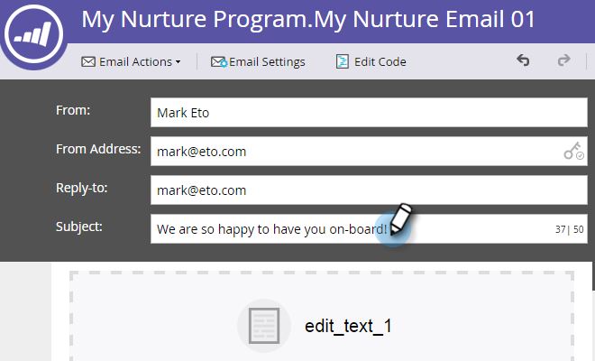
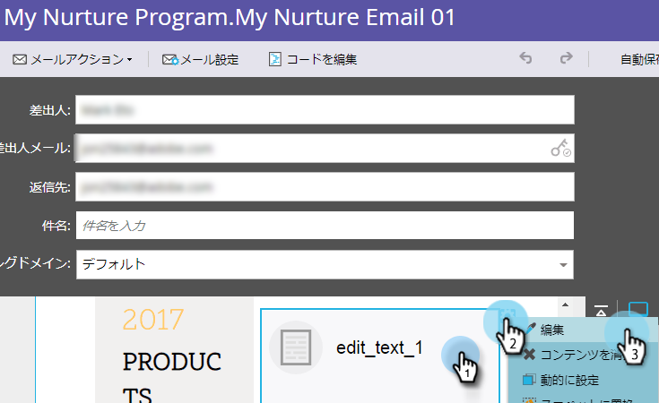
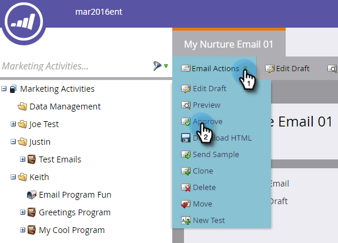
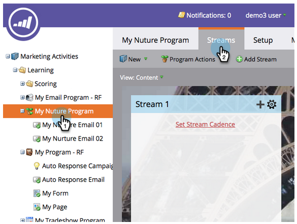
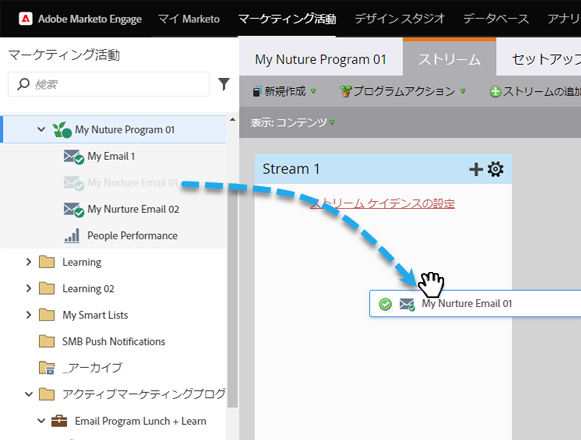
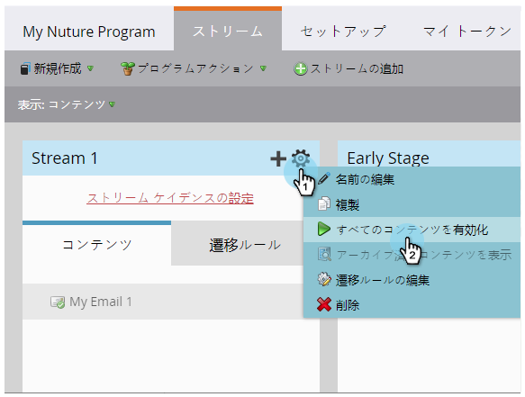
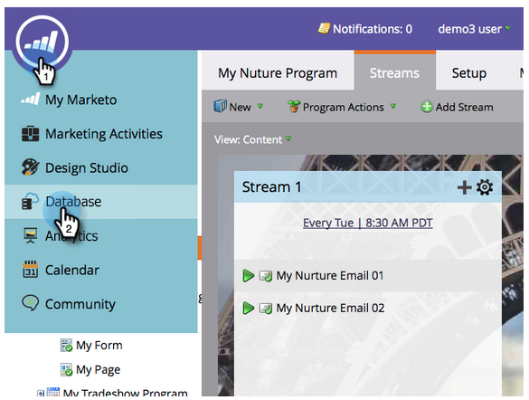

# ドリップ、ドリップ、ナーチャリング {#drip-drip-nurture}

## ミッション：最近のトレードショーに参加したリードをナーチャリングする {#mission-nurture-the-people-who-attended-your-recent-tradeshow}

Marketo では、詳細かつ洗練されたナーチャリングシステムを簡単に作成できます。ここでは、その方法を説明します。

>[!PREREQUISITES]
>
>* [セットアップと人物の追加](/help/marketo/getting-started/quick-wins/get-set-up-and-add-a-person.md)
>* [人物のリストの読み込み](/help/marketo/getting-started/quick-wins/import-a-list-of-people.md)

## 手順 1：エンゲージメントプログラムを作成する {#step-create-an-engagement-program}

1. **マーケティングアクティビティ**&#x200B;領域に移動します。

   

1. **学習**&#x200B;フォルダーを選択し、**新規**&#x200B;ドロップダウンをクリックして、「**新規プログラム**」を選択します。

   

1. **名前**&#x200B;を入力し、「**プログラムタイプ**」で「**エンゲージメント**」を選択します。

   

1. **チャネル**&#x200B;フィールドが&#x200B;**ナーチャリング**&#x200B;であることを確認し、「**作成**」をクリックします。

   

   これで、エンゲージメントプログラムが作成されました。

## 手順 2：メールを作成する {#step-create-an-email}

1. エンゲージメントプログラムを選択し、「**新規**」をクリックして、「**新規ローカルアセット**」を選択します。

   

1. 「**メール**」をクリックします。

   

1. **名前**&#x200B;を入力し、使用する&#x200B;**テンプレート**&#x200B;を選択して、「**作成**」をクリックします。

   

   >[!NOTE]
   >
   >メールエディターが表示されない場合お使いのブラウザーでウィンドウがブロックされている可能性があります。ブラウザーで [app.marketo.com](https://app.marketo.com) からのポップアップを有効にし、上部のメニューバーで「**ドラフトを編集**」をクリックします。

1. 件名を入力します。

   

1. 編集するメールの領域を選択し、歯車アイコンをクリックして、「**編集**」を選択します。

   

1. メールを編集し、「**保存**」をクリックします。

   

1. 「メールエディター」タブ／ウィンドウを閉じます。

   

1. 「**メールアクション**」で、「**承認**」をクリックします。

   

   >[!NOTE]
   >
   >忘れずにメールを承認してください。承認しないと、後でアクティブ化できません。

1. 次に、手順 2 のアクションを繰り返して、別のメールを作成します。

   

## 手順 3：ストリームにコンテンツを追加する {#step-add-content-to-your-stream}

1. 次に、作成したメールを使用して、エンゲージメントプログラムのコンテンツのストリームを作成します。

1. エンゲージメントプログラムを選択し、「**ストリーム**」タブをクリックします。

   

1. 作成した 2 つのメールを右側のキャンバスにドラッグします。

   

   >[!TIP]
   >
   >「**コンテンツを追加**」ボタンまたはストリームの&#x200B;**+**&#x200B;アイコンを使用することもできます。

## 手順 4：ストリームコンテンツをアクティブ化する {#step-activate-stream-content}

1. ストリームギアアイコンをクリックして、すべてのコンテンツを一度にアクティブ化し、「**すべてのコンテンツをアクティブ化**」をクリックします。

   

   >[!NOTE]
   >
   >承認する前にコンテンツをアクティブ化することはできません。

   すばらしいです。あと 1 つのステップで、エンゲージメントプログラムの準備が整います。

## 手順 5：ストリームサイクルを設定する {#step-set-the-stream-cadence}

1. 「**ストリームサイクルの設定**」をクリックします。

   

1. 目的のスケジュールに合わせて設定を編集し、「**保存**」をクリックします。

   

   エンゲージメントプログラムの準備が整いました。次に、プログラムにテスト担当者を追加します。

   >[!NOTE]
   >
   >テスト担当者とは、エンゲージメントプログラムをチェックし、顧客に送信する前に正しいかどうかをテストする人です。

## 手順 6：エンゲージメントプログラムにテスト担当者を追加する {#step-add-a-test-person-to-your-engagement-program}

1. **データベース**&#x200B;領域に移動します。

   

1. テスト担当者を検索します。

   

   >[!NOTE]
   >
   >テスト時にメールの受信を確認できるように、テスト担当者に有効なメールアドレスがあることを確認します。

1. 人物を右クリックし、「プログラム」、「エンゲージメントプログラムに追加」の順にクリックします。

   

1. **プログラム**&#x200B;と&#x200B;**ストリーム**&#x200B;を選択し、「**今すぐ実行**」をクリックします。

   

1. ミッション完了です。

1. 指定した日時にメールが届きます。

   >[!NOTE]
   >
   >[エンゲージメントプログラム](/help/marketo/product-docs/email-marketing/drip-nurturing/creating-an-engagement-program/understanding-engagement-programs.md)の詳細をご覧ください。

  

[◄ ミッション 5：リードのリストの読み込み](/help/marketo/getting-started/quick-wins/import-a-list-of-people.md)

[ミッション 7：メールのパーソナライズ ►](/help/marketo/getting-started/quick-wins/personalize-an-email.md)
