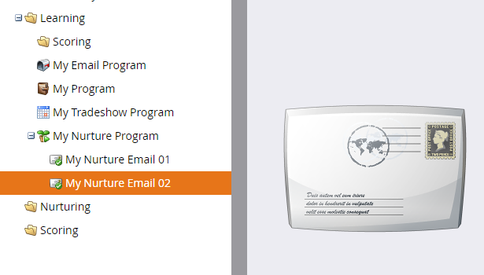

# ドリップ、ドリップ、ナーチャ{#drip-drip-nurture}

## ミッション：最近のトレードショーに参加した人を育てる{#mission-nurture-the-people-who-attended-your-recent-tradeshow}

Marketoでは、高度で高度なナチュレーションシステムを簡単に作成できます。 どうやって！

>[!PREREQUISITES]
>
>* [設定と追加人](/help/marketo/getting-started/quick-wins/get-set-up-and-add-a-person.md)
>* [人物のリストのインポート](/help/marketo/getting-started/quick-wins/import-a-list-of-people.md)

## 手順1:エンゲージメントプログラムの作成{#step-create-an-engagement-program}

1. **マーケティングアクティビティ**&#x200B;エリアに移動します。

   

1. **学習**&#x200B;フォルダーを選択し、**新しい**&#x200B;ドロップダウンをクリックして、**新しいプログラム**&#x200B;を選択します。

   

1. 「**名前**」を入力し、「**プログラムタイプ**」に「**アクション**」を選択します。

   

1. **チャネル**&#x200B;フィールドが&#x200B;**Nurture**&#x200B;であることを確認し、**作成**&#x200B;をクリックします。

   

   これで、エンゲージメントプログラムが作成されました。

## 手順2:電子メールの作成{#step-create-an-email}

1. エンゲージメントプログラムを選択し、「**新規**」をクリックして、「**新しいローカルアセット**」を選択します。

   

1. 「**電子メール**」をクリックします。

   

1. **名前**&#x200B;を入力し、使用する&#x200B;**テンプレート**&#x200B;を選択して、**作成**&#x200B;をクリックします。

   

   >[!NOTE]
   >
   >電子メールエディターが表示されない場合 ブラウザーがウィンドウをブロックした可能性があります。 ブラウザーで[app.marketo.com](https://app.marketo.com)のポップアップを有効にし、上部のメニューバーで「**ドラフトを編集**」をクリックします。

1. 件名を入力します。

   

1. 編集する電子メールの領域を選択し、歯車アイコンをクリックして「**編集**」を選択します。

   

1. 電子メールを編集し、「**保存**」をクリックします。

   

1. 「電子メールエディタ」タブまたはウィンドウを閉じます。

   

1. 「**電子メールアクション**」で、「**承認**」をクリックします。

   

   >[!NOTE]
   >
   >電子メールを承認するのを忘れないでください。承認しないと、後で電子メールをアクティブにできなくなります。

1. 次に、手順2の操作を繰り返して別の電子メールを作成します。

   

## 手順3:ストリ追加ームへのコンテンツ{#step-add-content-to-your-stream}

1. ここで、作成した電子メールを使用して、エンゲージメントプログラムのコンテンツのストリームを作成します。

1. エンゲージメントプログラムを選択し、「**Streams**」タブをクリックします。

   

1. 作成した2つの電子メールを右のキャンバスにドラッグします。

   

   >[!TIP]
   >
   >「**追加コンテンツ**」ボタンまたはストリーム&#x200B;**+**&#x200B;アイコンを使用することもできます。

## 手順4:ストリームコンテンツをアクティブ化{#step-activate-stream-content}

1. ストリームギアアイコンをクリックし、「**すべてのコンテンツをアクティブ化**」をクリックして、すべてのコンテンツを一度にアクティブ化します。

   

   >[!NOTE]
   >
   >承認しないとコンテンツをアクティブ化できません。

   素晴らしい仕事！ もう1つの手順を実行し、エンゲージメントプログラムの準備が整います。

## 手順5:ストリームカデンスを設定{#step-set-the-stream-cadence}

1. 「**Set Stream Cadence**」をクリックします。

   

1. 設定を編集して、目的のスケジュールに合わせ、[**保存**]をクリックします。

   

   エンゲージメントのプログラムがすべて設定されました。 次に、テスト担当者をプログラムに追加します。

   >[!NOTE]
   >
   >テスト担当者は、顧客に送信する前に、エンゲージメントプログラムをチェックして、正しいかどうかをテストする人です。

## 手順6:エンゲージメントプログラム追加に対するテスト担当者{#step-add-a-test-person-to-your-engagement-program}

1. **Database**&#x200B;領域に移動します。

   

1. テスト担当者を検索します。

   

   >[!NOTE]
   >
   >テスト時に電子メールの受信を確認できるように、テスト担当者に有効な電子メールアドレスがあることを確認します。

1. ユーザーを右クリックし、「プログラム」をクリックして、「アクション追加プログラム」をクリックします。

   

1. **プログラム**&#x200B;と&#x200B;**ストリーム**&#x200B;を選択し、**今すぐ実行**&#x200B;をクリックします。

   

1. ミッション完了！

1. 指定した日時に電子メールを受信します。

   >[!NOTE]
   >
   >[アクションプログラム](/help/marketo/product-docs/email-marketing/drip-nurturing/creating-an-engagement-program/understanding-engagement-programs.md)の詳細を表示します。

  

[エンジン5:リードのリストのインポート](/help/marketo/getting-started/quick-wins/import-a-list-of-people.md)

[ミッション7:電子メールのパーソナライズ…](/help/marketo/getting-started/quick-wins/personalize-an-email.md)
