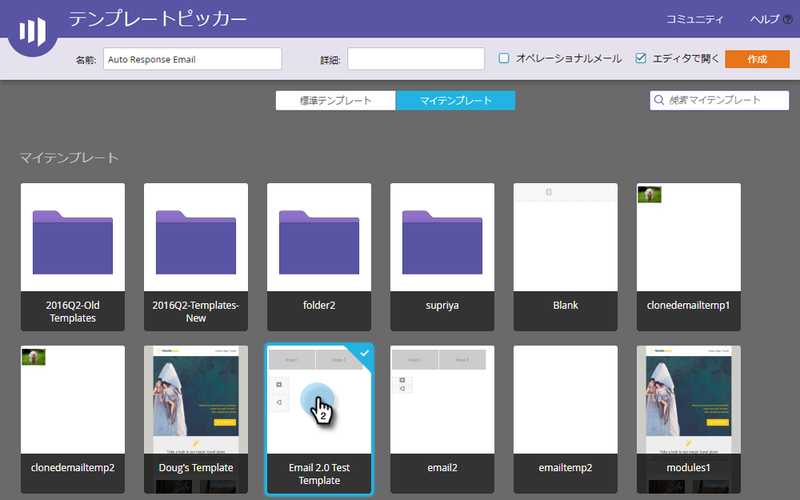
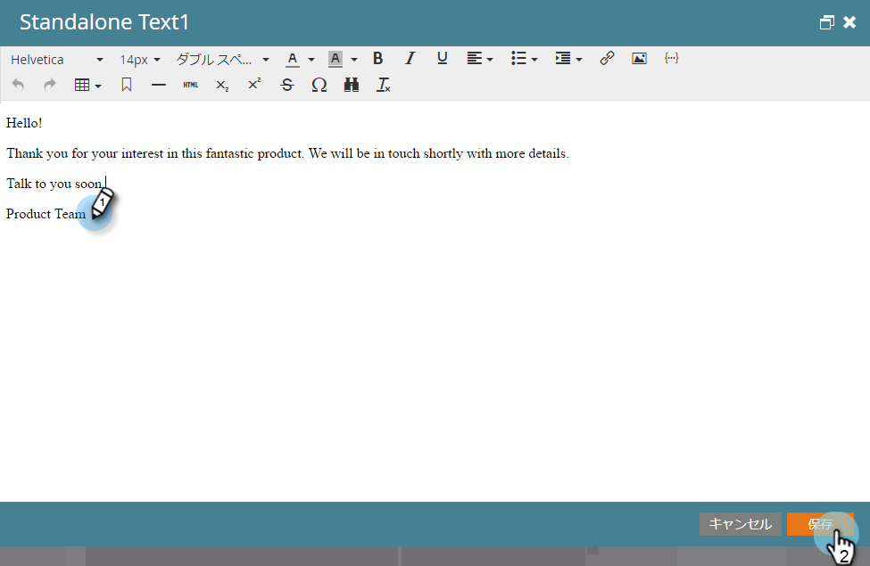
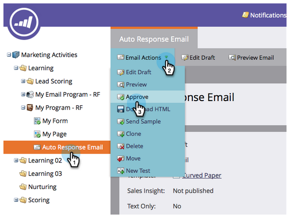
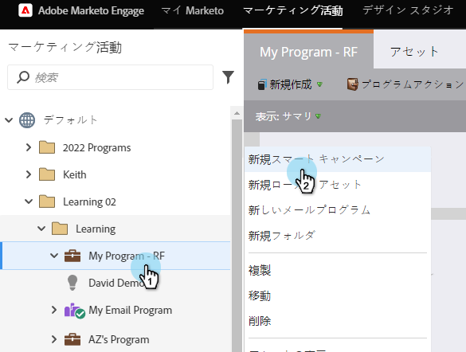
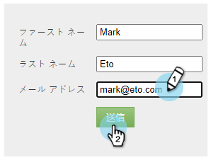

# 電子メールの自動応答 {#email-auto-response}

## ミッション：ユーザーがフォームに記入する際に、お礼の電子メールを送信する {#mission-send-out-a-thank-you-email-when-a-person-fills-out-a-form}

>[!PREREQUISITES]
>
>* [設定と追加人](/help/marketo/getting-started/quick-wins/get-set-up-and-add-a-person.md)
>* [フォームとのランディングページ](/help/marketo/getting-started/quick-wins/landing-page-with-a-form.md)

## 手順1:電子メールの作成 {#step-create-an-email}

1. 「マーケティングアクティビティ」領域に移動します。

   

1. 左のメニューで「マイプログラム」を選択し、「新規」ドロップダウンをクリックして、「新規ローカルアセット」を選択します。

   

1. 「電子メール」をクリックします。

   

1. 電子メールに「Auto Response Email」という名前を付け、テンプレートを選択し、「Create」をクリックします。

   

   電子メールエディターが新しいウィンドウまたはタブで開きます。 ポップアップがブロックされている場合は、アセット概要ページの「ドラフトを **編集** 」をクリックして電子メールにアクセスします。

1. 件名を入力し、重複キーを押しながら電子メールの編集可能な領域をクリックします。

   

   _電子メールエディターの上部にリッチテキストエディターが開きます。_

1. 既存の電子メールコンテンツを強調表示します。

   

1. 電子メールの内容を入力し、「保存」をクリックします。

   

1. 変更が自動保存されます。 「電子メールエディタ」タブまたはウィンドウを閉じます。

   

1. 新しい電子メールを選択します。 「電子メールアクション」で、「承認」をクリックします。

   

## 手順2:スマートキャンペーンの作成 {#step-create-a-smart-campaign}

1. 「 **マイプログラム** 」を右クリックし、「 **新規スマートキャンペーン**」をクリックします。

   

1. **スマートキャンペーンに** 「自動応答キャンペーン」という名前を付け、「 **作成**」をクリックします。

   

1. 「 **スマートリスト** 」タブに移動します。

   

   このキャンペーンは、 [**ランディングページで作成したフォームにフォームを入力するたびに実行されるように設定しています**](/help/marketo/getting-started/quick-wins/landing-page-with-a-form.md)。

1. 「 **Fills Out Form** 」トリガーを探し、左のカンバスにドラッグします。

   

1. ドロップダウン **から** 「マイフォーム」を選択します。 「 **フロー** 」タブをクリックします。

   

1. 「 **電子メールの** 送信」フローアクションを左のキャンバスにドラッグします。

   

1. 「 **自動応答電子メール** 」を選択し、「 **スケジュール** 」タブに移動します。

   

1. 「 **編集**」をクリックします。

   

1. [ **毎回]を選択し** 、[ **保存**]をクリックします。

   

1. 「 **アクティブ化**」をクリックします。

   

1. 確認画面で「 **アクティブ化** 」をクリックします。

   

>[!NOTE]
>
>アクティブにすると、指定したフォームにユーザーが入力するたびに、このキャンペーンが実行されます。 キャンペーンは、非アクティブ化されるまで実行を続けます。

## 手順3:フォームの入力 {#step-fill-out-the-form}

1. 「 **マイページ**」を選択します。 これは、 [ランディングページでForm](/help/marketo/getting-started/quick-wins/landing-page-with-a-form.md) Quick Winと共に作成されました。

   

1. 「 **表示が承認したページ**」をクリックします。

   

   「無償体験版」ランディングページが新しいタブに開きます。

1. 名、姓、電子メールアドレスをフォームに入力し、「 **送信**」をクリックします。

   

>[!NOTE]
>
>電子メールを取得できるように、実際の電子メールアドレスを使用してください。

## ミッション完了 {#mission-complete}

数分以内に、受信トレイに自動応答の電子メールが表示されます。 素晴らしい仕事！

  

[エスケアミッション3:単純スコア](/help/marketo/getting-started/quick-wins/simple-scoring.md)

[ミッション5:リードのリストのインポート…](/help/marketo/getting-started/quick-wins/import-a-list-of-people.md)
