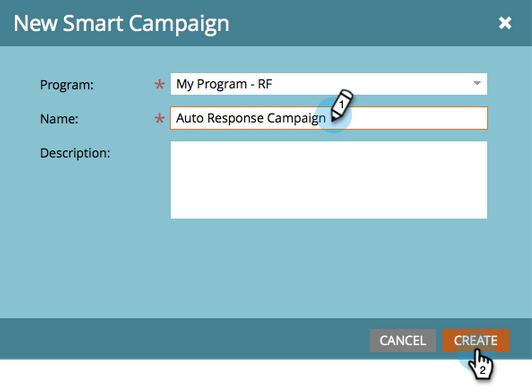
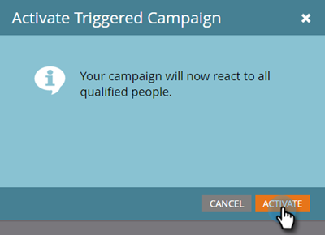

# メールの自動応答 {#email-auto-response}

## ミッション：フォームに入力されたときにお礼メールを送信する {#mission-send-out-a-thank-you-email-when-a-person-fills-out-a-form}

>[!PREREQUISITES]
>
>* [セットアップと人物の追加](/help/marketo/getting-started/quick-wins/get-set-up-and-add-a-person.md){target="_blank"}
>* [フォームを含むランディングページ](/help/marketo/getting-started/quick-wins/landing-page-with-a-form.md){target="_blank"}

## 手順 1：メールを作成する {#step-create-an-email}

1. **[!UICONTROL マーケティングアクティビティ]**&#x200B;領域に移動します。

   

1. 左側のメニューでプログラムを選択し、 **[!UICONTROL 新規]** ドロップダウンで、「 」を選択します。 **[!UICONTROL 新規ローカルアセット]**.

   

1. 「**[!UICONTROL メール]**」を選択します。

   

1. メールに「Auto Response Email」という名前を付け、テンプレートを選択して、 **[!UICONTROL 作成]**.

   

   新しいウィンドウまたはタブでメールエディターが開きます。ポップアップがブロックされている場合は、アセットの概要ページの「**[!UICONTROL 下書きの編集]**」をクリックして、メールにアクセスします。

1. 件名を入力し、メールの編集可能な領域をダブルクリックします。

   

   _リッチテキストエディターが、メールエディターの上に開きます。_

1. 既存のメールコンテンツをハイライトします。

   

1. E メールの内容を入力し、 **[!UICONTROL 保存]**.

   

1. 「**[!UICONTROL メールアクション]**」ドロップダウンをクリックし、「**[!UICONTROL 承認して閉じる]**」を選択します。

   

## 手順 2：アラースマートキャンペーンを作成する {#step-create-a-smart-campaign}

1. プログラムを選択し、 **[!UICONTROL 新規]** ドロップダウンして「 」を選択します。 **[!UICONTROL 新規スマートキャンペーン]**.

   

1. スマートキャンペーンに「自動応答キャンペーン」という&#x200B;**名前を付け**、「**[!UICONTROL 作成]**」をクリックします。

   

1. 「**[!UICONTROL スマートリスト]**」タブに移動します。

   

   [**フォームを含むランディングページ**](/help/marketo/getting-started/quick-wins/landing-page-with-a-form.md){target="_blank"}&#x200B;に作成したフォームに入力されるたびに、このキャンペーンを実行するように設定します。

1. 検索し、 **[!UICONTROL フォームの入力]** トリガーをキャンバスに追加します。

   

1. ドロップダウンから「**[!UICONTROL マイフォーム]**」を選択します。次に、 **[!UICONTROL フロー]** タブをクリックします。

   

1. 「**[!UICONTROL メールを送信]**」フローアクションを左のキャンバスにドラッグします。

   

1. を選択します。 **自動応答メール**. 次に、 **[!UICONTROL スケジュール]** タブをクリックします。

   

1. 「**[!UICONTROL 編集]**」をクリックします。

   

1. 「**[!UICONTROL 毎回]**」を選択して、「**[!UICONTROL 保存]**」をクリックします。

   

1. 「**[!UICONTROL アクティブ化]**」をクリックします。

   

1. 確認画面の「**[!UICONTROL アクティブ化]**」をクリックします。

   

>[!NOTE]
>
>アクティブにすると、指定したフォームに入力されるたびに、このキャンペーンが実行されます。キャンペーンは、無効にされるまで実行を続けます。

## 手順 3:フォームを入力する {#step-fill-out-the-form}

1. 選択 **マイページ** ( これは [フォームを含むランディングページ](/help/marketo/getting-started/quick-wins/landing-page-with-a-form.md){target="_blank"} クイックウィンドウ ) をクリックし、 **[!UICONTROL プレビュー]**.

   

   _「無料体験版」ランディングページが新しいタブで開きます。_

1. 氏名、メールアドレスを使用してフォームに入力し、「**[!UICONTROL 送信]**」をクリックします。

   

>[!NOTE]
>
>メールを受信するには、実際のメールアドレスを使用してください。

## ミッション完了 {#mission-complete}

数分以内に、インボックスに自動応答のメールが表示されます。これで完了です。

  

[◄ ミッション 3：単純スコア](/help/marketo/getting-started/quick-wins/simple-scoring.md)

[ミッション 5：人物のリストのインポート ►](/help/marketo/getting-started/quick-wins/import-a-list-of-people.md)
