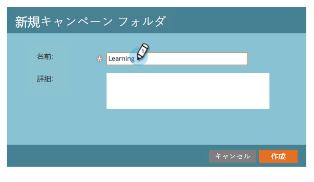
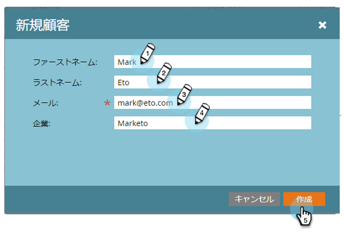

# 設定と担当者の追加 {#get-set-up-and-add-a-person}

ミッションを開始する前に、いくつかの作業が必要です。

## 手順 1:Marketoへのログイン {#step-log-in-to-marketo}

1. [Marketoにログイン](https://app.marketo.com) 電子メールで受け取った資格情報を使用します。

   

## 手順 2:学習フォルダーの作成 {#step-create-a-learning-folder}

ミッションで作成するすべての項目を格納するフォルダーを作成します。

1. **マーケティングアクティビティ**&#x200B;領域に移動します。

   

1. 次をクリック： **新規** ドロップダウンして「 」を選択します。 **新規キャンペーンフォルダ**.

   

1. フォルダーに「Learning」という名前を付け、 **作成**.

   

1. 左側のメニューに新しい「学習」フォルダが表示されます。

   

## 手順 3:自分を人物として追加 {#step-add-yourself-as-a-person}

後でテストメールを自分に送信できるように、Marketoで自分を担当者として追加します。

1. **データベース**&#x200B;領域に移動します。

   

1. 次をクリック： **新規** ドロップダウンして「 」を選択します。 **新規担当者**.

   

1. 氏名、E メールアドレス、会社名を入力し、 **作成** 自分を個人として追加する。

   

   >[!CAUTION]
   >
   >Marketo **not** は、絵文字を含む電子メールアドレスをサポートします。

1. 担当者を表示するには、左側のメニューで [ システムスマートリスト ] を開き、[ すべての担当者 ] をクリックします。

   

1. 「**リード**」タブをクリックします。データベース内に自分が表示されているはずです。

   

## 設定完了 {#set-up-complete}

最初のミッションを開始する準備が整いました。

  

[ミッション 1:メールの一斉送信►](/help/marketo/getting-started/quick-wins/send-an-email.md)
