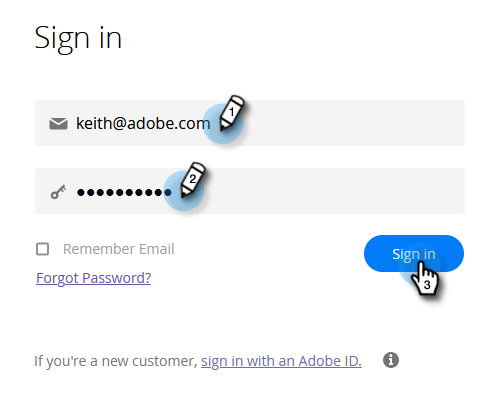
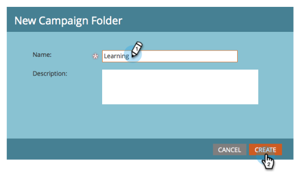
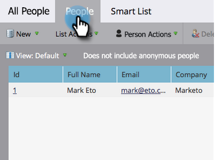

# セットアップと人物の追加 {#get-set-up-and-add-a-person}

ミッションを開始する前に、いくつかの作業が必要です。

## 手順 1：Marketo Engage にログインする {#step-log-in-to-marketo}

1. メールで受け取った資格情報を使用して、[Marketo Engage にログインします](https://app.marketo.com){target="_blank"}。

   

## 手順 2：学習フォルダーを作成する {#step-create-a-learning-folder}

ミッションで作成するものを格納するフォルダーを作成します。

1. 「**[!UICONTROL マーケティング活動]**」領域に移動します。

   

1. **[!UICONTROL 新規]**&#x200B;ドロップダウンをクリックして、**[!UICONTROL 新規キャンペーンフォルダー]**&#x200B;を選択します。

   

1. フォルダーに「学習」という名前を付け、「**[!UICONTROL 作成]**」をクリックします。

   

1. 左側のメニューに新しい「学習」フォルダーが表示されます。

   

## 手順 3：自分を人物として追加する {#step-add-yourself-as-a-person}

後でテストメールを自分に送信できるように、Marketo で自分を人物として追加します。

1. 「**[!UICONTROL データベース]**」領域に移動します。

   

1. **[!UICONTROL 新規]**&#x200B;ドロップダウンをクリックして、**[!UICONTROL 新規人物]**&#x200B;を選択します。

   

1. 氏名、メールアドレス、会社名を入力し、「**[!UICONTROL 作成]**」をクリックして自分を人物として追加します。

   

   >[!CAUTION]
   >
   >* メールアドレスには、ASCII 文字のみを含める必要があります。
   >
   >* Marketo は、絵文字を含むメールアドレスを&#x200B;**サポートしていません**。

1. 人物を表示するには、左側のメニューで「[!UICONTROL システムスマートリスト]」を開き、「**[!UICONTROL すべての人物]**」をクリックします。

   

1. 「**[!UICONTROL リード]**」タブをクリックします。 データベース内に自分が表示されているはずです。

   

## 設定完了 {#set-up-complete}

あなたの最初のミッションを開始する準備ができています！

  

[ミッション 1：一斉配信メールの送信 ►](/help/marketo/getting-started/quick-wins/send-an-email.md)
