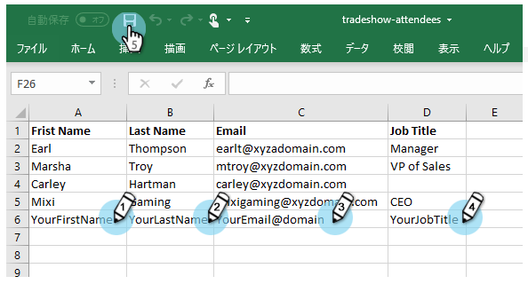
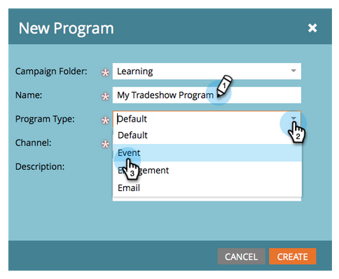
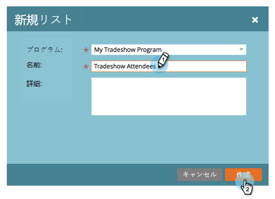
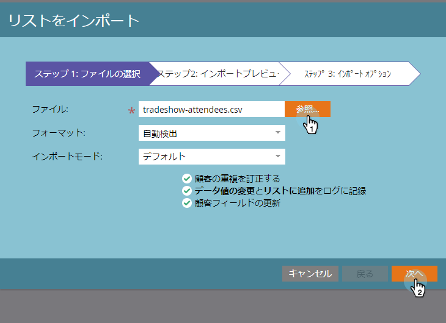
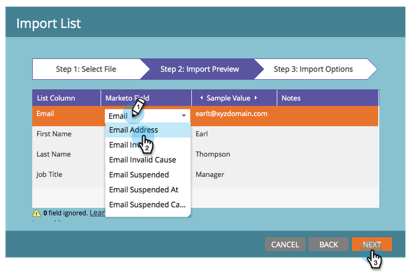

# 人物のリストの読み込み {#import-a-list-of-people}

## ミッション：トレードショーの出席者のスプレッドシートリストをデータベースに読み込む {#mission-import-a-spreadsheet-list-of-trade-show-attendees-into-your-database}

>[!PREREQUISITES]
>
>[セットアップと人物の追加](/help/marketo/getting-started/quick-wins/get-set-up-and-add-a-person.md)

このチュートリアルでは、スプレッドシートファイルから Marketo に人物を読み込む方法を学びます。

## 手順 1：スプレッドシートをダウンロード／編集する {#step-download-and-edit-a-spreadsheet}

1. まず、練習用のスプレッドシートファイル（[**tradeshow-attendees.csv**](/help/marketo/getting-started/assets/tradeshow-attendees.csv)）を PC にダウンロードしてください。

   

   >[!NOTE]
   >
   >日付を読み込む場合は、次の形式を使用します。**9/21/20**（月/日/年）。

   >[!NOTE]
   >
   >読み込まれる日時フィールドは、すべて米中央時間として扱われます。日時フィールドのタイムゾーンが異なる場合、Excel の数式を使用して、中央時刻（米国／シカゴ）に変換できます。

1. 自分の名、姓、メールアドレス、役職を追加して、ファイルを PC に保存します。

   

>[!NOTE]
>
>CSV ファイルに実際のメールアドレスを入力し、次のミッションで送信するメールを受信できるようにします。

## 手順 2：プログラムを作成する {#step-create-a-program}

1. **マーケティングアクティビティ**&#x200B;領域に移動します。

   

1. **学習**&#x200B;フォルダーを選択し、「**新規**」で「**新規プログラム**」をクリックします。

   

1. プログラムに「トレードショープログラム」と&#x200B;**名前を付け**、「**プログラムタイプ**」に「イベント」を選択します。

   

1. 「**チャネル**」で「**トレードショー**」を選択し、「**作成**」をクリックします。

   

>[!NOTE]
>
>イベントプログラムは特定の日に発生します。[**イベント**](/help/marketo/product-docs/demand-generation/events/understanding-events/understanding-event-programs.md)&#x200B;の詳細をご覧ください。

## 手順 3：スプレッドシートを Marketo に読み込む {#step-import-your-spreadsheet-into-marketo}

1. **トレードショープログラム**&#x200B;で、「**新規**」をクリックし、「**新規ローカルアセット**」を選択します。

   

1. 「**リスト**」をクリックします。

   

1. リストに「トレードショー参加者」という&#x200B;**名前を付け**、「**作成**」をクリックします。

   

1. **トレードショー参加者**&#x200B;リストで、「**リストアクション**」をクリックし、「**リストの読み込み**」を選択します。

   

   >[!CAUTION]
   >
   >独自の CSV ファイルを使用する場合は、エンコーディングが UTF-8、UTF-16、Shift-JIS、EUC-JP のいずれかであることを確認します。

   >[!NOTE]
   >
   >CSV ファイルのサイズの上限は 100MB です。

1. **PC  上の****tradeshow-attendees.csv** スプレッドシートファイルを参照し、「**次へ**」をクリックします。

   

   >[!NOTE]
   >
   >リストの読み込みモードで「**新しい人物とアップデートをスキップ**」を選択すると、既存の人物の記録やアクティビティのログには影響しません。マーケティングアクティビティで使用する既存の人物の、事前にフィルターされた迅速な静的リストを必要とする場合は、このモードを使用します。このモードを選択すると、次の操作がおこなわれます。
   >
   > * 新規人物の作成をスキップ
   > * 人物フィールドの更新をスキップ
   > * アクティビティログへの記録をスキップ

1. 「リスト列」フィールドをそれぞれの Marketo フィールドにマッピングし、「**次へ**」をクリックします。

   

   >[!TIP]
   >
   >最適な自動マッピング結果を得るには、列ヘッダーは、常にフィールドと完全に一致する（大文字と小文字を区別）必要があります。カスタムフィールドを使用していて、ドロップダウンに表示されていない場合は、オプションになるように、戻って[作成](/help/marketo/product-docs/administration/field-management/create-a-custom-field-in-marketo.md)します。

   >[!NOTE]
   >
   >読み込まないフィールドがある場合は、Marketo フィールドドロップダウンメニューで「**無視**」を選択します。

1. **獲得プログラム**&#x200B;に&#x200B;**マイトレードショープログラム**&#x200B;を選択し、「**読み込み**」をクリックします。

   

1. ユーザーが読み込むのを待ってから、読み込みの進行状況ポップアップを閉じます。

   

1. **トレードショープログラム**&#x200B;に戻り、「**メンバー**」タブをクリックします。読み込んだすべての人物が表示されます。

   

>[!NOTE]
>
>プログラムのメンバーシップを追跡することで、プログラムの成功を分析できます。[**プログラム**](/help/marketo/product-docs/core-marketo-concepts/programs/creating-programs/understanding-programs.md)&#x200B;の詳細をご覧ください。

## ミッション完了 {#mission-complete}

トレードショーの出席者は、Marketo プログラムのメンバーになりました。

  

[◄ ミッション 4：メールの自動応答](/help/marketo/getting-started/quick-wins/email-auto-response.md)

[ミッション 6：ドリップ、ドリップ、ナーチャリング ►](/help/marketo/getting-started/quick-wins/drip-drip-nurture.md)
