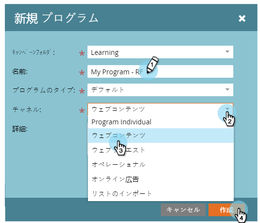
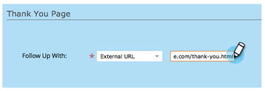
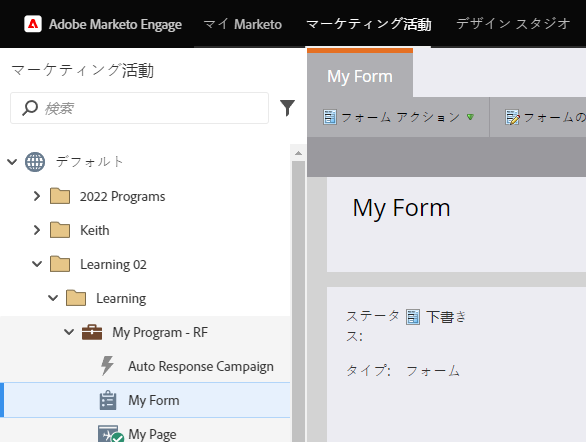
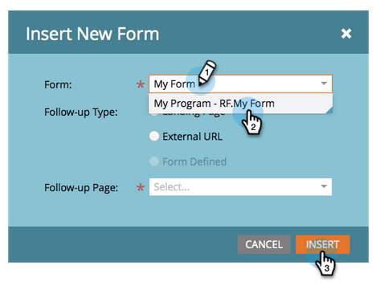
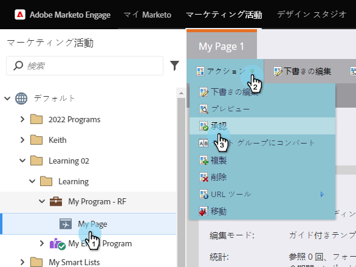
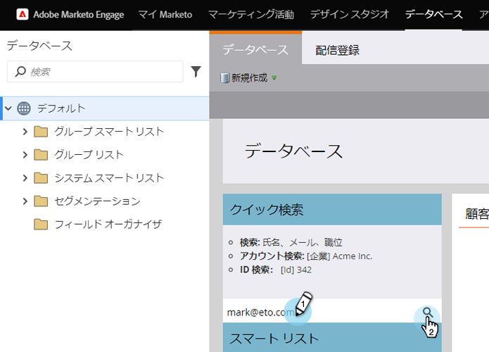

# フォームを含むランディングページ {#landing-page-with-a-form}

## ミッション：新しいリードを獲得するためのフォームを含むランディングページを作成する {#mission-create-a-landing-page-with-a-form-to-acquire-new-people}

>[!PREREQUISITES]
>
>[セットアップと人物の追加](/help/marketo/getting-started/quick-wins/get-set-up-and-add-a-person.md)

## 手順 1：プログラムの作成 {#step-create-a-program}

1. **マーケティングアクティビティ**&#x200B;領域に移動します。

   

1. [以前のクイックウィン](/help/marketo/getting-started/quick-wins/send-an-email.md)で作成した&#x200B;**学習**&#x200B;フォルダーを選択します。

   

1. 「**新規**」で、「**新規プログラム**」をクリックします。

   

1. プログラム&#x200B;**名**&#x200B;を入力し、**チャネル**&#x200B;を選択して、**作成**&#x200B;をクリックします。

   >[!NOTE]
   >
   >プログラム名の最後にイニシャルを含めて、一意にします。

   

   >[!NOTE]
   >
   >プログラムは、特定のマーケティングイニシアチブの 1 つです。**チャネル**&#x200B;は、ウェビナー、スポンサーシップ、オンライン広告などの配信メカニズムを意図しています。独自のインスタンスで使用可能なチャネルに応じて、ドロップダウンに異なるチャネルオプションが表示される場合があります。[独自のチャネル](/help/marketo/product-docs/administration/tags/create-a-program-channel.md)を作成することもできます。

   

これで完了です。プログラムを作成したら、次にコンテンツを作成します。

## 手順 2：フォームの作成 {#step-create-a-form}

1. プログラムを選択した状態で、「**新規**」、「**新規ローカルアセット**」の順にクリックします。

   

1. 「**フォーム**」を選択します。

   

1. フォーム&#x200B;**名前**&#x200B;を入力し、「**作成**」をクリックします。

   

   >[!NOTE]
   >
   >「**エディターで開く**」ボックスがオンになっていることを確認します。そうでない場合は、「**フォームを編集**」タブをクリックする必要があります。

   >[!TIP]
   >
   >フォームエディターが表示されない場合お使いのブラウザーでウィンドウがブロックされている可能性があります。ブラウザーで [app.marketo.com](https://app.marketo.com/) からのポップアップを有効にし、上部のメニューバーで「ドラフトを編集」をクリックします。

1. 「**メールアドレス**」フィールドを選択し、「**必須**」をオンにします。

   

1. 「**次へ**」をクリックします。

   

1. 矢印をクリックしてテーマ間をスクロールします。1 つ選択します。

   

1. 「**次へ**」をクリックします。

   

1. ありがとうページセクションの「**フォローアップ**」で「**外部 URL**」を選択します。

   

1. URL を入力します。

   

   >[!NOTE]
   >
   >フォームの入力後に訪問者がリダイレクトされるフォローアップページです。外部 URL は 1 つのオプションですが、他のオプションもあります。[フォームのありがとうございましたページの設定](/help/marketo/product-docs/demand-generation/forms/creating-a-form/set-a-form-thank-you-page.md)を参照してください。

1. 「**完了**」をクリックします。

   

1. 「**承認して閉じる**」をクリックします。

   

   完了です。これで、フォームを含むプログラムが作成されました。次に、ページを作成します。

   

## 手順 3：ランディングページの作成とフォームの追加 {#step-create-a-landing-page-and-add-your-form}

1. プログラムを選択した状態で、「**新規**」、「**新規ローカルアセット**」の順にクリックします。

   

1. 「**ランディングページ**」を選択します。

   

1. ページ&#x200B;**名**&#x200B;を入力し、テンプレートを選択して、「**作成**」をクリックします。

   >[!NOTE]
   >
   >スクリーンショットのテンプレートとは異なるテンプレートがあっても問題ありません。1 つ選択して、続行します。

   

1. ランディングページエディターが開いたら、フォーム要素をキャンバスにドラッグします。

   

1. フォームを探して選択し、「**挿入**」をクリックします。

   

1. フォームを目的の場所にドラッグします。

   

1. 変更内容はすべて自動保存されます。フォームエディターのタブ／ウィンドウを閉じます。

   

   完成です。フォームを含むランディングページが作成されています。ページを承認して公開します。

## 手順 4：ランディングページの承認 {#step-approve-your-landing-page}

1. ランディングページを選択し、「**ランディングページのアクション**」で「**承認**」をクリックします。

   >[!NOTE]
   >
   >ランディングページは承認されると公開され、インターネット上でアクセスできるようになります。

   

   完璧です。緑のチェックマークが見えますか。

   

## 手順 5：フォームのテスト {#step-test-your-form}

1. ランディングページを選択し、「**承認済みページを表示**」をクリックします。

   

1. フォームに一意な情報を入力し、「**送信**」をクリックします。

   

1. **データベース**&#x200B;領域に移動します。

   

1. フォームの入力時に使用した一意のメールアドレスを検索します。

   

   ありました。次に、フォームを含む新しいランディングページを作成し、それを使用して新規人物を生成します。

   

## ミッション完了です。 {#mission-complete}

 

[◄ 一斉配信メールの送信](/help/marketo/getting-started/quick-wins/send-an-email.md)

[単純スコア►](/help/marketo/getting-started/quick-wins/simple-scoring.md)
