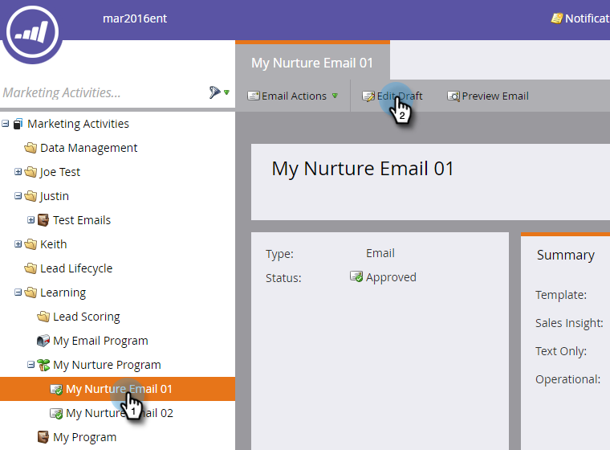
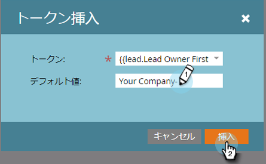
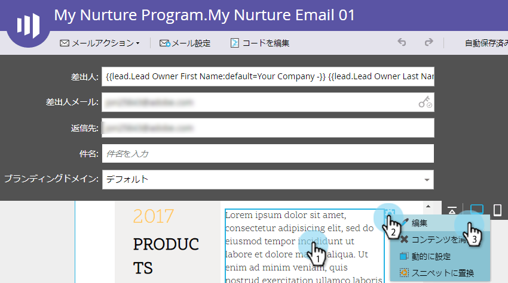
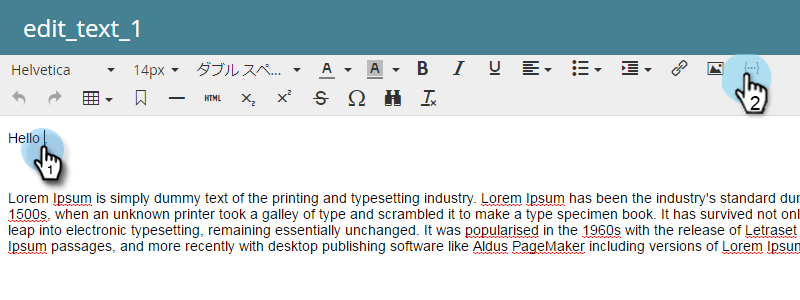

# 電子メールのパーソナライズ {#personalize-an-email}

## ミッション：データトークンを追加して電子メールを個人用にする {#mission-make-your-emails-personal-by-adding-data-tokens}

>[!NOTE]
>
>**FYI**
>
>Marketoは現在、すべての購読で言語を標準化しているので、購読およびdocs.marketo.comの人物/人物にリード/リードを表示できます。 これらの用語は同じことを意味し、記事の説明には影響しません。 他にも変化がある。 [詳細情報](http://docs.marketo.com/display/DOCS/Updates+to+Marketo+Terminology)。

>[!PREREQUISITES]
>
>* [設定と追加人](get-set-up-and-add-a-person.md)
>* [Eメール送信](send-an-email.md)
>* [ドリップ、ドリップ、ナーチャー](drip-drip-nurture.md)

## 手順1:パーソナライズする電子メールの選択 {#step-select-an-email-to-personalize}

1. [前のクイックウィンドウで作成されたはぐくみ電子メールの1つを選択し](drip-drip-nurture.md) 、「ドラフトを **編集**」をクリックします。

   

   >[!NOTE]
   >
   >これにより、電子メールのコピーがドラフトとして作成されます。 変更を有効にするには、下書きを承認する必要があります。

   **ドラフトを編集**

ポップアップブロッカーを有効にしていない場合は、電子メールエディターが新しいタブまたはウィンドウで開きます。 それ以外の場合は、2回クリックします。

## 手順2:販売員を送信者にする {#step-make-the-salesperson-the-sender}

1. 「 **From** 」フィールドを選択し、現在の名前をハイライト表示して **削除します** 。

   

1. 「 **From** 」フィールドの右側にある「 **Token** 」アイコンをクリックします。

   

1. トークンを探して選択し **`{{lead.Lead Owner First Name}}`** ます。

   

1. 会社名と **デフォルト値** （ダッシュ）を入力し、販売担当者の名が使用できない場合に何かが表示されるようにします。 [ **挿入**]をクリックします。

   

1. 「 **開始** 」フィールドのスペースバーを押し、挿入したトークンの1スペース後にカーソルが点滅していることを確認します。 次に、「 **Token** 」アイコンを再度クリックします。

   

1. トークンを探して選択し **`{{lead.Lead Owner Last Name}}`** ます。

   

1. 「 **デフォルト値** 」に「Sales」と入力し、「 **挿入**」をクリックします。

   

## 手順3:電子メ追加ールへのリードの名前 {#step-add-the-leads-name-to-the-email}

1. 編集可能な上部のセクションを選択し、歯車アイコンをクリックして「 **編集**」を選択します。

   

1. 「追加Hello」の後ろにスペースを入れ、カーソルをカンマの前に置き、「 **Insert Token** 」アイコンをクリックします。

   

1. トークンを探して選択し **`{{lead.First Name}}`** ます。

   

1. 「 **デフォルト値** 」フィールドに「友達」（または任意のラベル）と入力し、「 **挿入**」をクリックします。

   

   >[!TIP]
   >
   >トークンのデフォルト値を常に含める。これにより、個人情報の一部が欠落している場合に、デフォルト値が電子メールに表示されます。

1. 「 **保存**」をクリックします。

   

1. 「電子メールエディタ」タブまたはウィンドウを閉じます。

   

1. 「 **電子メールアクション**」で、「 **ドラフトの承認**」を選択します。

   

>[!TIP]
>
>メールの送信方法について簡単な更新が必要ですか？ Send an Email Blastを参照して [ください](send-an-email.md)。

### ビデオの視聴 {#watch-a-video}

`<iframe width="630" height="470" src="//play.vidyard.com/iRnqxMyJg6VKyuPeuxmHFb.html?v=3.1.1" frameborder="0" allowfullscreen></iframe>`

### ミッション完了 {#mission-complete}

メールをパーソナライズしました。

  

[エスケアミッション6:Drip、Drip、Nurture](drip-drip-nurture.md) [Mission 8:販売担当者への警告jpk向け](alert-the-sales-rep.md)