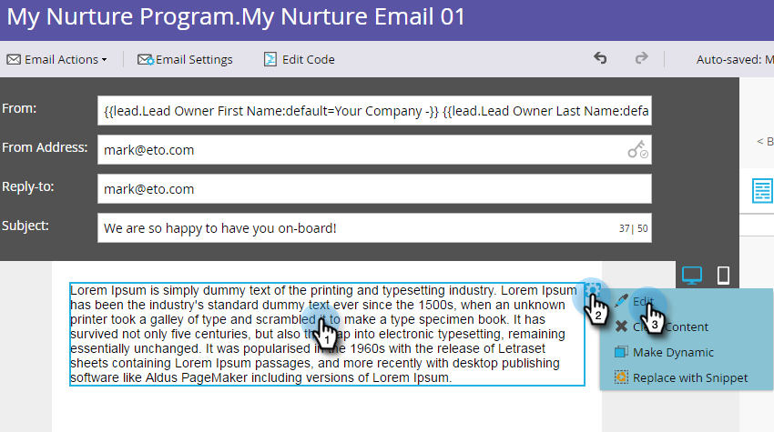

# メールのパーソナライズ {#personalize-an-email}

## ミッション：データトークンを追加してメールを個人用にする {#mission-make-your-emails-personal-by-adding-data-tokens}

>[!PREREQUISITES]
>
>* [セットアップと人物の追加](/help/marketo/getting-started/quick-wins/get-set-up-and-add-a-person.md){target=&quot;_blank&quot;}
>* [一斉配信メールの送信](/help/marketo/getting-started/quick-wins/send-an-email.md){target=&quot;_blank&quot;}
>* [ドリップ、ドリップ、ナーチャリング](/help/marketo/getting-started/quick-wins/drip-drip-nurture.md){target=&quot;_blank&quot;}

## 手順 1：パーソナライズするメールを選択 {#step-select-an-email-to-personalize}

1. [以前のクイックウィン](/help/marketo/getting-started/quick-wins/drip-drip-nurture.md){target=&quot;_blank&quot;}で作成したナーチャリングメールの 1 つを選択し、「**下書きの作成**」をクリックします。

   

   >[!NOTE]
   >
   >これにより、メールのコピーが下書きとして作成されます。忘れずに下書きを承認して、変更を有効にします。

ポップアップブロッカーを有効にしていない場合、メールエディターは新しいタブまたはウィンドウで開きます。それ以外の場合は、「**下書きの作成**」を 2 回クリックします。

## 手順 2：セールス担当者を送信者にする {#step-make-the-salesperson-the-sender}

1. 「**送信者**」フィールドを選択してハイライト表示し、現在の名前を&#x200B;**削除**&#x200B;します。

   

1. 「**送信者**」フィールドの右側にある「**トークン**」アイコンをクリックします。

   

1. **`{{lead.Lead Owner First Name}}`** トークンを検索して選択します。

   

1. **デフォルト値**&#x200B;には会社名とダッシュを入力し、セールス担当者の名前（名）が使用できない場合に何か表示されるようにします。次に「**挿入**」をクリックします。

   

1. 「**送信者**」フィールドでスペースバーを押し、挿入したトークンの後に 1 つスペースを空けてカーソルが点滅していることを確認します。次に、「**トークン**」アイコンを再度クリックします。

   

1. **`{{lead.Lead Owner Last Name}}`** トークンを検索して選択します。

   

1. 「**デフォルト値**」に「セールス」と入力し、「**挿入**」をクリックします。

   

## 手順 3：メールにリードの名前を追加する {#step-add-the-leads-name-to-the-email}

1. 上部の編集可能セクションを選択し、歯車アイコンをクリックして、「**編集**」を選択します。

   

1. 「Hello」の後にスペースを追加し、カーソルをコンマの前に置いて、「**トークンを挿入**」アイコンをクリックします。

   

1. **`{{lead.First Name}}`** トークンを検索して選択します。

   

1. 「**デフォルト値**」フィールドに「友人」（または任意のラベル）と入力し、「**挿入**」をクリックします。

   

   >[!TIP]
   >
   >トークンのデフォルト値を必ず含めるようにします。これにより、個人情報の一部が見つからない場合に、デフォルト値がメールに表示されます。

1. 「**保存**」をクリックします。

   

1. 「**メールアクション**」で、「**承認して閉じる**」を選択します。

   

>[!TIP]
>
>自分自身にメールを送信する方法について、簡単な情報が必要な場合は、[一斉配信メールの送信](/help/marketo/getting-started/quick-wins/send-an-email.md){target=&quot;_blank&quot;}を参照してください。

### ミッション完了 {#mission-complete}

おめでとうございます。メールをパーソナライズしました。

  

[◄ ミッション 6：ドリップ、ドリップ、ナーチャリング](/help/marketo/getting-started/quick-wins/drip-drip-nurture.md)

[ミッション 8：セールス担当者にアラート ►](/help/marketo/getting-started/quick-wins/alert-the-sales-rep.md)
