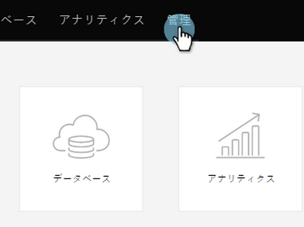

# ランディングページのリダイレクト {#redirect-a-landing-page}

## ミッション：ランディングページを別のWebページにリダイレクトする {#mission-redirect-a-landing-page-to-a-different-web-page}

>[!NOTE]
>
>**必要な管理者権限**

>[!NOTE]
>
>**前提条件**
>
>* [設定と追加人](get-set-up-and-add-a-person.md)
>* [フォームとのランディングページ](landing-page-with-a-form.md)
>* [CNAMEを使用したランディングページURLのカスタマイズ](../../product-docs/demand-generation/landing-pages/landing-page-actions/customize-your-landing-page-urls-with-a-cname.md)

>

## 手順1:新しいリダイレクトルールの開始 {#step-start-a-new-redirect-rule}

1. 「 **管理者** 」領域に移動します。

   

1. 「**ランディングページ**」に移動

   

1. 「 **ルール** 」タブをクリックし、「 **新規** 」および「 **新規リダイレクトルール**」をクリックします。

   

## 手順2:リダイレクトルールの定義 {#step-define-the-redirect-rule}

1. 最初の「**元のURL **」ドロップダウンをクリックし、「マーケティング先CNAME」を選択します。

   

   >[!NOTE]
   >
   >**Reminder**
   >
   >
   >リダイレクトできるのは、Marketto [CNAMEとの開始をランディングページにリダイレクトすることだけです](../../product-docs/demand-generation/landing-pages/landing-page-actions/customize-your-landing-page-urls-with-a-cname.md)。

1. 2つ目の「**元のURL **」ドロップダウンをクリックし、リダイレクトするランディングページを選択します。

   

1. 「 **リダイレクトURL** 」で、リダイレクト先のページを選択し、「 **作成**」をクリックします。

   

## ミッション完了 {#mission-complete}

おめでとう！ ランディングページのリダイレクトに成功しました。

  

[エスカン・ミッション9:リードデータの更新](update-person-data.md)