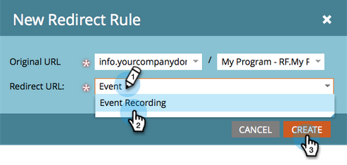

# ランディングページのリダイレクト {#redirect-a-landing-page}

## ミッション：ランディングページを別の web ページにリダイレクトする {#mission-redirect-a-landing-page-to-a-different-web-page}

>[!NOTE]
>
>**管理者権限が必要**

>[!PREREQUISITES]
>
>* [フォームを含むランディングページ](/help/marketo/getting-started/quick-wins/landing-page-with-a-form.md){target=&quot;_blank&quot;}
>* [CNAME を使用したランディングページ URL のカスタマイズ](/help/marketo/product-docs/demand-generation/landing-pages/landing-page-actions/customize-your-landing-page-urls-with-a-cname.md){target=&quot;_blank&quot;}

## 手順 1：新しいリダイレクトルールを開始する {#step-start-a-new-redirect-rule}

1. 「**管理者**」領域に移動します。

   

1. 「**ランディングページ**」に移動します。

   

1. 「**ルール**」タブをクリックし、「**新規**」および「**新規リダイレクトルール**」をクリックします。

   

## 手順 2：リダイレクトルールを定義する {#step-define-the-redirect-rule}

1. 最初の「**オリジナル URL**」ドロップダウンリストから、「Marketo CNAME」 を選択します。

   

   >[!NOTE]
   >
   >Marketoで始まるランディングページのみをリダイレクトできます。 [CNAME](/help/marketo/product-docs/demand-generation/landing-pages/landing-page-actions/customize-your-landing-page-urls-with-a-cname.md){target=&quot;_blank&quot;}。

1. 2 つ目の「**オリジナル URL**」ドロップダウンリストから、リダイレクトするランディングページを選択します。

   

1. 「**リダイレクト URL**」から、リダイレクト先のページを選択し、「**作成**」をクリックします。

   

## ミッション完了 {#mission-complete}

おめでとうございます！ランディングページが正常にリダイレクトされました。

  

[◄ミッション 9：リードデータの更新](/help/marketo/getting-started/quick-wins/update-person-data.md)
