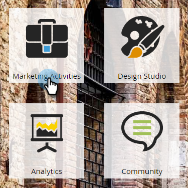
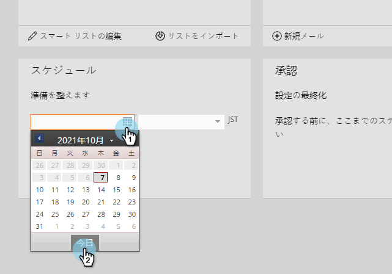
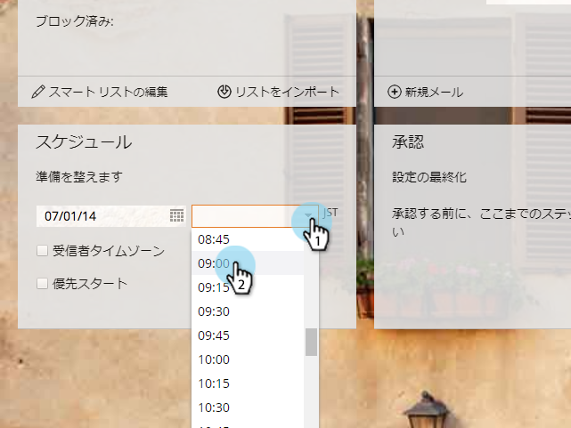
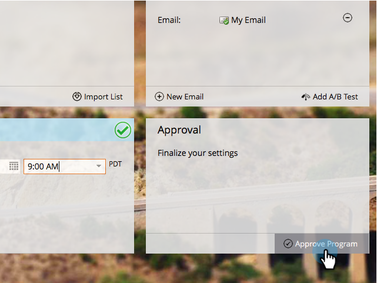

# 電子メールの送信 {#send-an-email}

みんなが最初にやりたいこと。 MarketoからEメールを送信します。

>[!PREREQUISITES]
>
>[設定と追加人](/help/marketo/getting-started/quick-wins/get-set-up-and-add-a-person.md)

## 電子メールプログラムの作成 {#create-an-email-program}

1. 「 **マーケティングアクティビティ** 」領域に移動します。

   

1. [ **学習** ]フォルダを選択します。 「 **新規** 」ドロップダウンをクリックし、「 **新規プログラム**」を選択します。

   

1. 「 **名前** 」を入力し、「 **プログラムタイプ** 」で「電子メール **」を選択します。**

   >[!TIP]
   >
   >プログラム名追加の末尾にあるイニシャルを一意にします。

   

1. 「 **チャネル**」で「 **電子メール送信** 」を選択し、「 **作成**」をクリックします。

   

## オーディエンスの定義 {#define-your-audience}

1. オーディエンスタイルの下にある「スマートリストを **編集** 」をクリックします。

   

1. 電子メールアドレスフィルターを探して、キャンバスにドラッグします。

   

   >[!TIP]
   >
   >フィルターリストの上部にある **検索** (Search)を使用すると、フィルターをより簡単に見つけることができます。

1. 電子メールアドレスを探して選択します。

   

   >[!NOTE]
   >
   >電子メールに自動入力が行われない場合は、「設定とリードの設定を忘れた可能性があり追加ます。 

   >[!NOTE]
   >
   >この例では、自分自身にのみ電子メールを送信するように設定していますが、必要に応じてオーディエンスをカスタマイズできます。

1. メインプログラムタブに戻り、「 **個人**」の更新アイコンをクリックします。

   

   人数が1まで増えるのが見えるはずです。 お前だ！

## 電子メールの作成 {#create-an-email}

1. 「電子メール」タイルの下にある「 **新規電子メール**」をクリックします。

   

1. **名前を入力し**、 **テンプレートを選択して**、「 ****&#x200B;作成」をクリックします。

   

1. 電子メールエディターウィンドウが開きます。 50文字以下の件名を入力します（推奨）。

   

   >[!NOTE]
   >
   >ポップアップブロッカーがある場合は、「ドラフトを **編集** 」をクリックして電子メールエディターを開きます。

1. 編集する領域を選択し、右側の歯車アイコンをクリックして、「 **編集** 」を選択します(編集するには、編集可能なセクションを重複クリックして選択することもできます)。

   

1. 目的のコンテンツを入力し、「 **保存**」をクリックします。

   

1. 変更は自動保存されます。 エディターのタブまたはウィンドウを閉じます。

   

1. 「 **電子メールアクション** 」ドロップダウンをクリックし、「 **承認**」を選択します。

   

   >[!TIP]
   >
   >起動前の電子メールの外観を簡単に確認するために、サンプルを自分に送信します。 上のメニューで **「サンプルを** 送信 **」を選択するか、「** 電子メールアクション [**」、「サンプルを**](/help/marketo/product-docs/email-marketing/general/creating-an-email/send-a-sample-email.md)&#x200B;送信」の順にクリックします。

1. 左のツリーで[電子メール]プログラムを選択します。

   

1. スケジュールタイルで、電子メールの開始日を **今日に設定します。**

   

1. 15分以上経過する日時を選択します。

   

   >[!TIP]
   >
   >デフォルトのタイムゾーンはお客様のものではありませんか。 ここで [更新する方法を説明します](/help/marketo/product-docs/administration/settings/select-your-language-locale-and-time-zone.md)。

1. 「承認」タイルの **下にある「プログラムの** 承認」をクリックすると、完了です。

   

スケジュールされた日時の後すぐに電子メールを受信します。

  

[áget Set Up and 追加 a Lead](/help/marketo/getting-started/quick-wins/get-set-up-and-add-a-person.md)

[フォーム付きのランディングページ``](/help/marketo/getting-started/quick-wins/landing-page-with-a-form.md)
