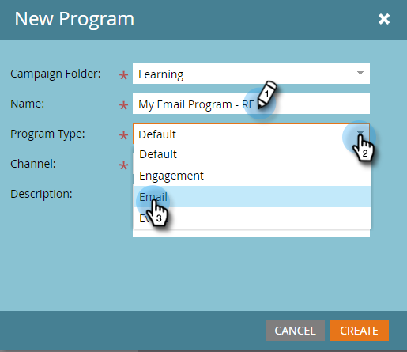

# メールの送信 {#send-an-email}

みんなが最初にやりたがる事です。Marketo からメールを送信しましょう。

>[!PREREQUISITES]
>
>[セットアップと人物の追加](/help/marketo/getting-started/quick-wins/get-set-up-and-add-a-person.md){target=&quot;_blank&quot;}

## メールプログラムの作成 {#create-an-email-program}

1. **マーケティングアクティビティ**&#x200B;領域に移動します。

   

1. **学習**&#x200B;フォルダーを選択します。「**新規**」ドロップダウンをクリックして、「**新規プログラム**」を選択します。

   

1. **名前**&#x200B;を入力し、「**プログラムタイプ**」で「**メール**」を選択します。

   >[!TIP]
   >
   >プログラム名の最後にイニシャルを追加して、一意にします。

   

1. 「**チャネル**」で「**メール送信**」を選択し、「**作成**」をクリックします

   

## オーディエンスの定義 {#define-your-audience}

1. 「オーディエンス」タイルの下にある「**スマートリストを編集**」をクリックします。

   

1. 「電子メールアドレス」フィルターを見つけて、キャンバスにドラッグします。

   

   >[!TIP]
   >
   >以下を使用： **検索** 関数を使用して、フィルターをより簡単に検索できます。

1. 自分のメールアドレスを探して選択します。

   

   >[!NOTE]
   >
   >メールが自動入力されない場合は、[リードの設定と追加を行っていないことが考えられます。](/help/marketo/getting-started/quick-wins/get-set-up-and-add-a-person.md){target=&quot;_blank&quot;}

   >[!NOTE]
   >
   >この例では、自分に対してのみメールを送信するようにしていますが、オーディエンスは必要に応じてカスタマイズできます。

1. メインのプログラムタブに戻り、「**人物**」の更新アイコンをクリックします。

   

   人物が 1 と表示されます。あなたのことです。

## メールの作成 {#create-an-email}

1. 「メール」タイルで、「**新規メール**」をクリックします。

   

1. 「**名前**」を入力し、**テンプレート**&#x200B;を選択して「**作成**」をクリックします。

   

1. メールエディターウィンドウが開きます。50 文字以下の件名を入力します（推奨）。

   

   >[!NOTE]
   >
   >ポップアップブロッカーがある場合は、「**下書きの編集**」をクリックして、メールエディターに入ります。

1. 編集する領域を選択し、右側の歯車アイコンをクリックして、「**編集**」を選択します（編集可能セクションをダブルクリックして編集することもできます）。

   

1. 目的のコンテンツを入力し、「**保存**」をクリックします。

   

1. 「**メールアクション**」ドロップダウンをクリックし、「**承認して閉じる**」を選択します。

   

   >[!TIP]
   >
   >ローンチ前にサンプルを自分に送信して、メールがどのように表示されるかを確認するには、選択 **サンプルを送信** 上のメニューで、または **メールアクション** その後 [**サンプルを送信**](/help/marketo/product-docs/email-marketing/general/creating-an-email/send-a-sample-email.md){target=&quot;_blank&quot;}。

1. 左側のツリーで「メールプログラム」を選択します。

   

1. 「スケジュール」タイルで、メールのローンチ日を「**今日**」に設定します。

   

   >[!NOTE]
   >
   >詳細情報： [受信者タイムゾーン](/help/marketo/product-docs/email-marketing/email-programs/email-program-actions/scheduling-with-recipient-time-zone/schedule-email-programs-with-recipient-time-zone.md){target=&quot;_blank&quot;} および [優先スタート](/help/marketo/product-docs/email-marketing/email-programs/email-program-actions/head-start-for-email-programs.md){target=&quot;_blank&quot;}。

1. 15 分以上後の時間を選択してください。

   

   >[!TIP]
   >
   >デフォルトのタイムゾーンが異なりますか？方法を学ぶ [ここで更新](/help/marketo/product-docs/administration/settings/select-your-language-locale-and-time-zone.md){target=&quot;_blank&quot;}。

1. 「承認」タイルで「**プログラムを承認**」をクリックすれば完了です。

   

スケジュールされた日時のすぐ後にメールが届きます。

## ミッション完了です。 {#mission-complete}

  

[◄ セットアップと人物の追加](/help/marketo/getting-started/quick-wins/get-set-up-and-add-a-person.md)

[ミッション 2：フォームを含むランディングページ ►](/help/marketo/getting-started/quick-wins/landing-page-with-a-form.md)
