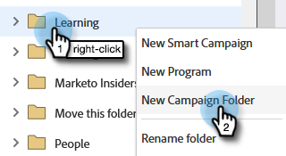
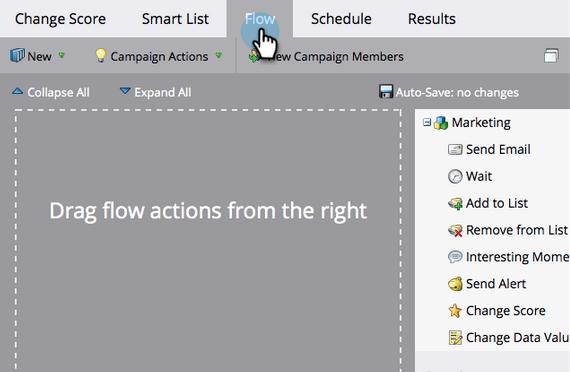

# シンプルなスコアリング {#simple-scoring}

>[!PREREQUISITES]
>
>* [セットアップと人物の追加](/help/marketo/getting-started/quick-wins/get-set-up-and-add-a-person.md){target=&quot;_blank&quot;}
>* [フォームを含むランディングページ](/help/marketo/getting-started/quick-wins/landing-page-with-a-form.md){target=&quot;_blank&quot;}

## 手順 1：スコアリングキャンペーンを作成する {#step-create-a-scoring-campaign}

1. **マーケティングアクティビティ**&#x200B;領域に移動します。

   

1. 「**学習**」フォルダーを右クリックし、「**新規キャンペーンフォルダー**」をクリックします。

   

1. キャンペーンに「スコアリング」という名前を付け、「**作成**」をクリックします。

   

   >[!NOTE]
   >
   >既に「スコアリング」フォルダーがある場合は、これに別の名前を付けます（例：スコアリング 1）。フォルダー名は一意である必要があります。

1. 次に、「**スコアリング**」フォルダーを右クリックして、「**スマートキャンペーン**」を選択します。

   

1. キャンペーンに「スコアを変更」という名前を付け、「**作成**」をクリックします。

   

1. 「**スマートリスト**」タブをクリックします。

   

   **体験版リクエストフォーム**&#x200B;に入力されるたびに、このキャンペーンを実行するようにします。

1. 「**フォームの入力**」トリガーを検索して、左側のキャンバスにドラッグします。

   

1. 「**マイフォーム**」を選択します。

   

   >[!NOTE]
   >
   >[フォームを含むランディングページ](/help/marketo/getting-started/quick-wins/landing-page-with-a-form.md){target=&quot;_blank&quot;}クイックウィンを完了している場合、このフォームがあります。フォームに別の名前を使用した場合は、その名前を選択します。

1. 「**フロー**」タブをクリックします。

   

1. 「**スコアを変更**」フローアクションを左のキャンバスにドラッグします。

   

1. 人物のスコアに追加する値を入力できます。「+5」を「**変更**」フィールドに入力します。

   

   >[!TIP]
   >
   >良いスコアリングキャンペーンは、高品質の人物をセールスに届けるうえで重要です。[**リードスコアリングの最終的なガイド**](https://www.marketo.com/definitive-guides/lead-scoring/){target=&quot;_blank&quot;}を参照してください。

1. 「**スケジュール**」タブをクリックし、「**アクティブ化**」ボタンをクリックします。

   

1. 確認画面の「**アクティブ化**」をクリックします。

   

>[!NOTE]
>
>アクティブにすると、ユーザがフォームに入力するたびにこのキャンペーンが実行されます。キャンペーンは、無効にされるまで実行を続けます。

## 手順 2:フォームを入力する {#step-fill-out-the-form}

1. [フォームを含むランディングページ](/help/marketo/getting-started/quick-wins/landing-page-with-a-form.md){target=&quot;_blank&quot;}クイックウィンで作成したランディングページを選択します。

   

1. 「**プレビュー**」をクリックします。ランディングページが新しいタブで開きます。

   

1. 氏名、メールアドレスを使用してフォームに入力し、「**送信**」をクリックします。

   

   >[!NOTE]
   >
   >「+5」スコア増加を適用するために、最初に入力したときに使用したものと同じ名前とメールアドレスを使用します。

## 手順 3：人物情報の表示 {#step-view-the-person-info}

1. データベース領域に移動します。

   

1. フォームの入力時に使用したメールアドレスを検索します。

   

1. 該当する人物をダブルクリックします。

   

人物の詳細が新しいタブまたはウィンドウで開きます。フォームを入力したことで、スコアが 5 ポイント増加したことを確認できましたか？

## ミッション完了です。 {#mission-complete}

 

[◄ ミッション 2：フォームを含むランディングページ](/help/marketo/getting-started/quick-wins/landing-page-with-a-form.md)

[ミッション 4：メールの自動応答 ►](/help/marketo/getting-started/quick-wins/email-auto-response.md)
