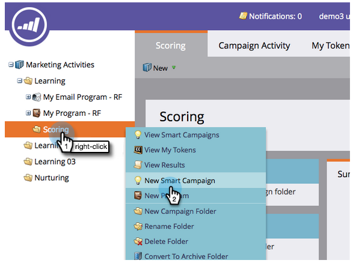

# 単純スコア {#simple-scoring}

>[!NOTE]
>
>**FYI**
>
>Marketoは現在、すべての購読で言語を標準化しているので、購読およびdocs.marketo.comの人物/人物にリード/リードを表示できます。 これらの用語は同じことを意味し、記事の説明には影響しません。 他にも変化がある。 [詳細情報](http://docs.marketo.com/display/DOCS/Updates+to+Marketo+Terminology)。

>[!NOTE]
>
>**前提条件**
>
>* [設定と追加人](get-set-up-and-add-a-person.md)
>* [フォームとのランディングページ](landing-page-with-a-form.md)

>

## 手順1:スコアリングキャンペーンの作成 {#step-create-a-scoring-campaign}

1. 「 **マーケティングアクティビティ** 」領域に移動します。

   

1. [ **学習** ]フォルダを右クリックし、[ **新規キャンペーンフォルダ**]をクリックします。

   

1. キャンペーンフォルダーに「スコアリング」という名前を付けます。

   

   >[!NOTE]
   >
   >既にスコアリングフォルダーがある場合は、このフォルダーに別の名前を付けます（スコアリング1など）。 フォルダー名は一意にする必要があります。

1. 次に、新しい **スコアリングキャンペーンーを右クリックし、「** 新しいスマートフォルダー ****」を選択します。

   

1. **キャンペーンに** 「スコアを変更」という名前を付け、「 **作成**」をクリックします。

   

1. 「 **スマートリスト** 」タブをクリックします。

   

   お客様が **体験版請求フォームに記入するたびに、このキャンペーンを実行してもらいたいと考えています**。

1. 「 **Fills Out Form** 」トリガーを探し、左のカンバスにドラッグします。

   

1. 「 **マイフォーム**」を選択します。

   >[!NOTE]
   >
   >フォームのクイックウィンドウで [ランディングページを完了した場合は](landing-page-with-a-form.md) 、フォームが必要です。 フォームに別の名前を使用した場合は、その名前を選択します。

   

1. 「**フロー**」タブをクリックします。

   

1. 「スコア **の** 変更」フローアクションを左のキャンバスにドラッグします。

   

1. ユーザーのスコアに追加する値を入力できます。 「 **変更** 」フィールドに「+5」と入力します。

   

   >[!TIP]
   >
   >良いスコアキャンペーンは、高品質の人をセールスに送るための重要な要素です。 リードスコア [**の最終的なガイドを読み**](http://www.marketo.com/definitive-guides/lead-scoring/)ます。

1. 「 **スケジュール** 」タブをクリックし、「 **アクティブ化** 」ボタンをクリックします。

   

1. 確認画面で「 **アクティブ化** 」をクリックします。

   

>[!NOTE]
>
>アクティブにすると、ユーザーがフォームに入力するたびに、このキャンペーンが実行されます。 キャンペーンは、非アクティブ化されるまで実行を続けます。

## 手順2:フォームの入力 {#step-fill-out-the-form}

1. フォーム [のクイックウィンドウが表示された](landing-page-with-a-form.md) ランディングページで作成したランディングページを選択します。

   

1. 「 **表示が承認したページ**」をクリックします。 ランディングページが新しいタブで開きます。

   

1. 名、姓、電子メールアドレスをフォームに入力し、 **送信をクリックします** 。

   

   >[!NOTE]
   >
   >「+5」スコアの増加を適用するために、自分を最初に個人として入力したときと同じ名前と電子メールアドレスを使用します。

## 手順3:個人情報の表示 {#step-view-the-person-info}

1. 「Database」領域に移動します。

   

1. フォームの入力時に使用した電子メールアドレスを検索します。

   

1. 重複を押しながら、自分の人をクリックします。

   

ユーザーの詳細が新しいタブまたはウィンドウで開きます。 フォームの入力に対するスコアが5ポイント上昇した様子をご覧ください。

**おめでとう！** スコアリングキャンペーンを作成しました。
[エスケアミッション2:Form](landing-page-with-a-form.md) [Mission 4とのランディングページ:電子メールの自動応答ï¿](email-auto-response.md)