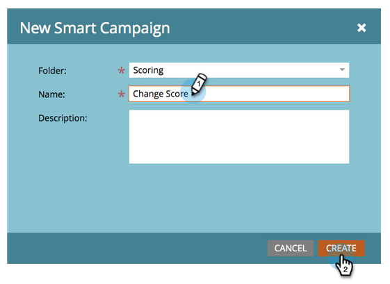

# 単純スコア{#simple-scoring}

>[!PREREQUISITES]
>
>* [設定と追加人](get-set-up-and-add-a-person.md)
>* [フォームとのランディングページ](landing-page-with-a-form.md)

## 手順1:スコアリングキャンペーンの作成{#step-create-a-scoring-campaign}

1. **マーケティングアクティビティ**&#x200B;エリアに移動します。

   

1. **学習**&#x200B;フォルダーを右クリックし、**新しいキャンペーンフォルダー**&#x200B;をクリックします。

   

1. キャンペーンフォルダーに「スコアリング」という名前を付けます。

   

   >[!NOTE]
   >
   >既にスコアリングフォルダーがある場合は、このフォルダーに別の名前を付けます（スコアリング1など）。 フォルダー名は一意にする必要があります。

1. 次に、新しい&#x200B;**スコア**&#x200B;キャンペーンーを右クリックし、「**新しいスマートフォルダー**」を選択します。

   

1. **「スコアを変更」** というキャンペーン名を付け、「 **作成**」をクリックします。

   

1. 「**スマートリスト**」タブをクリックします。

   

   **体験版依頼フォーム**&#x200B;に記入するときは、必ずこのキャンペーンを実行してください。

1. **Fills Out Form**&#x200B;トリガーを探して左のキャンバスにドラッグします。

   

1. 「**マイフォーム**」を選択します。

   >[!NOTE]
   >
   >フォーム](/help/marketo/getting-started/quick-wins/landing-page-with-a-form.md)のクイックウィンドウで[ランディングページを完了した場合は、フォームが必要です。 フォームに別の名前を使用した場合は、その名前を選択します。

   

1. 「**フロー**」タブをクリックします。

   

1. **スコア**&#x200B;の変更フローアクションを左のキャンバスにドラッグします。

   

1. ユーザーのスコアに追加する値を入力できます。 「**変更**」フィールドに「+5」と入力します。

   

   >[!TIP]
   >
   >良いスコアキャンペーンは、高品質の人をセールスに送るための重要な要素です。 [**リードスコアの確定的なガイド**](https://www.marketo.com/definitive-guides/lead-scoring/)を読みます。

1. 「**スケジュール**」タブをクリックし、「**アクティブ化**」ボタンをクリックします。

   

1. 確認画面で「**アクティブ化**」をクリックします。

   

>[!NOTE]
>
>アクティブにすると、ユーザーがフォームに入力するたびに、このキャンペーンが実行されます。 キャンペーンは、非アクティブ化されるまで実行を続けます。

## 手順2:フォームに入力{#step-fill-out-the-form}

1. フォーム](/help/marketo/getting-started/quick-wins/landing-page-with-a-form.md)のクイックウィンドウが表示された[ランディングページで作成したランディングページを選択します。

   

1. 「**表示が承認したページ**」をクリックします。 ランディングページが新しいタブで開きます。

   

1. 名、姓、電子メールアドレスをフォームに入力し、[**送信**]をクリックします。

   

   >[!NOTE]
   >
   >「+5」スコアの増加を適用するために、自分を最初に個人として入力したときと同じ名前と電子メールアドレスを使用します。

## 手順3:個人情報の表示{#step-view-the-person-info}

1. 「Database」領域に移動します。

   

1. フォームの入力時に使用した電子メールアドレスを検索します。

   

1. 重複を押しながら、自分の人をクリックします。

   

ユーザーの詳細が新しいタブまたはウィンドウで開きます。 フォームの入力に対するスコアが5ポイント上昇した様子をご覧ください。

**おめでとう！** スコアリングキャンペーンを作成しました。[エスケアミッション2:フォームとのランディングページ](/help/marketo/getting-started/quick-wins/landing-page-with-a-form.md)

[ミッション4:電子メールの自動応答ï¿](/help/marketo/getting-started/quick-wins/email-auto-response.md)
