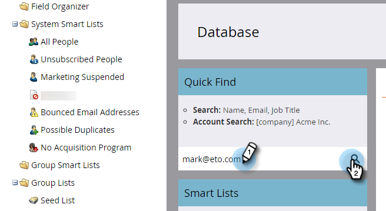

# 人物データの更新 {#update-person-data}

## ミッション：人物の取引先責任者情報またはその他のデータを更新する {#mission-update-a-persons-contact-info-or-other-data}

>[!PREREQUISITES]
>
>* [セットアップと人物の追加](/help/marketo/getting-started/quick-wins/get-set-up-and-add-a-person.md){target="_blank"}
>* [人物のリストのインポート](/help/marketo/getting-started/quick-wins/import-a-list-of-people.md){target="_blank"}

最近の展示会で、ある人から追加の連絡先情報を提供されたとします。人物データの更新方法を以下に示します。

## 更新する人物を検索する {#find-the-person-you-need-to-update}

1. **[!UICONTROL データベース]**&#x200B;に移動します。

   

1. 人物の名前またはメールアドレスを検索します。

   >[!TIP]
   >
   >メールアドレスを使用して検索すると、検索が高速になります。

   

1. ダブルクリックして人物の詳細を開きます。

   

   >[!TIP]
   >
   >Marketo では、人物データを更新する方法がたくさんあります。詳しくは、[人物のリストのインポート](/help/marketo/getting-started/quick-wins/import-a-list-of-people.md){target="_blank"}および[データ値の変更](/help/marketo/product-docs/core-marketo-concepts/smart-campaigns/flow-actions/change-data-value.md){target="_blank"}を参照してください。

## 人物データを更新する {#update-the-person-data}

1. 受け取った新しい情報を入力し、タブを閉じます。

>[!CAUTION]
>
>* メールアドレスに ASCII 文字のみが含まれていることを確認します。
>
>* Marketo は、絵文字を含む電子メールアドレスを&#x200B;**サポートしていません**。

>[!NOTE]
>
>データを変更すると、スマートリストとスマートキャンペーンは新しい情報を即座に認識します。

## ミッション完了 {#mission-complete}

これで完了です。人物データを更新しました。

  

[◄ ミッション 8：セールス担当者にアラート](/help/marketo/getting-started/quick-wins/alert-the-sales-rep.md)

[ミッション 10：ランディングページのリダイレクト ►](/help/marketo/getting-started/quick-wins/redirect-a-landing-page.md)
