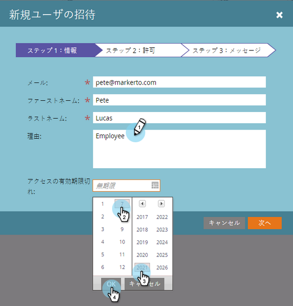
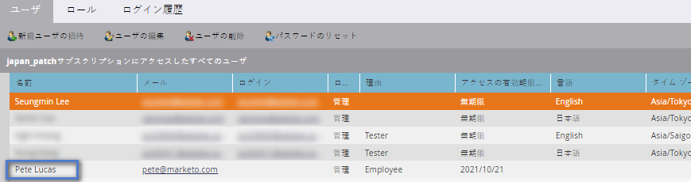
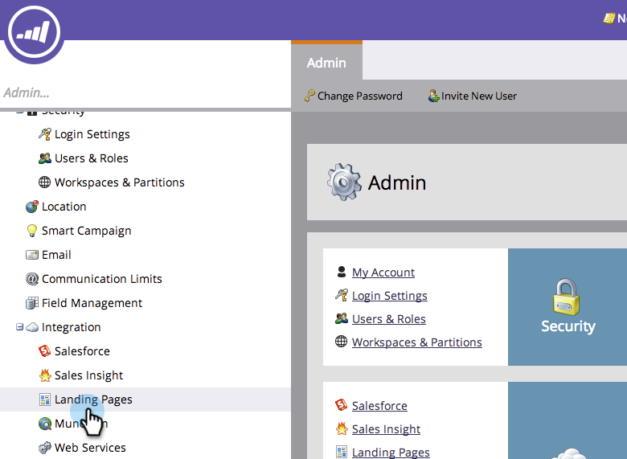
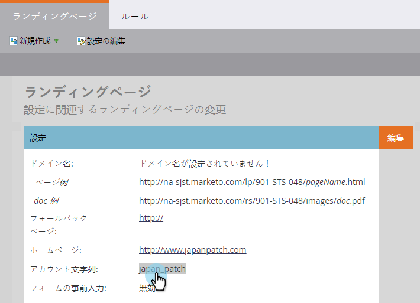
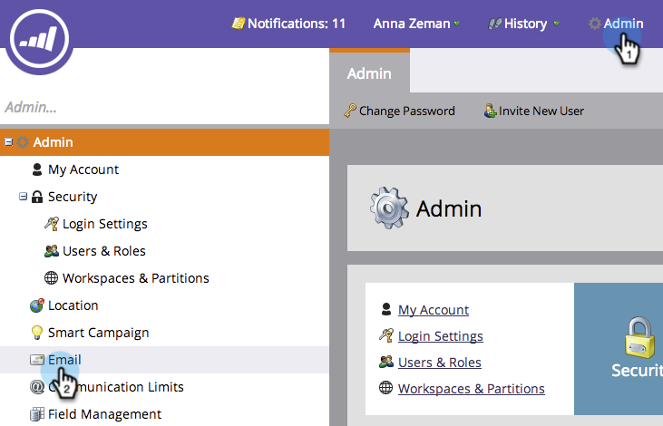
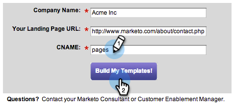

# 設定手順 {#setup-steps}

**マーケットへようこそ！**
Marketoの使い方を学ぶ前に、いくつかの手順を完了する必要があります。

>[!NOTE]
>
>**FYI**
>
>Marketoは現在、すべての購読で言語を標準化しているので、購読およびdocs.marketo.comの人物/人物にリード/リードを表示できます。 これらの用語は同じことを意味し、記事の説明には影響しません。 他にも変化がある。 [詳細情報](http://docs.marketo.com/display/DOCS/Updates+to+Marketo+Terminology)。

次の手順を実行します。

* いくつかの基本的なアカウント設定
* 信頼性と配信品質を向上させるために、ランディングページのURLと電子メールのリンクのブランド化を行う
* CRMの同期
* 会社のWebサイトへのトラッキングコードの追加

>[!NOTE]
>
>会社がMarketoを初めて使用する場合は、次の手順を実行する必要があり **ます**。 そうでない場合は、既に設定が完了している可能性があります。

一部の手順では、ITグループからのヘルプが必要です。

>[!TIP]
>
>このチェックリストを [印刷する場合](setup-steps/setup-checklist.md) 、項目を完了する際にチェックアウトできます。

1. ログインして追加のマーケティングユーザーを作成する
1. 電子メールで受け取った資格情報を [使用して](https://app.marketo.com/) 、Marketorにログインします。

   
おめでとう！ 現在はMarketoの内部にあり、開始が調査できます。 マーケティングチームの同僚を招待して参加させることもできます。 これは、新しいユーザーを追加することで行うことができます。

   「管理者」領域に移動します。

   >[!TIP]
   >
   >ここにいる間、「 **マイアカウント** 」をクリックして、アカウントと場所の設定を変更したり、新しい購読名を設定したりできます。

   

   >[!NOTE]
   >
   >**必要な管理者権限**

   「ユーザーと役割」をクリックします。

   

   「新しいユーザーを招待」をクリックします。

   

   同僚の電子メールアドレス、名、姓を入力します。

   

   必要に応じて、カレンダーピッカーを使用して、招待の理由とアクセス有効期限を入力します。 「OK」をクリックします。

   

   「次へ」をクリックします。

   

   >[!TIP]
   >
   >有効期限は、短期間のみマーケティングへのアクセスを必要とする、外部の関係者またはコンサルタントに適しています。

   >[!NOTE]
   >
   >有効期限が到達すると、ユーザーは有効期限の通知を受け取り、アカウントはロックされます。

   ロールを選択し、「次へ」をクリックします。 標準ユーザーは、管理者以外のすべての領域にアクセスできます。

   

   >[!NOTE]
   >
   >5つの組み込みの役割に加えて、カスタムの役割を作成することもできます。 ユーザーの役割と権限の [管理についての詳細](../product-docs/administration/users-and-roles/managing-user-roles-and-permissions.md)。

   招待のテキストは自由に調整してください。 「送信」をクリックします。

   

   これで、新しいユーザーが「ユーザー」タブに表示され、パスワードとログインを作成するためのリンクが記載された電子メールを受信します。 次のステップ！   

1. 承認されたサポートの連絡先の設定

   お客様は、会社のマーケティング担当者であることを伝える電子メールをMarketo Supportから受け取った可能性があります。 その場合は、 **承認されたサポートの連絡先をチーム用に設定できます** 。 承認されたサポート担当者のみが、マー [ケティング担当者サポートポータルを介して直接マーケティング担当者に連絡できます](http://support.marketo.com)。

   >[!NOTE]
   >
   >作成できるサポートの連絡先の数は、購入したパッケージによって異なります。 この制限は、マーケティングサポートからの電子メールで指定します。

   承認されたサポートの連絡先ドキュメントは、マーケティングコミュニティに移動されました。 この記事 [を参照してください](http://nation.marketo.com/t5/Knowledgebase/Managing-Authorized-Support-Contacts/ta-p/254341)。

   >[!NOTE]
   >
   >リストには、マーケティング担当者コミュニティにログインした人のみが表示されます。 そのユーザーが見つからない場合は、まずコミュニティにログインしていることを確認してください。

1. CNAMEを使用したランディングページURLのカスタマイズ

   >[!NOTE]
   >
   >Launch Packのお客様ですか。 この手順はスキップできます。 キックオフ会議中に、担当のコンサルタントからITのセットアップに関する指示ドキュメントが提供されます。

   >[!NOTE]
   >
   >**必要な管理者権限**

   ランディングページのCNAMEを選択します。 例を次に示します。

   * **行け**。[CompanyDomain].com
   * **www2**.[CompanyDomain].com
   * **lp**.[CompanyDomain].com

   >[!TIP]
   >
   >手短に！ 短いURLを指定すると、覚えやすくなります。 「行く」をドメインとしてお勧めします。

   最初の部分（太字）はLandingPageCNAME [です]。 手順5で必要になります。
ランディングページのCNAMEと置き換えるアカウント文字列を取得するには、「管理者」領域に移動します。

   

   「ランディングページ」をクリックします。

   

   ランディングページ設定から「アカウント文字列」をコピーします。

   

   これはAccountString [です]。 保存します。 手順5でITに渡す必要があります。

ランディングページが（マーケティング担当者がホストされている場所で）マーケティング担当者のドメインではなく、会社のドメインを使用するように、ドメイン設定を指定します。

1. 電子メールの配信品質の確保

   >[!NOTE]
   >
   >Launch Packのお客様ですか。 この手順はスキップできます。 キックオフ会議中に、担当のコンサルタントからITのセットアップに関する指示ドキュメントが提供されます。

   電子メールができるだけ多くの人に届くように、いくつかの方法が考えられます。

   1. **トラッキングリンクのブランド化**。 Marketoからの電子メールに含めるリンクに、（マーケティング担当者の代わりに）独自のドメインを使用するCNAMEを選択できます。 これにより、ドメインのブランディングが強化され、受信者の信頼と配信品質が向上します。
   1. **会社の追加電子メール許可リストにマーケティングします。** 実際の訪問者に電子メールを送信する前に、テスト用の電子メールをテストアカウントに送信するのが一般的です。 マーケティングを許可すると、そのようなテスト電子メールがブロックされたりスパムとしてフラグ付けされたりするのを防ぐことができます。
   1. **SPFとDKIMを設定します。** これらのテクノロジーにより、受信者はMarketorの電子メールがスパムでないことを保証できます。 受信者のスパムフィルターがMarketo Eメールを拒否するのを防ぐには、次の手順に従って、電子メール配信品質に対してSPFとDKIMを [設定します](../product-docs/email-marketing/deliverability/set-up-spf-and-dkim-for-your-email-deliverability.md)。

   1. **ドメインのMXレコードを設定します。** MXレコードを使用すると、返信や自動返信を処理するために、電子メールの送信元のドメインにメールを受信できます。 会社ドメインから送信する場合は、既にこの設定が行われている可能性があります。 そうでない場合は、通常、会社ドメインのMXレコードにマップするように設定できます。
   1. **送信者アドレスの推奨設定を参照してください。** すべての電子メールキャンペーンの「送信者アドレス」に、有効な既存の、および作業中の電子メールドメインを使用する必要があります。 会社ドメインから送信するのではなく、会社ドメインのサブドメインを設定する方が効果的な場合があります。 これにより、会社のメールストリームの問題がMarketoのメールストリームに影響を与えず、逆も同様に影響を与えなくなります。 さらに、からのメールの送信は、電子メールがフィルタ [`[email protected]`](http://docs.marketo.com/cdn-cgi/l/email-protection#e99a86848c9d8180878ea98786878c91809a9d8c879d8d8684888087c78a8684) ーされたりブロックされたりする原因となります。 送信者の「送信者のアドレス」で使用するドメインには、有効で作業中の [[電子メールで保護]](http://docs.marketo.com/cdn-cgi/l/email-protection) および[ [電子メールで保護]](http://docs.marketo.com/cdn-cgi/l/email-protection) アカウントが必要です。\
      Google Appsを使用して会社の電子メールをホストしている場合、ドメインの下に [[email protected]](http://docs.marketo.com/cdn-cgi/l/email-protection) 電子メールまたは[email protected]  電子メールを作成できません。 この問題を回避するには、「abuse」および「postmaster」という名前のグループを作成する必要があります。 これらのグループのメンバーであるユーザーは、それらのアドレスに送信された電子メール( [ポストマストなど `[email protected]`](http://docs.marketo.com/cdn-cgi/l/email-protection#88f8e7fbfce5e9fbfcedfac8ece7e5e9e1e6a6ebe7e5))を受信します。 グループ作成の手順について詳しくは、 [こちらを参照してください](https://support.google.com/a/answer/33343#adminconsole)。

   E メールトラッキングログリンクのCNAMEを選択します。 (手順3で選択したランディングページCNAMEと *異なるものを選択します* )。 例を次に示します。

   * go2.[CompanyDomain].com
   * em.[CompanyDomain].com
   * わぁ。[CompanyDomain].com

   最初の部分は、E メールトラッキングログCNAME、 [EmailTrackingCNAME]です。 手順5でITに渡す必要があります。

   >[!CAUTION]
   >
   >電子メールCNAMEとランディングページCNAMEは異なる必要があります。 また、「track」や「link」のようなCNAMEは使用しないでください。 多くの場合、スパムとしてフラグ付けされます

   Marketorの追跡リンクを探すには、「管理者」領域に移動します。

   

   「電子メール」をクリックします。

   

   電子メール設定からトラッキングリンクをコピーします。

   トラッキングリンクは次の形式で表示されます。mkto-[a-z][4 digits].com

   

   これは [MktoTrackingLink]です。 保存します。 手順5でITに渡す必要があります。

   「送信者」ドメインを収集します。 Marketoからの電子メールの送信に使用するすべての「From」ドメイン( [Sender]@[FromDomain].comなど)をリストします。 ほとんどの場合、1つしかありません。

   例えば、「marketo.com」、「info.marketo.com」のように指定します。 FromDomain1 []、[FromDomain2]など 保存します。 手順5でITに提供する必要があります。

   リクエストをITに送信するために必要な情報がすべて揃いました。

1. ITにプロトコルの設定を依頼する

   >[!NOTE]
   >
   >Launch Packのお客様ですか。 この手順はスキップできます。 キックオフ会議中に、担当のコンサルタントからITのセットアップに関する指示ドキュメントが提供されます。

   必要な情報をすべて収集したら、IT部門にリクエストを送信する準備が整います。 以下のテキストをテンプレートとして使用し、太字のテキストを独自の情報に置き換えることができます。

   [この記事へのリンクを含めます](setup-steps/configure-protocols-for-marketo.md)。

   電子メールにこのテキストを貼り付け、太字のプレースホルダーを置き換えます。

   >[!NOTE]
   >
   >プレースホルダを置き換えるテキストについては、上記の手順3と4を参照してください。 LandingPageCNAME [とEmailTrackingCNAMEは異なる] 必要があることに注意してください [] 。

   Awesome IT管理者様、

   マーケティングチームは、現在、Marketoプラットフォームを使用して従業員と連絡を取っています。 優れた電子メールの配信品質を確保するには、次の変更を行う必要があります。

   `1)` ランディングページに対して、LandingPageCNAMEのDNSエントリ(CNAME)を追加し **[ます]**。**[CompanyDomain]**.com( **[AccountString]**.mktoweb.comを参照)。

   `2)` 電子メール内のトラッキングリンクに、EmailTrackingCNAMEにDNSエントリ(CNAME)を追加し **[ます]**。**[CompanyDomain]**.com。MktoTrackingLink **[を参照]**。

   `3)` 許可リストマーケティング。

   * 電子メール許可リストでIPアドレスを使用する場合は、以下に示すIPアドレスを追加します。\
      199.15.212.0/22

      192.28.144.0/20

      192.28.160.0/19

      185.28.196.0/22

      130.248.172.0/24

      130.248.173.0/24

      103.237.104.0/22

      94.236.119.0/26
   注意：環境に固有の許可リストに対するIPの短縮リストをご希望の場合は、Marketor Supportにお問い合わせください。

   * スパム対策システムで送信元ドメインを使用している場合は、次を追加します。

   **`[FromDomain1]`**
   **`[FromDomain2]`**

   `4)` SPFとDKIMを設定し、Marketoが署名済みの電子メールを送信する権限を持つようにする必要があります。

   `a.` SPFを設定するには、DNSエントリに次の行を追加してください。

   IN TXT **[From Domain]**: v=spf1 mx ip4:**[企業IP(s)]**** **include:mktomail.com ～all

   DNSエントリに既にSPFレコードが存在する場合は、次を追加します。

   include:mktomail.com

   `[`「 **From Domain** 」を「Email From Domain」(例：会社.com)と **CorpIP** (例：255.255.255.255)。  複数のドメインからMarketor経由で電子メールを送信する場合は、ITスタッフに各ドメインに対してこの行を（1行で）追加してもらう必要があります。`]`

   `b.` DKIMの場合は、セットアップするドメインごとにDNSリソースレコードを作成してください。 署名する各ドメインのホストレコードとTXT値を以下に示します。

   **`[DKIMDomain1]`**:「Host Record」 **`[HostRecord1]`** はで、「TXT Value」は **[TXTValue1]**&#x200B;です。

   **`[DKIMDomain2]`**:「Host Record」 **`[HostRecord2]`** はで、「TXT Value」はで **`[TXTValue2]`**&#x200B;す。

   `[`ここで説明する手順に従って、設定した各 **DKIMDomainのHostRecord** と **TXTValue** をコピー **し**ます。 ITスタッフがこの手順を完了した後は、 **管理者/電子メール/DKIM** で各ドメインを確認するのを忘れないでください。`]`

   `5)` FROMドメインFromDomain1 **[、FromDomain2]****[]**&#x200B;などに有効なMXレコードがあることを確認する必要があります。 確認できる？ そうでない場合は、弊社の企業ドメインMXレコードにマップするように設定してください。 これにより、マーケティング担当者への返信/自動返信を確実に処理できます。

   これらの手順が完了したら、Marketoと共にセットアッププロセスを完了できるように、お知らせください。

   ありがとう！ お前は最高だ！

   愛

   **`[Your Name]`**

   電子メールをITに送信します。 ITがこれらのタスクを完了するには、時間がかかる場合があることを理解しています。 手順7に進むことができますが、手順6に戻ってMarketoの設定を完了する必要があることに注意してください。

1. IT終了後にマーケティングのセットアップを完了する

   IT部門がタスクを完了したら、次の手順に従ってランディングページと電子メールのCNAMEを追加し、DKIM署名をアクティブにします。

   「管理者」領域で、「ランディングページCNAME」追加を選択します。

   

   ランディングページを選択し、設定領域で「編集」をクリックします。

   

   「ランディングページのドメイン名」フィールドに新しいドメイン名を入力します。 これは次の形式になります。

   [LandingPageCNAME]。[CompanyDomain].com

   

   「フォールバックページ」フィールドに、ランディングページが利用できない場合に訪問者に通知するURLを入力します。 フォールバックページがない場合は、会社ホームページを使用できます。 「ホームページ」フィールドに、会社のWebサイトを入力します。

   

   「管理者」領域で、「電子メールCNAMEへ追加の電子メール」を選択します

   

   下にスクロールし、「編集」をクリックします。

   

   「Domain」フィールドに、E メールトラッキングログドメインを入力します。 これは次の形式になります。

   [EmailTrackingCNAME]。[CompanyDomain].com。 「 **保存**」をクリックします。

   

1. ランディングページおよび電子メールテンプレート用のURLの送信

   アドビのクリエイティブデザイナーは、マーケティングプログラムを迅速かつ容易に起動できる、カスタマイズされた電子メールおよびランディングページテンプレートを提供できます。 テンプレートが会社のWebサイトやロゴに一致するように、情報を提供する必要があります。

   >[!NOTE]
   >
   >これらのカスタムテンプレートは、Launch Packのお客様のみ利用できます。

   「 [Marketorテンプレートのデザインとビルド](http://pages2.marketo.com/CESubmit-URL-ForTemplates.html) 」フォームに移動します。 会社情報を入力します。

   

   「ランディングページのURL」に、会社の色、ロゴ、スタイルを表示する会社のWebサイトのサンプルURLを入力します。 ほとんどのお客様は、フォームを含む「お問い合わせ」ページを使用しています。

   

   「CNAME」に、手順3で選択したランディングページCNAMEを入力します(「[LandingPageCNAME]」)。 リクエストを送信します。

   

   >[!NOTE]
   >
   >IT部門がランディングページCNAMEのDNSレコードを作成するまで、テンプレートを完成させることはできません。

   それだ！ 新しいテンプレートは、3 ～ 5営業日後にMarketo Design Studioに表示されます。

1. CRMの統合

   これは、お客様の設定の最も画期的なステップです。CRMに保存したすべてのリードや連絡先をMarketoに記入するタイミングです。

   会社が使用するCRMに応じて、次の中から選択します。

   * [MarketoとSalesforce.comの統合](http://docs.marketo.com/display/docs/salesforce+sync)
   * [MarketorとMicrosoft Dynamicsの統合](http://docs.marketo.com/pages/viewpage.action?pageid=6094951)

   >[!NOTE]
   >
   >これらの手順を実行するには、会社のCRM管理者の支援が必要です。

## 9. Webサイト追加へのトラッキングコード {#add-tracking-code-to-your-website}

>[!NOTE]
>
>Launch Packのお客様ですか。 この手順はスキップできます。 担当のコンサルタントが、ITセットアップ手順ドキュメントのMunchkinコードの手順を提供します。

Marketoには、任意のWebページ上の個人アクティビティを追跡するために使用できる、カスタムの追跡JavaScript(Munchkin)があります。 Munchkinは、WebサイトをMarketoに統合するために必要です。 トラッキングコードをWebサイトに [追加マンチキングするには、次の手順に従います](../product-docs/administration/additional-integrations/add-munchkin-tracking-code-to-your-website.md)。

>[!NOTE]
>
>トラッキングコードの追加に必要なHTMLの使用経験がある。

すべての設定手順は終了です。 残るのは、マーケットに飛び込んで使うことだけ！
