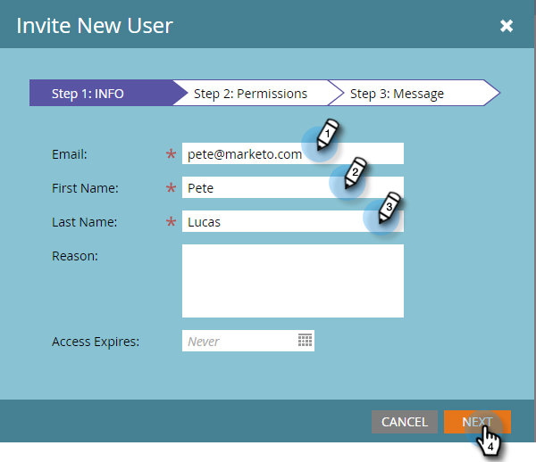
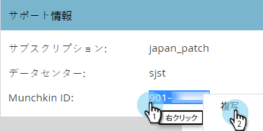

# 設定手順 {#setup-steps}

**Marketo Engage へようこそ！**

Marketo を使用する前に、いくつかの手順を完了する必要があります。

次の手順が含まれます。

* いくつかの基本的なアカウント設定
* ランディングページの URL とメールリンクのブランディングによる信頼性と配信品質の向上
* CRM の同期
* 会社の web サイトへのトラッキングコードの追加

>[!NOTE]
>
>自社に **Marketo を初めて導入する**&#x200B;お客様は、これらの手順を行うだけで完了できます。初めてではない場合は、既に設定が完了している可能性があります。

一部の手順では、IT チームのサポートが必要です。

>[!TIP]
>
>[このチェックリストを印刷する](/help/marketo/getting-started/setup/setup-checklist.md){target="_blank"}と、チェックを入れて完了を確認することができます。

## ログインして追加の Marketo ユーザーを作成する {#log-in-and-create-additional-marketo-users}

メールで受け取った資格情報を使用して、[ここ](https://app.marketo.com/)から Marketo にログインします。{target="_blank"}

これで完了です。Marketo で探索を開始できます。マーケティングチームの同僚を招待して参加させるには、新しいユーザを追加します。

「**[!UICONTROL 管理者]**」領域に移動します。

>[!TIP]
>
>ここで、「**[!UICONTROL マイアカウント]**」をクリックして、アカウントと場所の設定の変更と、新しいサブスクリプション名を設定できます。

>[!NOTE]
>
>**管理者権限が必要**

「**[!UICONTROL ユーザ＆ロール]**」をクリックします。

「**[!UICONTROL 新しいユーザを招待]**」をクリックします。

同僚のメールアドレス、氏名を入力します。_アクセスの有効期限の設定はオプションです_。「**[!UICONTROL 次へ]**」をクリックします。

>[!TIP]
>
>有効期限は、Marketo に短期間のみアクセスする必要がある、短期間の外部の関係者やコンサルタントに最適です。

>[!NOTE]
>
>有効期限が来ると、ユーザは有効期限通知を受け取り、アカウントがロックされます。

ロールを選択し、「**[!UICONTROL 次へ]**」をクリックします。標準ユーザは、管理者領域を除くすべての領域にアクセスできます。

>[!NOTE]
>
>5 つの組み込みの役割に加えて、カスタムの役割を作成することもできます。詳しくは、[ユーザーの役割と権限の管理](/help/marketo/product-docs/administration/users-and-roles/managing-user-roles-and-permissions.md){target="_blank"}を参照してください。

招待のテキストは自由に変更できます。「**送信**」をクリックします。

新しいユーザーが **[!UICONTROL ユーザー]** 」タブに移動し、パスワードとログインを作成するためのリンクが記載された電子メールを受け取る必要があります。 次の手順へ進みます。

## 認証済みのサポート取引先責任者を設定する {#set-up-your-authorized-support-contacts}

Marketo サポートから、ご自身が自社の Marketo カスタマーサポート管理者であることを示すメールを受け取っている可能性があります。その場合は、ご自身のチームに&#x200B;**認証済みのサポート取引先責任者**&#x200B;を設定できます。認証済みのサポート担当者のみが、 [Marketo Support Portal](https://support.marketo.com){target="_blank"}.

>[!NOTE]
>
>作成できるサポート取引先責任者の数は、購入したパッケージによって異なります。この制限は、Marketo サポートからメールで指定されます。

認証済みサポート取引先責任者ドキュメントは、Marketo コミュニティに移動しました。詳しくは、 [この記事](https://nation.marketo.com/t5/Knowledgebase/Managing-Authorized-Support-Contacts/ta-p/254341){target="_blank"}.

>[!NOTE]
>
>Marketo コミュニティにログインしたユーザのみがリストに表示されます。ユーザが見つからない場合は、最初にコミュニティにログインしてください。

## CNAME を使用したランディングページ URL のカスタマイズ {#customize-your-landing-page-urls-with-a-cname}

>[!NOTE]
>
>Launch Pack をご利用の場合は、この手順をスキップできます。初回コール時に、担当のコンサルタントが IT セットアップ手順書を提供します。

>[!NOTE]
>
>**管理者権限が必要**

ランディングページの CNAME を選択します。次に例を示します。

    * **go**.[CompanyDomain].com
    * **www2**.[CompanyDomain].com
    * **lp**.[CompanyDomain].com

>[!TIP]
>
>短くするようにします。URL は短いほど覚えやすくなります。ドメインには「go」を指定することをお勧めします。

最初の部分（太字）が `[LandingPageCNAME]` です。手順 5 で必要になります。

ランディングページ CNAME に置き換える Munchkin ID を取得するには、管理者領域に移動します。

「**マイアカウント**」をクリックします。

を [!UICONTROL アカウント文字列] ランディングページの設定から。

これが `[Munchkin ID]`.です。保存します。これは、手順 5 で IT チームに渡す必要があります。

ランディングページが（ホストされている場所で）Marketo ドメインではなく、自社のドメインを使用するように、ドメイン設定を指定します。

## メールの配信品質を確保する {#ensure-email-deliverability}

>[!NOTE]
>
>Launch Pack をご利用の場合は、この手順をスキップできます。初回コール時に、担当のコンサルタントが IT セットアップ手順書を提供します。

メールができるだけ多くの人に届くように、いくつかの方法が用意されています。

* **トラッキングリンクのブランディング**。Marketo からのメールに含めるリンクに、（Marketo ドメインではなく）独自のドメインを使用する CNAME を選択できます。これにより、ドメインのブランディングが強化され、受信者との信頼と配信品質が向上します。
* **Marketo を自社のメール許可リストに追加します。**&#x200B;実際の人々にメールを送信する前に、テストアカウントにテストメールを送信するのが一般的なベストプラクティスです。Marketo を許可リストに加えることで、これらのテストメールがブロックされたりスパムとしてフラグ付けされたりするのを防ぐことができます。
* **SPF と DKIM を設定します。**&#x200B;これらのテクノロジーは、Marketo のメールがスパムではないことを受信者に保証するものです。受信者のスパムフィルターによる Marketo メールの拒否を防ぐには、次の手順に従って[メールの配信品質に SPF と DKIM を設定](/help/marketo/product-docs/email-marketing/deliverability/set-up-spf-and-dkim-for-your-email-deliverability.md)します。
* **ドメインの MX レコードを設定します。** MX レコードを使用すると、返信や自動返信を処理するために、メールを送信するドメインにメールを受け取ることができます。会社ドメインから送信する場合は、既にこの設定が完了している可能性があります。そうでない場合は、通常、会社ドメインの MX レコードにマッピングするように設定できます。
* **送信元アドレスの推奨設定。**&#x200B;すべてのメールキャンペーンの送信元アドレスに、有効な既存メールドメインと動作中のメールドメインを使用する必要があります。会社ドメインから送信するのではなく、会社ドメインのサブドメインを設定すると便利です。これにより、会社のメールストリームの問題が Marketo のメールストリームに影響を与えず、逆についても同様のことが言えます。さらに、`something@nonexistentdomain.com` からメールを送信すると、メールがフィルターされたりブロックされたりします。送信者の送信元アドレスで使用されるドメインには、有効で動作中の postmaster@ アカウントと abuse@ アカウントが必要です。

Google アプリを使用して自社のメールをホストしている場合、お使いのドメインで abuse@ や postmaster@ のメールを作成することはできません。この問題を回避するには、「abuse」および「postmaster」という名前のグループを作成する必要があります。このグループのメンバーであるユーザは、そのアドレスに送信されたメールを受信します（例：postmaster@domain.com）。グループ作成の詳しい手順については、 [ここ](https://support.google.com/a/answer/33343#adminconsole){target="_blank"}.

メールトラッキングリンクの CNAME を選択します（手順 3 で選択したランディングページ CNAME とは&#x200B;_異なる_&#x200B;ものを選択）。次に例を示します。

* go2.[CompanyDomain].com
* em.[CompanyDomain].com
* wow.[CompanyDomain].com

最初の部分は、メールトラッキング CNAME `[EmailTrackingCNAME]` です。これは、手順 5 で IT チームに渡す必要があります。

>[!CAUTION]
>
>電子メールとランディングページの CNAME は別にする必要があります。また、「track」や「link」といった CNAME は使用しないでください。多くの場合、スパムとしてフラグ付けされます

Marketo のトラッキングリンクを確認するには、「**[!UICONTROL 管理者]**」領域に移動します。

「**[!UICONTROL メール]**」をクリックします。

を [!UICONTROL トラッキングリンク] 電子メールの設定から。

この [!UICONTROL トラッキングリンク] は次の形式で記述します。 `mkto-[a-z][4 digits].com`.

これがご自身の `[MktoTrackingLink]` です。保存します。これは、手順 5 で IT チームに渡す必要があります。

「差出人」ドメインを収集します。Marketo からのメール送信に使用するすべての「差出人」ドメイン（`[Sender]@[FromDomain].com` のように）のリストを作成します。ほとんどの場合、1 つだけです。

例、「marketo.com」、「info.marketo.com」。これらは `[FromDomain1]`、`[FromDomain2]` 等があります。保存します。これらは、手順 5 で IT チームに渡す必要があります。

リクエストを IT チームに送信するために必要な情報がすべて揃いました。

## プロトコルの設定を IT チームに依頼する {#ask-it-to-configure-protocols}

>[!NOTE]
>
>Launch Pack をご利用の場合は、この手順をスキップできます。初回コール時に、担当のコンサルタントが IT セットアップ手順書を提供します。

必要な情報をすべて収集したら、IT チームにリクエストを送信する準備が整いました。以下のテキストをテンプレートとして使用し、太字のテキストを独自の情報に置き換えることができます。

[この記事へのリンクを含める](/help/marketo/getting-started/setup/configure-protocols-for-marketo.md)。

メールにこのテキストを貼り付け、太字のプレースホルダーを置き換えます。

>[!NOTE]
>
>上記の手順 3 と 4 を参照して、プレースホルダーを置き換えるテキストを決定してください。`[LandingPageCNAME]` と `[EmailTrackingCNAME]` は、別のものを使用する必要があります。

`----------------------------------------------`

IT 管理者様

マーケティングチームは、コミュニケーションに Marketo プラットフォームを使用することになりました。優れたメール配信品質を確保するには、次の変更を行う必要があります。

`1)` ランディングページには、**[LandingPageCNAME]**.**[CompanyDomain]**.com、を指す **[Munchkin ID]**.mktoweb.com.

`2)` メール内のトラッキングリンクには、**[EmailTrackingCNAME]**.**[CompanyDomain]**.com の DNS エントリ（CNAME）を追加して、**[MktoTrackingLink]** を指すようにしてください。

`3)` Marketo を許可リストに加えてください。

    * メール許可リストに IP アドレスを使用する場合は、以下に示す IP アドレスを追加してください。
    199.15.212.0/22
    
    192.28.144.0/20
    
    192.28.160.0/19
    
    185.28.196.0/22
    
    130.248.172.0/24
    
    130.248.173.0/24
    
    103.237.104.0/22
    
    94.236.119.0/26

>[!NOTE]
>
>ご使用の環境に合わせた IP の短縮リストを希望する場合は、Marketo サポートにお問い合わせください。

    * スパム対策システムで送信元ドメインが使用されている場合は、次のドメインを追加してください。

**`[FromDomain1]`**
**`[FromDomain2]`**

`4)` SPF と DKIM を設定し、Marketo が署名済みメールを会社に代わって送信する権限を付与する必要があります。

`a.` SPF を設定するには、DNS エントリに次の行を追加してください。

IN  TXT **[From Domain]**:  v=spf1 mx ip4:**[Corporate IP(s)]**
 include: mktomail.com ~all

DNS エントリに既に SPF レコードが存在する場合は、次のコードを追加します。

include: mktomail.com

`[`**From Domain** をメール送信元ドメイン（例：company.com）に、**CorpIP** を会社のメールサーバーの IP アドレス（例：255.255.255.255）に置き換えます。Marketo を通じて複数のドメインからメールを送信する場合は、IT スタッフに各ドメインに対してこの行を（1 行で）追加してもらう必要があります。`]`

`b.`DKIM の場合は、設定するドメインごとに DNS リソースレコードを作成してください。署名する各ドメインのホストレコードと TXT 値を次に示します。

**`[DKIMDomain1]`**：ホストレコードが **`[HostRecord1]`** で、TXT 値が **[TXTValue1]**.です。

**`[DKIMDomain2]`**：ホストレコードが **`[HostRecord2]`** で、TXT 値が **`[TXTValue2]`** です。

`[`[こちらの手順に従って](/help/marketo/product-docs/email-marketing/deliverability/set-up-a-custom-dkim-signature.md)、設定した **DKIMDomain** ごとに **HostRecord** と **TXTValue** をコピーします。IT スタッフがこの手順を完了したら、必ず&#x200B;**管理者／メール／DKIM** で各ドメインを確認してください。`]`

`5)` **[FromDomain1]**、**[FromDomain2]** など、送信元ドメインに有効な MX レコードがある必要があります。確認できますか？そうでない場合は、会社のドメイン MX レコードにマッピングするように設定してください。これにより、Marketo 宛ての返信／自動応答を確実に処理できます。

これらの手順が完了したらお知らせください。Marketo で設定プロセスを完了します。

ありがとうございました。ご協力感謝します。

よろしくお願いします。

**`[Your Name]`**

`----------------------------------------------`

IT チームにメールを送信します。IT チームがこれらのタスクを完了するまでに時間がかかる場合があることを承知しています。手順 7 に進むことはできますが、Marketo の設定を完了するには、手順 6 に戻る必要があります。

## IT チームの作業完了後に、Marketo の設定を完了する {#complete-your-marketo-setup-after-it-finishes}

IT チームが作業を完了したら、次の手順に従ってランディングページとメールの CNAME を追加し、DKIM 署名を有効にします。

「**[!UICONTROL 管理者]**」領域に移動してランディングページ CNAME を追加します。

ランディングページを選択し、設定領域の「**[!UICONTROL 編集]**」をクリックします。

「 」フィールドに新しいドメイン名を入力します **[!UICONTROL ランディングページのドメイン名]**. これは次の形式で記述します。

`[LandingPageCNAME].[CompanyDomain].com`

内 **[!UICONTROL フォールバック]** ページフィールドに、ランディングページが利用できない場合に訪問者に表示する URL を入力します。 フォールバックページがない場合は、会社のホームページを使用できます。内 **[!UICONTROL ホームページ]** 「 」フィールドに、会社の web サイトを入力します。

内 [!UICONTROL 管理者] 領域、選択 **[!UICONTROL 電子メール]** :E メール CNAME を追加します。

下にスクロールして [!UICONTROL ブランディングドメイン]. ドメインを選択し、「**[!UICONTROL 編集]**」をクリックします。

「ドメイン」フィールドに、メールトラッキングドメインを入力します。これは次の形式で記述します。

`[EmailTrackingCNAME].[CompanyDomain].com`.「**[!UICONTROL 保存]**」をクリックします。

## CRM を統合する {#integrate-your-crm}

これはおそらく、設定の最もエキサイティングな手順です。CRM に保存したすべてのリードと取引先責任者を Marketo に取り込みます。

会社が使用している CRM に応じて、次の中から選択します。

    * [Marketoを [!DNL Salesforce.com]](/help/marketo/product-docs/crm-sync/salesforce-sync/understanding-the-salesforce-sync.md)
    * [Marketoを [!DNL Microsoft Dynamics]](/help/marketo/product-docs/crm-sync/microsoft-dynamics-sync/understanding-the-microsoft-dynamics-sync.md)

>[!NOTE]
>
>これらの手順を完了するには、会社の CRM 管理者の支援が必要です。

## Web サイトへのトラッキングコードの追加 {#add-tracking-code-to-your-website}

>[!NOTE]
>
>あなたは [!DNL Launch Pack] お客様？ この手順をスキップできます。担当のコンサルタントがお客様に [!DNL Munchkin] コードの説明は、IT セットアップ手順ドキュメントに記載されています。

Marketoには、JavaScript ( [!DNL Munchkin]) を使用して、任意の web ページ上のユーザーアクティビティを追跡できます。 [!DNL Munchkin]Web サイトを Marketo に統合するには、 が必要です。次の手順に従って、 [追加 [!DNL Munchkin] Web サイトへのトラッキングコード](/help/marketo/product-docs/administration/additional-integrations/add-munchkin-tracking-code-to-your-website.md){target="_blank"}.

>[!NOTE]
>
>トラッキングコードの追加には、HTML の知識が必要です。

## パフォーマンスの期待値 {#performance-expectations}

Marketo のパフォーマンスに関して期待できる点は何ですか？マーケティングキャンペーンのサイズと複雑さに応じて異なる場合があります。ただし、「標準」列で説明されているとおり、パフォーマンスレベルは、「 [Marketo Engage製品の説明](https://helpx.adobe.com/legal/product-descriptions/adobe-marketo-engage-product-description.html){target="_blank"}. The "Performance" and "Performance Plus" columns refer to performance tier packages that provide [higher performance levels](https://nation.marketo.com/t5/product-documents/marketo-engage-performance-tiers/ta-p/328835){target="_blank"}.

すべての設定手順が完了しました。さっそく Marketo を使用してみましょう。
