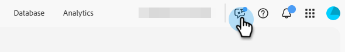

# 製品知識のための AI アシスタント {#ai-assistant-for-product-knowledge}

製品知識のための AI アシスタントは、マーケティングチームのための強力なアクセラレータであり、Marketo Engageの製品ドキュメントの全幅と深さに瞬時に対話型アクセスを提供します。 必要なときに正確で最新の製品詳細を表示することで、キャンペーンの作成、コンテンツ開発、ユーザーメッセージを合理化します。

製品知識 AI アシスタントを使用すると、チームの動きが速くなり、より効果的に共同作業を行い、鋭く正確で影響力のあるマーケティングを提供できます。

## アシスタントを使用 {#use-the-assistant}

1. [Adobe Experience Cloud](https://experience.adobe.com/) からMarketo Engageにログインします。

1. ヘッダーの右側にある AI アシスタント アイコンを選択します。

   

1. 自然言語を使用して目的のプロンプトを入力します。

   

1. 青い矢印をクリックしてプロンプトを送信します。

   

   >[!TIP]
   >
   >このアイコン  を使用して画面を展開し、このアイコン  を使用して履歴を表示したり、新しい会話を開始したりします。

## クイックスタート：60 秒のビデオの概要 {#video}

>[!VIDEO](https://video.tv.adobe.com/v/3480116?captions=jpn&learn=on){transcript=true}
