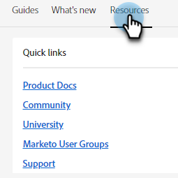
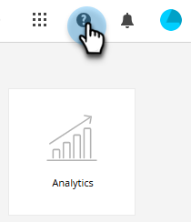
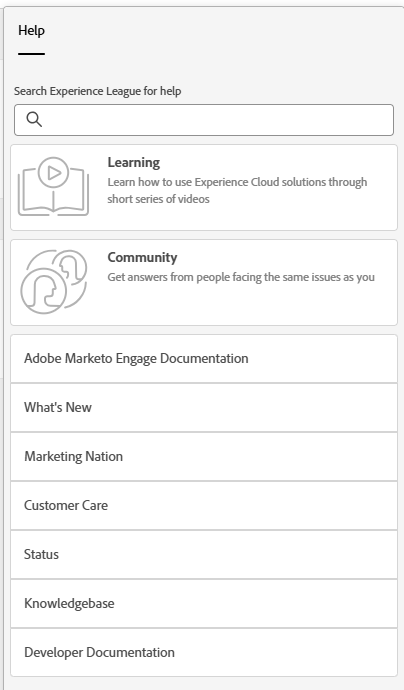

# ヘルプセンター {#help-center}

Adobe Marketo Engage のヘルプセンターは、サポートを受ける際の一元的な場所として機能します。様々なリソース（例えば、[製品ドキュメント](/help/marketo/home.md){target="_blank"}、[リリース情報](/help/marketo/release-notes/current.md){target="_blank"}、[Marketing Nation コミュニティ](https://nation.marketo.com/){target="_blank"}）へのリンクに加えて、エクスペリエンスレベルで整理された、便利な製品内ウォークスルーにアクセスできます。

## アクセスする方法 {#how-to-access}

サブスクリプションが Adobe ID 管理システム（IMS）に移行されているかどうかに応じて、2 つの異なるエクスペリエンスがあります。

### Adobe IMS 移行前 {#pre-adobe-ims-integration}

これらの手順は、[Adobe IMS](/help/marketo/product-docs/administration/marketo-with-adobe-identity/adobe-identity-management-overview.md){target="_blank"} にまだ移行して&#x200B;_いない_ Marketo Engage ユーザーを対象としています。

Marketo Engage に[ログイン](https://login.marketo.com/){target="_blank"}し、ヘルプアイコンをクリックします。

#### ガイド {#guides}

ガイドは、人気の高い機能の簡単なウォークスルーとして機能します。

1. 目的のガイドをクリックして表示します。

   

1. 「**開始する**」をクリックします。

   

1. 続行するには、「**次へ**」をクリックします。

   

1. 「**完了**」をクリックして、ウォークスルーを終了します。

   

   >[!TIP]
   >
   >「**閉じる**」をクリックすることで、いつでもガイドを終了できます。

#### 新着情報 {#whats-new}

「新着情報」タブには、Marketo Engage の最新リリースの詳細が含まれています。

>[!TIP]
>
>Experience League のページを表示するには、下部の矢印アイコンをクリックします。

#### リソース {#resources}

「リソース」タブでは、Marketo Engage インスタンスに関する追加のサポートを得る様々な方法に直接、すばやくアクセスできます。

### Adobe IMS 移行後 {#post-adobe-ims-integration}

これらの手順は、[Adobe IMS](/help/marketo/product-docs/administration/marketo-with-adobe-identity/adobe-identity-management-overview.md){target="_blank"} に既に移行した Marketo Engage ユーザーを対象としています。

Marketo Engage に[ログイン](https://experienceleague.adobe.com/ja){target="_blank"}し、ヘルプアイコンをクリックします。

ヘルプセンターが表示されます。表示されているヘルプリソースのいずれかをクリックして、それぞれの領域に移動します。また、特定の用語を検索することもできます。

ガイド（以前は Adobe IMS 移行前のヘルプセンターの一部）が左側のナビゲーション領域に表示されるようになりました。

ガイドセンターには、「ガイド」と「新着情報」の 2 つのタブがあります。ガイドは、Marketo Engage で人気の高い機能の簡単なウォークスルーとして機能します。目的のガイドをクリックするか、特定のガイドを検索します。

「新着情報」タブには、Marketo Engage の最新リリースの詳細が含まれています。

