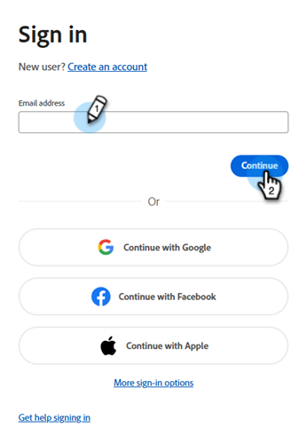
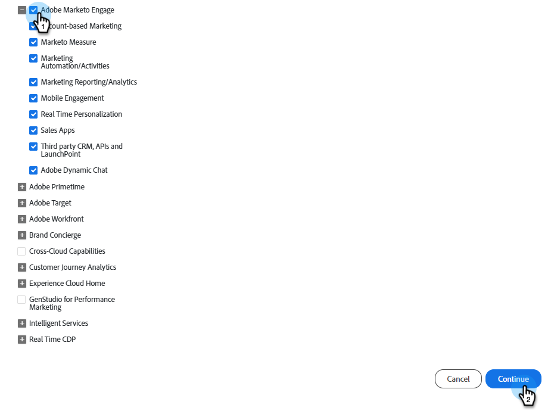

# システムステータス通知の購読 {#subscribe-to-system-status-notifications}

さまざまなステータス通知を購読して、現在の問題に関する最新情報を入手する方法について説明します。

>[!PREREQUISITES]
>
>サブスクリプションを作成する前に、サブスクリプションがどのデータセンターやポッド/サーバーにあるのかを特定する必要があります。

## データセンターの特定 {#identify}

1. Marketo Engageの&#x200B;**管理者** セクションで、**マイアカウント**&#x200B;をクリックします。

   

1. 下にスクロールして、_サポート情報_&#x200B;を表示します。

   

_データセンター_ フィールドでは、文字はデータセンターで、数字はポッドです。 上記の例では、ユーザーはポッド 49のAshburn データセンターにいます。

次のセクション ](#create-a-subscription)のステップ 7では、地域の場所&#x200B;**Marketo アッシュバーン**&#x200B;とポッド **ab49**&#x200B;を選択します。[

**データセンターの略語**

* ab: アシュバーン
* sj: サンノゼ
* sn: シドニー
* 長い：ロンドン
* nld: アムステルダム

>[!TIP]
>
>この方法は、サブスクリプションがどのReal Time Personalization（RTP）ポッド/サーバーにあるかを特定するためにも使用できます。

## サブスクリプションの作成 {#create-a-subscription}

[ データセンターとポッド/サーバー](#identify)を特定したら、次の手順に従ってサブスクリプションを作成します。

1. [status.adobe.com](https://status.adobe.com/ja)で、**サブスクリプションの管理**&#x200B;をクリックします。

   

1. Adobeの資格情報を使用して（まだログインしていない場合）ログインするか、アカウントをお持ちでない場合は「**アカウントを作成**」をクリックします。

   

1. 「_製品説明_」タブに移動し、**サブスクリプションの作成**&#x200B;をクリックします。

   

1. _Experience Cloud_&#x200B;の横にある アイコンをクリックして、メニューを展開します。 _Adobe Marketo Engage_&#x200B;に対して同じ操作を行います。

   {width="800"}

1. 通知を受け取る製品の提供/サービスを選択し、**続行**&#x200B;をクリックします。

   >[!TIP]
   >
   >_Adobe Marketo Engage_&#x200B;にチェックを入れて、すべてを選択します。

   {width="800"}

1. 必要なイベントタイプを選択します。

   

   <table style="width:500px;">
   <tr>
   <td style="width:35%;"><b>サービスに関する大きな問題</b></td>
   <td>本番システム上の複数のユーザーに対して、サービスの可用性が低下したり、パフォーマンスが大幅に低下したりします。</td>
   </tr>
   <tr>
   <td style="width:35%;"><b>マイナーサービスの問題</b></td>
   <td>本番システム上の複数のユーザーに対して、部分的なサービスの可用性の低下または中程度のパフォーマンスの低下。</td>
   </tr>
   <tr>
   <td style="width:35%;"><b>サービスメンテナンス</b></td>
   <td>製品の可用性やパフォーマンスに影響を与える可能性のある製品メンテナンスを実行するためのスケジュール済みウィンドウ。</td>
   </tr>
   <tr>
   <td style="width:35%;"><b>お知らせ</b></td>
   <td>グローバル、プロダクトファミリー、または製品関連のメッセージで、幅広い影響を与える。</td>
   </tr>
   </table>

1. 地域の場所と環境を選択します。 「**続行**」をクリックします。

   {width="900"}

   >[!NOTE]
   >
   >これを見つける場所が見つからない場合は、[ データセンターの特定](#identify)を参照してください。

1. サブスクリプションの環境設定（**電子メール**&#x200B;または&#x200B;**Slack**）を選択し、**続行**&#x200B;をクリックします。

   

1. 選択内容を確認し、**環境設定の確認**&#x200B;をクリックします。

   
