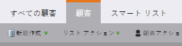

# Marketo 用語のアップデート {#updates-to-marketo-terminology}

プラットフォームに変更が加えられているため、一部の用語への影響があります。2016 年 3 月時点で新しい Marketo インスタンスを使用している場合、または 2016 年 7 月以降に会社が更新した場合は、現在新しい用語が表示されている可能性があります。

Marketo のドキュメントには様々な用語が記載されていますが、これらの変更を反映するために、すべての記事が近日中に更新されます。すべての手順は同じです。

何が変わったのでしょうか。

## 「リード」が「人物」に {#lead-is-now-person}

最大の変更点は、「リード」が「人物」に名前変更されたことです。

<table> 
 <colgroup> 
  <col> 
  <col> 
 </colgroup> 
 <tbody> 
  <tr> 
   <td><strong>前</strong></td> 
   <td><strong>新規</strong></td> 
  </tr> 
  <tr> 
   <td> 
    
 
      
    
</td> 
   <td> 
    
 
      
    
</td> 
  </tr> 
 </tbody> 
</table>

場合によっては、「Lead」という単語が単に削除されます。

<table> 
 <colgroup> 
  <col> 
  <col> 
 </colgroup> 
 <tbody> 
  <tr> 
   <td><strong>前</strong></td> 
   <td><strong>新規</strong></td> 
  </tr> 
  <tr> 
   <td> 
    
 
      
    
</td> 
   <td> 
    
 
     

 
    
</td> 
  </tr> 
 </tbody> 
</table>

「リード」と「人物」は&#x200B;**同じ**&#x200B;です。

## トークン {#tokens}

Lead という単語を含むトークンは、変更&#x200B;**されません**。混乱が起きたことをお詫び申し上げます。ただし、すべてのトークンを新しい用語に合わせて変更すれば、現在使用中のトークンが大量に機能しなくなってしまうでしょう。したがって、「`{{lead.First Name}}`」などのトークンはそのままになります。人物固有のトークンはありません。

>[!NOTE]
>
>「人物のメモ」と呼ばれるトークンが&#x200B;*あります*&#x200B;が、そのトークンは以前から存在します。これは、通常、CRM の説明フィールドに使用されますが、使用されるのはまれです。

## フィールド管理 {#field-management}

フィールドに「リード」という用語が含まれていた場合、これは「人物」に置き換えられたか、「リード」という単語が削除されました。ただし、「リード所有者」フィールドは例外です。現在は「営業所有者」と呼ばれています。

<table> 
 <colgroup> 
  <col> 
  <col> 
 </colgroup> 
 <tbody> 
  <tr> 
   <td><strong>前</strong></td> 
   <td><strong>新規</strong></td> 
  </tr> 
  <tr> 
   <td> 
    
 
      
    
</td> 
   <td> 
    
 
      
    
</td> 
  </tr> 
 </tbody> 
</table>

>[!NOTE]
>
>影響を受けるフィールド名の完全なリストについては、[サポート記事](https://nation.marketo.com/docs/DOC-4218#jive_content_id_Field_Names_and_Tokens)を参照してください。

## リアルタイムパーソナライゼーション（RTP）が Web パーソナライゼーションに {#real-time-personalization-rtp-is-now-web-personalization}

<table> 
 <colgroup> 
  <col> 
  <col> 
 </colgroup> 
 <tbody> 
  <tr> 
   <td><strong>前</strong></td> 
   <td><strong>新規</strong></td> 
  </tr> 
  <tr> 
   <td> 
    
 
      
    
</td> 
   <td> 
    
 
      
    
</td> 
  </tr> 
 </tbody> 
</table>

名前の変更に加えて、4 つの異なるアプリで構成されるようになりました。

| ** [Web パーソナライゼーション](https://docs.marketo.com/display/DOCS/Web+Personalization+-+RTP)** | ホーム画面に独自のタイルを表示 |
|---|---|
| ** [アカウントベースの Web マーケティング](https://docs.marketo.com/display/DOCS/Account-Based+Web+Marketing)** | Web パーソナライゼーションタイルからアクセス可能 |
| ** [パーソナライズされた再ターゲティング](https://docs.marketo.com/display/DOCS/Website+Retargeting)** | Web パーソナライゼーションタイルからアクセス可能 |
| ** [予測コンテンツ](https://docs.marketo.com/display/DOCS/Predictive+Content)** | ホーム画面に独自のタイルを表示 |

>[!NOTE]
>
>ホーム画面に表示されるタイルには、購入したモジュールが反映されます。

アップデートの間、ご迷惑をおかけしますがご協力お願いいたします。
