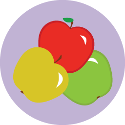

# 製品ドキュメント {#product-docs}

Marketo の学習には、いくつかの重要な要素があります。 これらを学べば、Marketo は半分マスターできています。
** コアコンセプト** [&#x200B; コアコンセプトこれらの内容を学習すると、Marketoの習得の半分になります。](product-docs/core-marketo-concepts.md)     **電子メールとモバイル** [電子メールとモバイル Marketoには、オーディエンスと柔軟にコミュニケーションするための優れたツールが多数用意されています。](https://docs.marketo.com/pages/viewpage.action?pageId=557076)     **需要創出** [需要創出カスタムフォームとソーシャルウィジェットを使用してランディングページを作成します。](product-docs/demand-generation.md)     **Personalization** [Personalization マーケティングを個別化すればするほど、対応する可能性が高まります。](product-docs/personalization.md)     ** レポート** [実用的なインサイトをレポートします。 アイテムを受信トレイに直接配信することもできます。](product-docs/reporting.md)     **管理** [管理アドミンクラブに所属している場合、必要な情報は次のとおりです。](https://docs.marketo.com/display/DOCS/Administration)     **追加アプリ** [追加アプリ リード管理は、私たちが得意とする唯一のものではありません。](product-docs/additional-apps.md)     **CRM同期** [CRM同期ここが魔法のようなことが起こります。](product-docs/crm-sync.md)
