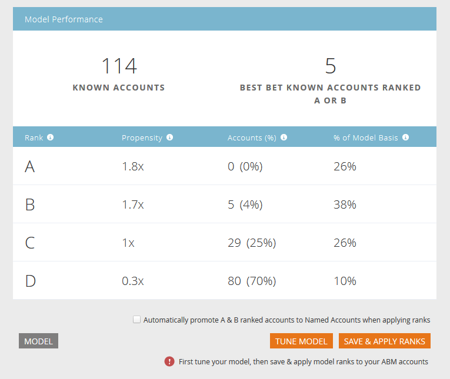
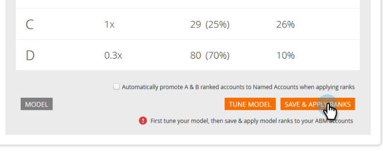

# アカウントプロファイリングのランク付けと調整 {#account-profiling-ranking-and-tuning}

勘定科目プロファイリングは、理想的な顧客プロファイル(ICP)を識別し、ICPに基づいてデータベース内の会社をランク付けし、ICPインジケータ・データを名前付き勘定科目として昇格させる勘定科目に追加します。

## モデルの結果 {#model-results}

結果により、等級別に分類された既知の勘定科目がすべて表示されます。 Aは最も高い等級、Dは最も低い等級です。

オプションですが、[自動的にプロモート]チェックボックスをオンにすることをお勧めします。これにより、時間を節約できます。 ただし、各アカウントを調べて手動で [追加する場合は](http://docs.marketo.com/display/DOCS/Discover+Accounts#DiscoverAccounts-DiscoverCRMAccounts)、チェックボックスをオフのままにします。

<table> 
 <tbody> 
  <tr> 
   <td><strong>ランク</strong></td> 
   <td> 
    

      理想的な顧客プロファイルに基づくアカウントランク。 Aは最適フィット、Dは最も適合しない。 
    
</td> 
  </tr> 
  <tr> 
   <td><strong>傾向</strong></td> 
   <td> 
    

      非ICPベースの勘定科目の選択と比較したコンバージョン率の増加予測。 
    
</td> 
  </tr> 
  <tr> 
   <td><strong>アカウント(%)</strong></td> 
   <td> 
    

      このランクを持つモデル入力の勘定の割合。 
    
</td> 
  </tr> 
  <tr> 
   <td><strong>モデル基準の%</strong></td> 
   <td> 
    

      このランクを持つモデルベースの勘定の割合。 
    
</td> 
  </tr> 
 </tbody> 
</table>

## モデルの調整 {#model-tuning}

「モデル」(Model)タブで、「モデルを調整」(Tune Model)ボタンをクリックします。

いくつかのタブから選択でき、詳細なカスタマイズが可能です。

インジケーターカテゴリ

| **準拠** | 認定、コンプライアンス関連の職階/採用 |
|---|---|
| **操作** | 業務関連の職階/採用。 |
| **人事** | 人事または給与ソフトウェア、人事関連の職階/雇用。 |
| **エンジニアリング** | テクノロジー、フレームワーク、エンジニアリング関連の職階/採用 |
| **売上高** | 販売、販売関連の職階/雇用に関するソリューションとソフトウェア |
| **意図** | インテントインジケーター。 |
| **IT** | ハードウェア/ソフトウェア・ソリューション、テクノロジー、IT関連の位置づけ/採用 |
| **金融** | 金融ソフト、財務関連の職階/雇用。 |
| **マーケティング** | マーケティングテクノロジーとソフトウェア、マーケティング関連の職位/雇用 |
| **ビジネス** | フォーブス又は株式会社の上場又は事業提携 |
| **顧客体験と関係** | 顧客の成功と顧客関係の位置/雇用。 |

各列の説明を表示するには、ツールヒントの上にカーソルを置きます。

「追加ICPインジケータ」ドロップダウンをクリックして、追加のインジケータをモデルに挿入します。

「エクスポート」ボックスを選択すると、「名前付き勘定科目の詳細」ページにICPインジケータが表示され、選択したICPインジケータを [名前付き勘定科目フィルターの制約として使用でき](http://docs.marketo.com/display/DOCS/Account+Filters)ます。

>[!NOTE]
>
>ICPインジケータは、「名前付き勘定科目 **フィルター** 」および「トリガー」のメンバーに制約として含まれます。

インジケーターの重み付けは、モデルで各インジケーターが受け取る重要度のレベルを制御します。

変更を有効にするには、「モデルを更新」をクリックします。

モデルの調整が完了したら（更新した後）、「モデル結果」タブに戻り、「 **保存してランクを適用」をクリックします**。

