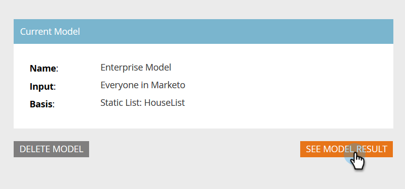

# アカウントプロファイルの設定{#setting-up-account-profiling}

アカウントプロファイルを使用して開始するには、次の手順に従います。

1. 「マイマーケティング」で、**アカウントベースのマーケティング**&#x200B;を開きます。

   

1. 「アカウントのプロファイル」タブをクリックします。

   

1. 「モデル」(Model)タブはデフォルトで開きます。 「**開始**」をクリックします。

   

1. モデルに名前を付け、結果に含めるユーザーを選択し、理想的な顧客プロファイル(ICP)の基盤となるユーザーを選択します。 完了したら、「**モデルを作成**」をクリックします。

   

1. モデルが構築を開始します。 しばらくかかる場合がありますが、心配しないでください。終了すると通知が送信されます。

   

1. モデルの結果を表示するには、**「モデル結果を表示**」をクリックします。

   

   これで、モデルが作成されます。

   

   >[!TIP]
   >
   >モデルが作成されたら、[アカウントプロファイリングの概要](http://docs.marketo.com/x/NIDv)でモデルを調整する方法を学びます。

