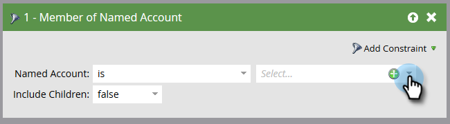

# アカウントフィルター {#account-filters}

新しいアカウント中心のフィルターを使用して、固有のアカウントとその中の個人を特定し、関与させます。

## ABMフィルター {#abm-filters}

1. スマートキャンペーンを選択し、「 **スマートリスト**」をクリックします。

   

1. [ **+]をクリック** して[ **アカウントフィルター** ]フォルダを展開します。

   

1. 使用するフィルターをキャンバスにドラッグします。

   

## 勘定リストのメンバ {#member-of-account-list}

このフィルタを使用するには、アカウントリストドロップダウンをクリックします。

...目的のアカウントリストを選択します。

>[!NOTE]
>
>アカウントリストのメンバーフィルターには、次の修飾子が1つだけあります。&quot;is&quot; — 追加の修飾子（「is not」や「is any」など）は使用できません。

## 指定されたアカウントのメンバ {#member-of-named-account}

1. 修飾子を選択します。 特定の名前のアカウントの場合、または任意の名前の付いたアカウントの場合。

   

1. 「アカウント名」ドロップダウンをクリックします。

   

1. 目的の名前付きアカウントを選択します。

   

1. 「いずれか」の修飾子を使用する場合は、 [制約を利用して検索結果を絞り込むことができます](http://docs.marketo.com/display/DOCS/Add+a+Constraint+to+a+Smart+List+Filter) 。 好き追加なだけ！

   

1. 単一の最上位アカウントからのメンバーのみを必要とする場合は、「子を含める」をfalseに設定します。 すべての子アカウントからメンバーを作成する場合は、trueを選択します。

   

>[!MORELIKETHIS]
>
>* [アカウントトリガー](account-triggers.md)

