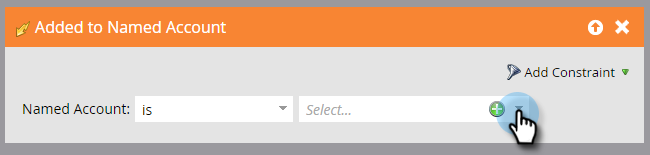

# アカウントトリガー{#account-triggers}

アカウントレベルのトリガーを使用して、様々なチャネル（電子メール、Web、広告など）のアカウントレベルの重要な行動アクティビティをリッスンし、行動を起こします。

スマートキャンペーンを選択し、**[!UICONTROL スマートリスト]**&#x200B;をクリックします。

検索ボックスに「名前付きアカウント」と入力して、名前付きアカウントトリガーを両方検索します。

目的のトリガーをキャンバスにドラッグします。 この例では、_名前付きアカウントに追加_&#x200B;を使用しています。

修飾子を選択します。

[名前付きアカウント]ドロップダウンリストをクリックします。

...をクリックし、目的の名前付きアカウントを選択します。

それだ！ スマートキャンペーンの残りの部分を終了したら、必ずアクティブにします。

>[!MORELIKETHIS]
>
>[アカウントフィルター](/help/marketo/product-docs/account-based-marketing/engage/account-filters.md)
