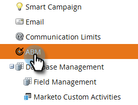

# ABMレポートの設定 {#abm-report-setup}

ABMの販売レポートは、週1回、アカウントチームに送信するパーソナライズされた電子メールです。

## レポートの設定 {#report-setup}

1. 「 **管理者**」をクリックします。

   

1. 「 **ABM**」をクリックします。

   

1. 「週別レポート」で、「 **編集**」をクリックします。

   

1. 「 **日** 」ドロップダウンをクリックし、受信者に電子メールを受信させる曜日を選択します。

   

1. 電子メールのレイアウトを決定するには、「 **並べ替え** 」ドロップダウンをクリックし、選択範囲を指定します。

   

1. 「 **ユーザ** 」チェックボックスをオンにし、ドロップダウンをクリックして、電子メールの受信先を選択します。

   

   >[!NOTE]
   >
   >通知は、アカウントの所有者またはチームメンバーにのみ送信されます。

1. 「 **保存**」をクリックします。

   

それだ！

## 登録を解除する方法 {#how-to-unsubscribe}

各レポートには、に対するオプションが付属オプトアウトしています。 これを行うには、電子メールの下部にある「 **登録解除** 」をクリックします。

## 再登録方法 {#how-to-resubscribe}

1. 「 **管理者**」をクリックします。

   

1. 「 **ABM**」をクリックします。

   

1. 「週別レポート」で、「登録解除」と表示されている数をクリックします。

   

1. ユーザードロップダウンをクリックします。

   

1. 電子メールを再度受信するユーザーを選択し、「 **再登録**」をクリックします。

   

