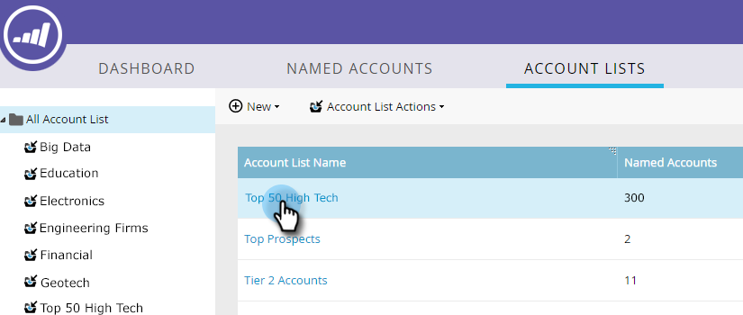
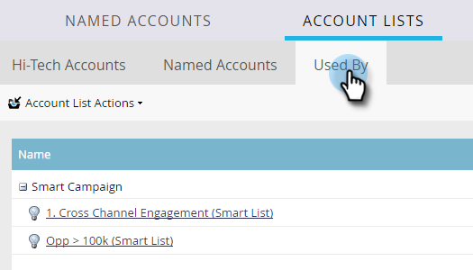

# アカウントリストインサイト{#account-list-insights}

アカウントリストダッシュボードオファーは、そのリスト内の指定されたすべてのアカウントからの集計されたインサイトの表示を測定します。

>[!NOTE]
>
>Marketor ABMは、生成されたパイプラインまたはアカウントエンゲージメントスコアに基づいて、アカウントリスト内の上位のアカウントを自動的に決定します。

## アカウントリストダッシュボード{#account-list-dashboard}

アカウントリストのダッシュボードを表示するには、アカウント名をクリックします。

...ダッシュボードが表示されます。

<table> 
 <tbody> 
  <tr> 
   <td colspan="1"><strong>パイプライン</strong></td> 
   <td colspan="1">経時的なパイプラインを参照してください。 週単位で経時的にパイプラインを決定するために、最終日にパイプラインを使用します。</td> 
  </tr> 
  <tr> 
   <td><strong>売上高</strong></td> 
   <td>
経時的な売上高を表示します。 時間の経過に伴う売上高を週別に判断するには、その週の売上高の合計を受け取ります。
</td> 
  </tr> 
 </tbody> 
</table>

## [名前付きアカウント]タブ{#named-accounts-tab}

「**名前付きアカウント**」タブをクリックして、そのアカウントリストに属する名前付きアカウントを確認します。

>[!NOTE]
>
>このタブで名前付きのアカウントを削除するには、アカウントを選択し、**名前付きのアカウントを削除**&#x200B;をクリックします。

## タブで使用{#used-by-tab}

「**使用者**」タブをクリックして、そのアカウントリストを参照しているアセットを確認します。

