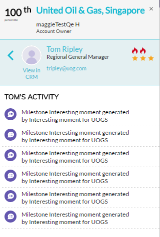
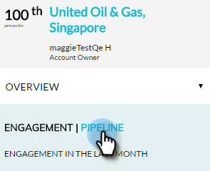

# アカウントインサイトプラグインの概要 {#account-insight-plug-in-overview}

Account Insightは、すぐに使えるABMやアカウントのインサイトをセールスチームに提供するChromeプラグインで、アカウントをより効果的に関与させることができます。

>[!NOTE]
>
>**可用性**
>
>アカウントインサイトは、ABMとMarketo Sales Insightの両方を持つすべての顧客に対して含まれます。 ABMのみをお持ちのお客様の場合、購入したアドオンとしてアカウントインサイトを利用できます。 各顧客は、250個のアカウントインサイトシートに制限されています。 詳細については、担当営業にお問い合わせください。 ABMをお持ちでないお客様はご利用いただけません。

>[!CAUTION]
>
>アカウントインサイトプラグインは、 [SSOのみ](http://docs.marketo.com/display/DOCS/Restrict+User+Login+to+SSO+Only) （シングルサインオン）が有効になっている購読では動作しません。
>
>アカウント、リード、または連絡先からプラグインを起動すると、SalesforceでCRMコンテキストが機能します。 アカウント、リード、または連絡先からプラグインを起動する場合、CRMコンテキストはDynamicsでは動作しません。 Dynamicsユーザーの場合は、アカウントインサイトプラグインを使用することをお勧めします。

## 名前付きアカウント {#named-accounts}

互いにランク順に名前付きのアカウントを表示します。 このリストは、アカウントの所有者のみが使用できます。 アカウントチームのサポートは、近日中に提供されます。

名前付きアカウントの詳細を表示するには、名前をクリックします。

...概要が表示されます。

ドロップダウンを使用して、興味深い瞬間を確認します。

下にスクロールして最適なベットを確認します。 興味深い瞬間もここにあり、婚約者もいます。

人の名前をクリック…

...アクティビティを見て

表示を「エンゲージメント」から「パイプライン」に切り替えることもできます。

この名前のアカウントを終了するには、右上の「X」をクリックします。

## アクティビティフィード {#activity-feed}

アクティビティフィードには、7日前の最新アクティビティが表示されます。

異なる **アクティビティタイプでフィルタリングするには、[** フィルタ]ドロップダウンをクリックします。\

複数の項目をクリックできます。 この名前のアカウントをクリックすると、詳細が表示されます。 アクティビティを表示するユーザーの名前をクリックします。 [その他のアクティビティ]をクリックすると、その他のアクティビティを表示できます。

すごい！

>[!NOTE]
>
>**関連記事**
>
>* [アカウントインサイトの設定](set-up-account-insight.md)

>

