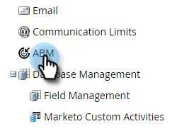
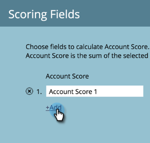

# アカウントスコア {#account-score}

アカウントスコアリングは、アカウントベースのマーケティングの重要な部分です。 アカウントのエンゲージメントレベルを判断する際に役立ちます。

## アカウントスコアリングとは {#what-is-account-scoring}

これは、販売チームとマーケティングチームが購入に至る可能性が最も高い会社(見込み客を含む)を特定し、優先順位を付けるのに役立つように設計された体系的なアプローチです。

B2Bの購買プロセスの複雑な世界では、1人の個人が購入を決定することはまれです。 様々な役割が関わり、それぞれが独自のニーズを持つ場合が多い。 アカウントベースのスコアリングでは、複数のリードからのリードスコアを集計し、アカウントレベルでスコアを提供することで、この点を考慮に入れます。

## 一般的な例 {#common-examples}

| **アカウントエンゲージメントスコア** | 様々なチャネル（電子メール、Web、広告など）で追跡される、特定のターゲットアカウントのユーザーの行動アクティビティに基づくアクションの深さ。 |
|---|---|
| **アカウント製品の関心スコア** | 特定のターゲットのコンテンツに対する関心を示している、製品アカウントのユーザー（例：ホワイトペーパーのダウンロード）。 |
| **アカウントWebエンゲージメントスコア** | Webチャネルーを訪問するターゲットアカウントのユーザー。 電子メールや広告などのチャネルからチャネルのエンゲージメントを測定するために、同じスコアを作成できます。 |

## アカウントスコアの設定方法 {#how-to-configure-account-score}

>[!NOTE]
>
>**説明**
>
>アカウントスコアを計算するには、まずリードスコアを作成する必要があります。 Marketo BuilderのABMでは、集計が自動的にアカウントスコアを算出します。 例として、上記の2つの例(*Account **商品の関心スコア*&#x200B;と&#x200B;*アカウントWebの関与スコア*)を挙げます。
>
>まず、ターゲットアカウントの各リードから関連のある詳細を取り込むリードスコアフィールドを作成します。\
>次に、これらのリードスコアをそれぞれのアカウントスコアに割り当てます。\
>アカウント製品の関心スコア= SUM（リード製品の関心スコア）\
>アカウントのWebエンゲージメントスコア= SUM（リードのWebエンゲージメントスコア）

>[!NOTE]
>
>ユーザーは、複数のアカウントエンゲージメントスコアを作成し、様々な訪問者スコアを様々なアカウントスコアに割り当てることができます。

リードスコアを設定したら、次の手順に従って操作を進めます。

1. 「 **管理者**」をクリックします。

   

1. 「 **ABM**」をクリックします。

   

1. 「スコアリングフィールド」で、「 **編集**」をクリックします。

   

   >[!NOTE]
   >
   >アカウントスコアの計算には、**5個までの***フィールドを選択できます。

1. アカウントスコア名を入力し、「 **人物スコアの選択** 」ドロップダウンをクリックして、対応するスコアを選択します。

   

1. 「**+追加 **」をクリックして、スコアを追加します。

   

1. す追加べての希望スコア。 終了したら **「保存** 」をクリックします。

   

