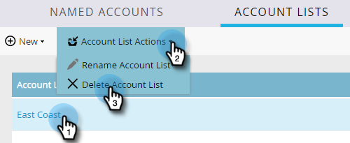

# アカウントリスト{#account-lists}

アカウントリストは、複数のアカウントをターゲットにすることができる、名前付きのアカウントの集まりです。 アカウントリストを使用すると、会社の業種、場所またはサイズに基づいてアカウント名をターゲットできます。

アカウントリストに加えて、パブリックCRMアカウント表示から生成される動的なアカウントリストを作成することもできます。 CRMアカウント表示は、アカウントを表示する際にフィルターとして機能する一連のルールです。 例えば、IndustryがHealthcare *で* Revenueが$100Mを超えるアカウントを検索する場合に使用できます。

>[!NOTE]
>
>Markettoのアカウントベースのマーケティングで作成されたアカウントリストは、[Webパーソナライゼーション](/help/marketo/product-docs/web-personalization/using-web-segments/web-segments.md)でスマートリストとWebキャンペーンを構築する際に自動的に使用できます。

## 新しいアカウントリストの作成{#create-a-new-account-list}

1. 「**新規**」ドロップダウンをクリックし、「**新しいアカウントを作成**」を選択します。

   

1. リストに名前を付け、「**作成**」をクリックします。

   

1. アカウントリストを作成したら、に名前付きのアカウントを追加し始めます。

   >[!NOTE]
   >
   >Marketorは、2,000個以下の名前付きアカウントを持つアカウントリストのインサイトのみを表示します。

## 新しい動的アカウントリストの作成{#create-a-new-dynamic-account-list}

1. 「**新規**」ドロップダウンをクリックし、「**新しい動的リストを作成**」を選択します。

   

1. ダイアログで、ドロップダウンから&#x200B;**CRMアカウント表示**&#x200B;を選択するか、名前を入力して検索します。

   

1. 「**作成**」をクリックします。

   

   >[!NOTE]
   >
   >Salesforceでは、同期ユーザーに対してリスト表示オブジェクトの権限を必ず指定してください。

## アカウントリストの名前を変更{#rename-an-account-list}

>[!NOTE]
>
>これらの手順は、アカウントリストにのみ適用されます。 _Dynamicaccount_ リストは、関連するCRMアカウント表示の名前を使用します。

1. 名前を変更するアカウントを選択し、「**アカウントリストの操作**」ドロップダウンをクリックして、「**アカウントリスト名の変更**」を選択します。

   

1. 新しい名前を入力し、**名前の変更**&#x200B;をクリックします。

   

   >[!NOTE]
   >
   >CRMアカウント表示は、8時間ごとに動的アカウントリストに同期します。 まだ同期されていない場合は、次のサイクル中にMarketoが同期します。

## アカウントリストの削除{#delete-an-account-list}

>[!NOTE]
>
>これらの手順は、アカウントリストと動的アカウントリストの両方で同じです。

1. 削除するアカウントを選択し、「**アカウントリストの操作**」ドロップダウンをクリックして、「**アカウントリストを削除**」を選択します。

   

1. 「**削除**」をクリックします。

   

>[!MORELIKETHIS]
>
>* [ア追加カウントリストに対する既存の名前付きアカウント](/help/marketo/product-docs/account-based-marketing/target/named-accounts/add-an-existing-named-account-to-an-account-list.md)
>* [アカウントリストインサイト](/help/marketo/product-docs/account-based-marketing/measure/account-list-insights.md)

