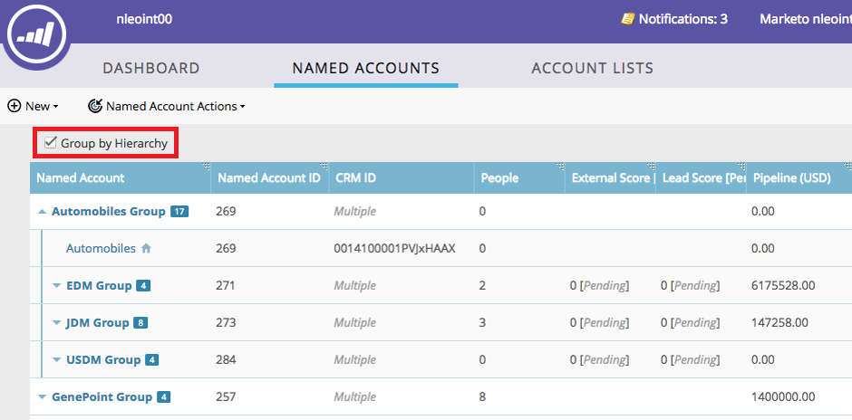

# ABM階層 {#abm-hierarchies}

階層によって、ABMユーザーは、CRMの名前付きアカウント間の親/子の関係を継承できます。

## ABM階層とは {#what-are-abm-hierarchies}

会社は複数の部門や子会社を持つことができます。 会社は、階層と呼ばれる親子関係を通じて、自らを組織化することがよくあります。 ABMは、SFDCまたはMSD統合からこれらの階層を継承し、1つのファミリとして異なる部門を扱うことができます。

## ABM階層の操作 {#working-with-abm-hierarchies}

ABM階層を使用すると、指定アカウントダッシュボードで階層全体または個々のアカウントに関する情報をすばやく取得できます。

階層を使用しない

階層の使用

>[!NOTE]
>
>Marketing Toインターフェイスには、最大10レベル下に表示されます（親アカウントの子アカウントと孫アカウント）。ただし、作成できる子アカウントの数に制限はありません。

1回のクリックで階層全体のターゲットとレポート [を作成できます](http://docs.marketo.com/display/DOCS/Account+Filters#AccountFilters-MemberofNamedAccount)。

