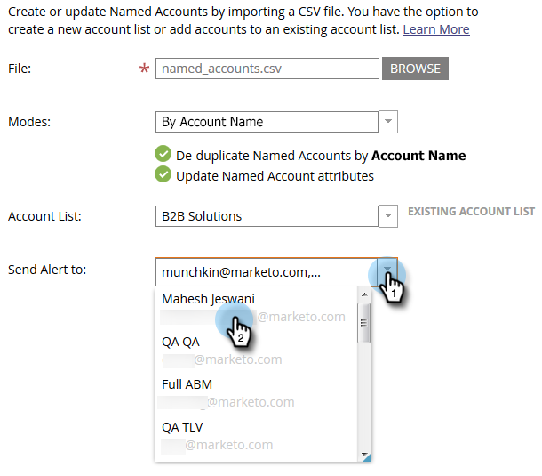

# 名前付きアカウントのインポート{#import-named-accounts}

既にCSVに見込みのターゲットアカウントが含まれていますか？ ABMに直接インポート！

1. 「**新規**」ドロップダウンをクリックし、「**名前付きアカウントをインポート**」を選択します。

   

1. 新しいウィンドウが開きます。 「**参照**」をクリックし、読み込む名前付きアカウントのファイルを選択します。

   

   >[!TIP]
   >
   >ファイルに、[できるだけ多くの情報](http://docs.marketo.com/display/DOCS/Named+Account+Overview#NamedAccountOverview-NamedAccountAttributes)を入力します。 追加できるのは、最初の情報だけです。計算される値は何もありません（例：パイプライン）。 CRMアカウントに基づいて名前付きのアカウントを作成するには、CRMからアカウント名とCRM IDをCSVファイルにエクスポートし、「アカウント名」オプションを使用して、インポートプロセス中にCRM IDをマッピングします。 CRMアカウントを指定されたアカウントに適切にリンクするには、CRMアカウントの正確な名前を指定する必要があります。

1. 次の2つの重複除外モードから選択します。アカウント名またはドメイン名。 この例では、「アカウント」を選択します。 「**モード**」ドロップダウンをクリックし、「**アカウント名**」を選択します。

   

   >[!NOTE]
   >
   >「**ドメインモード**」を選択する場合は、名前付きのアカウントとドメインの両方のフィールドを含める必要があります。

1. 指定したアカウントを追加するアカウントリストを選択するには、**アカウントリスト**&#x200B;ドロップダウンをクリックし、選択を行います。

   

   >[!NOTE]
   >
   >ドロップダウンボックスに名前を入力するだけで、新しいアカウントリストを作成することもできます。

1. インポートの通知を送信するには、**アラートを**&#x200B;に送信ドロップダウンをクリックし、Marketorユーザーを選択します。 電子メールアドレスを&#x200B;*手動で入力することはできません。*

   

1. 「**次へ**」をクリックします。

   

1. **マーケティング先フィールド**&#x200B;ドロップダウンを重複クリックし、適切なフィールドを選択して、各フィールドをマッピングします。 終了したら「**次へ**」をクリックします。

   

   成功！

   

   >[!NOTE]
   >
   >[インポートステータスの確認]には、過去3日間のアクティビティのみが表示されます。

<table> 
 <tbody> 
  <tr> 
   <td>既存の名前付きアカウント名を持つレコードをインポートしています</td> 
   <td>
既存のレコードを更新します
</td> 
  </tr> 
  <tr> 
   <td>新しい名前付きアカウント名を持つレコードをインポートしています</td> 
   <td>新しいレコードを作成します</td> 
  </tr> 
 </tbody> 
</table>

ドメイン名で重複除外する場合のシナリオ：

| **新しいアカウント名と新しいドメイン名を持つレコードのインポート** | 提供された情報を使用して、新しい名前付きアカウントを作成します |
|---|---|
| **既存のアカウント名と既存のドメイン名を使用したレコードのインポート** | 既存の名前付きアカウントを更新します |
| **新しいアカウント名と既存のドメイン名を持つレコードのインポート** | ドメイン名と一致する既存の名前付きアカウントに新しいアカウント名を追加し、その他の情報（業界、州など）を更新します。 |
| **既存の名前付きアカウント名と新しいドメイン名を持つレコードをインポートしています** | アカウント名と一致する既存の名前付きアカウントに新しいドメイン名を追加し、その他の情報（業界、州など）を更新します。 |

>[!NOTE]
>
>Marketoが名前付きアカウントを追加すると、名前付きアカウントに含める必要のある人を識別できるルールが（背後で）更新されます。 例：「IBM」を「IBM, USA」に更新すると、いずれかの会社名を持つユーザーが「固有のアカウント」に関連付けられます。

重複と見なされるレコードがMarketoで見つかった場合は、最初のレコードのみ処理します。

アカウント名で重複除外を行う場合のシナリオ：