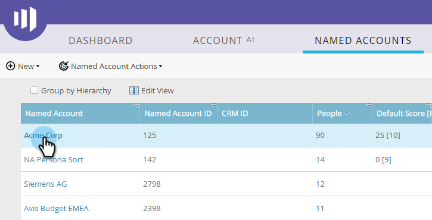

# パーソナス{#using-personas}の使用

個人は、ABMのオーディエンスとマーケティングを特定の人々のサブセットに分ける優れた方法です。

## 追加{#add-a-persona}

1. 「マーケティング」で、**管理者**&#x200B;をクリックします。

   

1. ツリーで、**ABM**&#x200B;を選択します。

   

1. 「**編集**」をクリックします。

   

   >[!NOTE]
   >
   >デフォルトでは、役職の役職の個人情報が含まれます。 変更または削除はできません。

1. 別の個人を追加するには、**+追加**&#x200B;をクリックします。

   

1. 個人に名前を付け、ドロップダウンで対応するフィールドを選択します。 最大2人のユーザーを追加できます。 終了したら「**保存**」をクリックします。

   

   >[!NOTE]
   >
   >Marketorインスタンスと同期された、タイプが「picklist」のSalesforceカスタムフィールドのみが、パーソナの作成時に「persona」フィールドドロップダウンで使用できます。

## 表示ユーザー{#view-your-personas}

特定の指名されたアカウントにアクセスして、個人を表示します。

1. 目的の名前付きアカウントを選択します。

   

1. 「**パーソナ**」タブをクリックします。

   

1. ユーザーの個人名がすべて表示されます。 人のリストを表示するには、数字をクリックします。

   

   >[!NOTE]
   >
   >タイトルパーソナのXはワイルドカード文字の役割を果たします。 例えば、「CXO」にはCEO、CFOなどが含まれます。

## パーソナフィルター{#persona-filters}

1. スマートリストで個人フィルターを使用して、特定のグループの人にマーケティングします。

