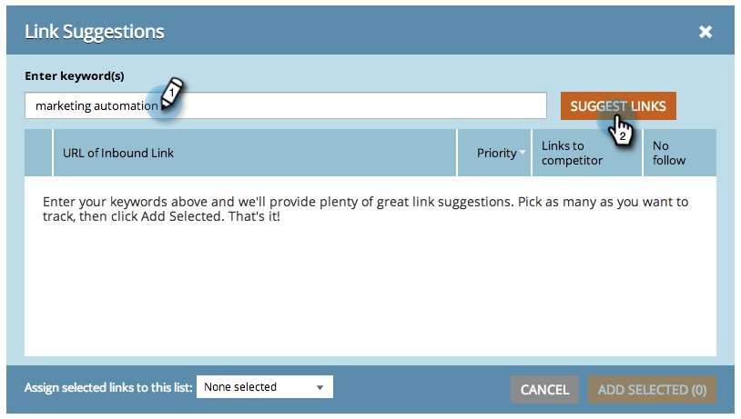

# SEO - インバウンドリンク候補の取得 {#seo-get-inbound-link-suggestions}

Marketo は、[オフページの最適化](/help/marketo/product-docs/additional-apps/seo/understanding-seo/understanding-search-engine-optimization.md)に役立つインバウンドリンクを提案できます。

1. 「**インバウンドリンク**」セクションに移動します。

   

1. 「**候補を取得**」をクリックします。

   

1. キーワードを入力します。「**リンクを提案**」をクリックします。

   

1. リンクを選択します。「**選択項目を追加**」をクリックします。

   

   >[!TIP]
   >
   >[新しいリストまたは既存のリストにリンクを追加](/help/marketo/product-docs/additional-apps/seo/inbound-links/seo-add-remove-an-inbound-link-url-from-a-list.md)できることをご存知でしょうか。ご確認ください。

1. これで完成です。追加されたこれらのリンクは、追跡されるようになりました。

   >[!NOTE]
   >
   >[インバウンドリンクについて](/help/marketo/product-docs/additional-apps/seo/inbound-links/seo-understanding-inbound-links.md)
