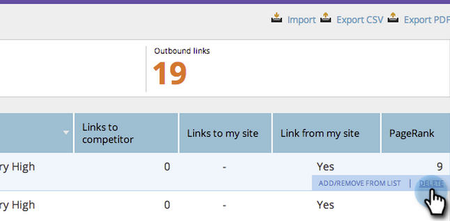

# SEO — 受信リンクURLの削除/削除{#seo-remove-delete-an-inbound-link-url}

受信リンクを削除する場合があります。 その方法を次に示します。

1. **Inbound Links**&#x200B;セクションに移動します。

   

1. 削除するインバウンドリンクURLの上にカーソルを置きます。

   

1. 「**削除**」をクリックします。

   

この受信リンクは削除されました。
