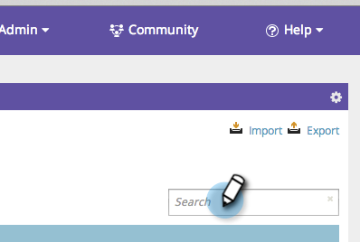

# SEO — キーワードの結果をフィルター {#seo-filter-keyword-results}

多数の [キーワードを持つこともできます](seo-understanding-keywords.md)。 フィルターを適用する方法は次のとおりです。

## リストでフィルタ {#filter-by-list}

1. 「 **キーワード** 」セクションに移動します。

   

1. 対象とするリストの名前をクリックします。

   

   >[!NOTE]
   >
   >リストが表示されない場合は、キーワードリストの作成方法 [を](../../../../product-docs/additional-apps/seo/understanding-seo/seo-managing-lists.md)[学びます](../../../../product-docs/additional-apps/seo/understanding-seo/seo-managing-lists.md)。

甘い！ これで、そのリストのキーワードのみが表示されます。

## SERPランクでフィルター {#filter-by-serp-rank}

1. [キーワード]セクションに移動します。

   

   オレンジ色の四角形は、上限（左）と下限（右）を定義します。 このフィルタは、キーワードの [SERPランクに対して機能します](../../../../product-docs/additional-apps/seo/understanding-seo/understanding-search-engine-optimization.md)。

1. オレンジ色の四角形を左右にスライドして、結果をフィルタします。

   

## 検索でフィルタ {#filter-by-search}

右上隅の検索フィールドを使用して、探しているキーワードを探すこともできます。

1. 「 **キーワード** 」セクションに移動します。

   

1. 検索フィールドにキーワードを入力します。

   

   おめでとう！ お前は今度はキーワードフィルターのサムライ・ウォリアーだ！

