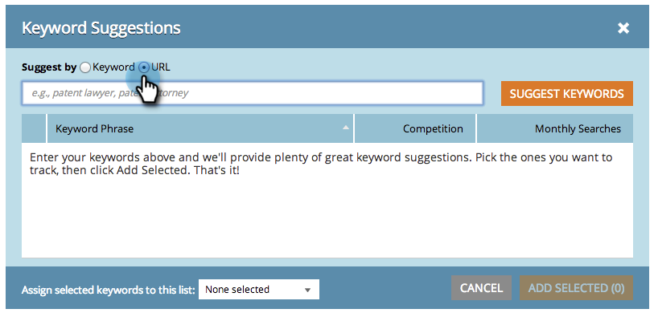

# SEO - 推奨キーワードの取得 {#seo-get-suggested-keywords}

Marketo SEO は、どのキーワードをトラックするべきか推奨できます。キーワードまたはサイトの URL に基づいて推奨することができます。お試しください。

## キーワードを使用したキーワード推奨を取得する {#get-keyword-suggestions-using-a-keyword}

1. 「**キーワード**」セクションに移動します。

   

1. 「**候補を取得**」をクリックします。

   

1. **キーワード**&#x200B;を入力します。「**推奨キーワード**」をクリックします。

   

   >[!TIP]
   >
   >[新しいリストまたは既存のリストに、キーワードを追加](/help/marketo/product-docs/additional-apps/seo/understanding-seo/seo-managing-lists.md)できることをご存知ですか？

1. 推奨キーワードを選択します。「**選択項目を追加**」をクリックします。

   

   これで完了です。キーワードが追加されました。

   

   簡単ですね。キーワードに基づいて推奨キーワードを取得する方法を理解できたので、URL に基づいて推奨を取得してみてください。

## URL からのキーワード推奨の取得  {#get-keyword-suggestions-from-a-url}

1. 「**キーワード**」セクションに移動します。

   

1. 「**候補を取得**」をクリックします。

   

1. 「**推奨元**」に「**URL**」を設定します。

   

1. **URL** を入力し、「**推奨キーワード**」をクリックします。

   

   >[!TIP]
   >
   >[新しいリストまたは既存のリストに、キーワードを追加](/help/marketo/product-docs/additional-apps/seo/understanding-seo/seo-managing-lists.md)できることをご存知ですか？

1. 推奨キーワードを選択します。「**選択項目を追加**」をクリックします。

   

1. これで完了です。キーワードが追加されました。

   

   順調ですね。その調子です。

   >[!MORELIKETHIS]
   >
   >* [キーワードについて（概要の表示）](/help/marketo/product-docs/additional-apps/seo/keywords/seo-understanding-keywords.md)
   >* [リストに対するキーワードの追加／削除](/help/marketo/product-docs/additional-apps/seo/keywords/seo-add-remove-keywords-from-a-list.md)

