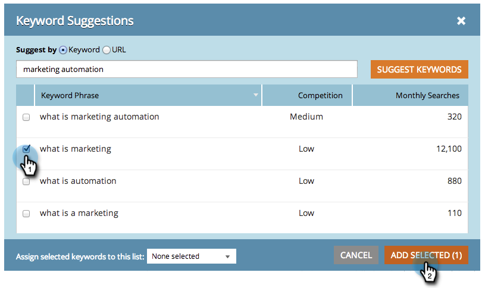

# SEO — 推奨キーワードの取得{#seo-get-suggested-keywords}

Marketo SEOは、どのキーワードを追跡すべきかを提案できます。 キーワードまたはサイトのURLに基づいて提案を行うことができます。 やれ！

## キーワードを使用したサーチクエリの取得{#get-keyword-suggestions-using-a-keyword}

1. 「**キーワード**」セクションに移動します。

   

1. 「**サーチクエリの取得**」をクリックします。

   

1. **キーワード**&#x200B;を入力します。 「**キーワードを提案**」をクリックします。

   

   >[!TIP]
   >
   >ここに新しいキーワードまたは既存のリスト](/help/marketo/product-docs/additional-apps/seo/understanding-seo/seo-managing-lists.md)を[追加できるのをご存じですか。

1. 推奨キーワードを選択します。 「**選択追加**」をクリックします。

   

   素晴らしい！ キーワードが追加されました。

   

   イーハー！ キーワードに基づくサーチクエリの取得方法がわかったら、URLに基づくサーチクエリの取得を試してみてください。

## URLからのキーワードの提案の取得{#get-keyword-suggestions-from-a-url}

1. 「**キーワード**」セクションに移動します。

   

1. 「**サーチクエリの取得**」をクリックします。

   

1. **Suggest by**&#x200B;を&#x200B;**URL**&#x200B;に設定します。

   

1. **URL**&#x200B;を入力し、**キーワードの提案**&#x200B;をクリックします。

   

   >[!TIP]
   >
   >ここに新しいキーワードまたは既存のリスト](/help/marketo/product-docs/additional-apps/seo/understanding-seo/seo-managing-lists.md)を[追加できるのをご存じですか。

1. 推奨キーワードを選択します。 「**選択追加**」をクリックします。

   

1. 素晴らしい！ キーワードが追加されました。

   

   これを揺らしている。 続けろ！

   >[!MORELIKETHIS]
   >
   >* [キーワードについて(概要表示)](/help/marketo/product-docs/additional-apps/seo/keywords/seo-understanding-keywords.md)
   >* [リストから追加のキーワードの削除](/help/marketo/product-docs/additional-apps/seo/keywords/seo-add-remove-keywords-from-a-list.md)

