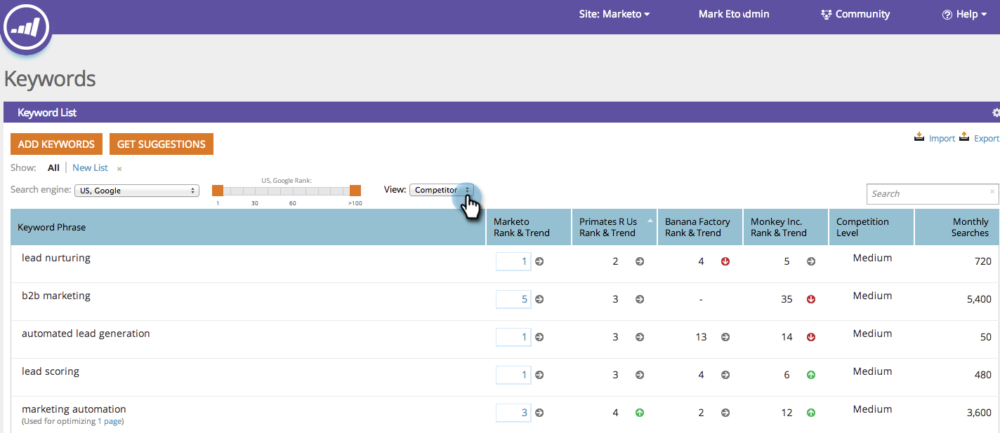

# SEO — キーワードについて {#seo-understanding-keywords}

キーワードはSEO戦略の中心です。 目標は、ビジネスに関連するキーワードのできる限り#1に近い最初のページにあることです。

キーワードのセクションには、サイトがどの程度成功を収めているか、および競合相手にどのように積み重ねているかが示 [されます。](../../../../product-docs/additional-apps/seo/understanding-seo/seo-add-competitors.md)

## キーワード — 概要表示 {#keywords-summary-view}

<table> 
 <thead> 
  <tr> 
   <th colspan="1" rowspan="1">列名</th> 
   <th colspan="1" rowspan="1">説明</th> 
  </tr> 
 </thead> 
 <tbody> 
  <tr> 
   <td colspan="1" rowspan="1">キーワードフレーズ</td> 
   <td colspan="1" rowspan="1">手元のキーワード。</td> 
  </tr> 
  <tr> 
   <td colspan="1" rowspan="1">ランクとトレンド</td> 
   <td colspan="1" rowspan="1">
このキーワードのサイトのランク。 矢印は、キーワードランクが先週の傾向を示します。 

  =ランクアップ

 =ランクダウン

 =ランクは同じ
</td> 
  </tr> 
  <tr> 
   <td colspan="1" rowspan="1">競合レベル</td> 
   <td colspan="1" rowspan="1">特定のキーワードに対してランク付けを行うのが困難です。 </td> 
  </tr> 
  <tr> 
   <td colspan="1" rowspan="1">毎月の検索</td> 
   <td colspan="1" rowspan="1">キーワードで1か月に何回検索が行われたか。 このデータは完全一致に基づいており、12か月以内のGoogle-USでのみ利用できます。 </td> 
  </tr> 
  <tr> 
   <td colspan="1" rowspan="1">キーワードフレーズの最高ランクURL</td> 
   <td colspan="1" rowspan="1">のランクが最も高いURLです。</td> 
  </tr> 
 </tbody> 
</table>

## キーワード —競合他社表示 {#keywords-competitor-view}

「表示」ドロップダウンをクリックし、「競合他社」を選択すると、同じ指標を使用して競合他社のパフォーマンスを表示できます。

素晴らしい！ キーワードの節を理解したら、ページとインバウンドリンクについて学びましょう。

>[!MORELIKETHIS]
>
>* [ページについて](../../../../product-docs/additional-apps/seo/pages/seo-understanding-pages.md)
>* [受信リンクについて](../../../../product-docs/additional-apps/seo/inbound-links/seo-understanding-inbound-links.md)

>

